<p align="center">
  
</p>

<h1 align="center">Quorum</h1>

<p align="center">
  <b>Many minds. One answer.</b><br>
  A council of AI models that runs on your own computer, debates your question, and agrees on one answer.
</p>

<p align="center">
  <a href="https://github.com/dv333/quorum/actions/workflows/ci.yml"></a>
  <a href="LICENSE"></a>
  
  
</p>

<p align="center">
  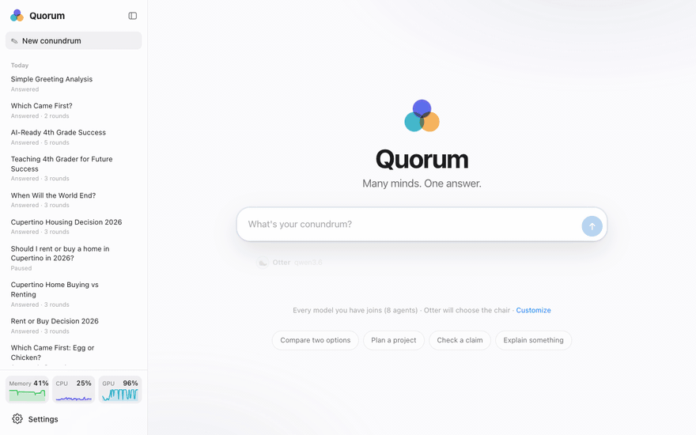
</p>

Ask one model a hard question and you get one opinion, with its blind spots. Quorum puts several local models in a room
instead. If your question is ambiguous, the chair asks you what it needs to know. Then a researcher looks up current
facts, the council argues it out in rounds, and the chair writes one answer anyone can read, with the reasoning and
dissent one tap away.

Everything runs on your machine with [Ollama](https://ollama.com). No account, no API key, no data leaving your
computer (unless you choose to add web search or a cloud model).

## See it work

| The chair clarifies | The council debates | One clear answer |
|:---:|:---:|:---:|
| 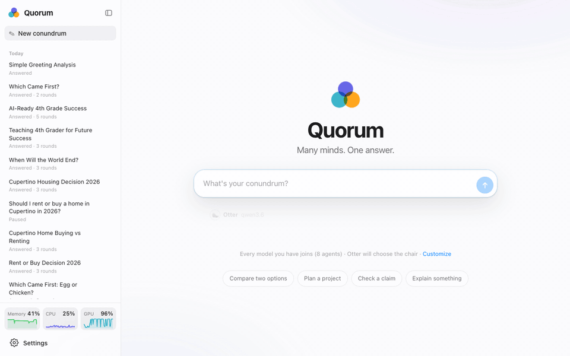 | 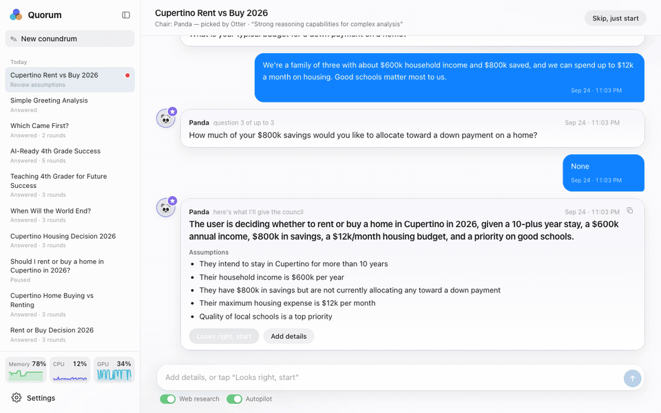 | 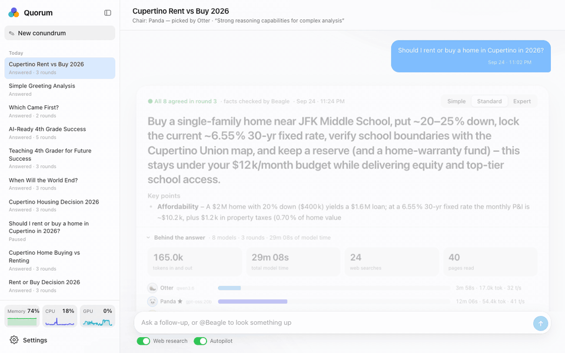 |
| Ambiguous? The chair asks up to three questions, with tap-to-answer suggestions, then confirms its assumptions. | Every model you have joins as an agent and argues in rounds; Beagle 🐶 fetches current facts with sources when anyone asks. | A one-line bottom line, key points, where they differed, and Simple / Standard / Expert versions (Expert adds a diagram). |

A full-length recording is in [docs/images/demo.mp4](docs/images/demo.mp4).

## Features

- **Type and go.** Ask anything. Every model you have installed joins the council as an agent, and the largest one
  picks the best chair for your question.
- **Effort that fits the question.** Say "hi" or ask a simple fact and the chair just answers. Harder questions get
  a debate sized by the chair, from one round to ten.
- **It asks before it guesses.** When the answer depends on something only you know (budget, timeline, where you
  live), the chair asks, one question at a time, three at most. Otherwise it gets straight to work.
- **Memorable agents.** 🦦 Otter, 🐼 Panda, 🐨 Koala, 🐧 Penguin, 🦔 Hedgehog, 🐰 Bunny, 🐢 Turtle and 🐬 Dolphin
  debate; 🐶 Beagle does the web research on a model of its own. The models only ever see these names, never each
  other's model names. Type `@` to talk to any of them.
- **Current facts, with sources.** Beagle searches the web through [Firecrawl](https://github.com/firecrawl/firecrawl),
  posts cited briefs, and fact-checks the claims the final answer depends on.
- **Topic packs.** Pick a kind of debate (Review code, Stress-test a decision, Brainstorm ideas and more) or write
  your own in a few lines of JSON. Packs can build the council around suitable models, like coding models for code
  review, and suggest one to add when you have none.
- **Watch the answer improve.** After every round the chair updates a draft answer pinned at the top, with the
  changed words highlighted. Round recaps show who agrees and who dissents.
- **Answers for everyone.** The bottom line comes first. Switch between Simple, Standard and Expert; the Expert view
  adds a diagram when one helps. Every message has a copy button and a timestamp.
- **Why? on any sentence.** Select part of the answer to see which agents argued for it, who pushed back, and the
  sources behind it.
- **Nothing hidden.** Expand the whole debate, every source and each model's thinking (reasoning models think by
  default). *Behind the answer* shows tokens, time per model, searches and pages read.
- **You're in the loop.** Add a thought mid-debate, ask `@Beagle` anything, pause, or ask for the answer now. A soft chime,
  a notification and a badge tell you when the chair needs you or the answer is ready.
- **Knows your hardware.** Memory, CPU and GPU charts; per-model memory estimates; councils that don't fit are run one
  model at a time instead of crashing.
- **Take it with you.** Export an answer as Markdown (with or without the debate) or PDF, or ask from the terminal
  and scripts with the `quorum` command.
- **Bring cloud models if you like.** Add OpenAI, Anthropic, Gemini, OpenRouter, Groq, Mistral, Together, DeepSeek or
  any OpenAI-compatible API with your own key. Cloud models are never picked automatically.
- **A native-feeling app.** Light and dark mode, glass materials, and layouts from phone to ultrawide.

## Tour

> Every feature, with screenshots: **[docs/FEATURES.md](docs/FEATURES.md)**

One real conundrum, *Should I rent or buy a home in Cupertino in 2026?*, answered by eight local models on a
MacBook Pro. Click any image to see it full size.

### 1. Ask

<table>
<tr>
<td width="50%">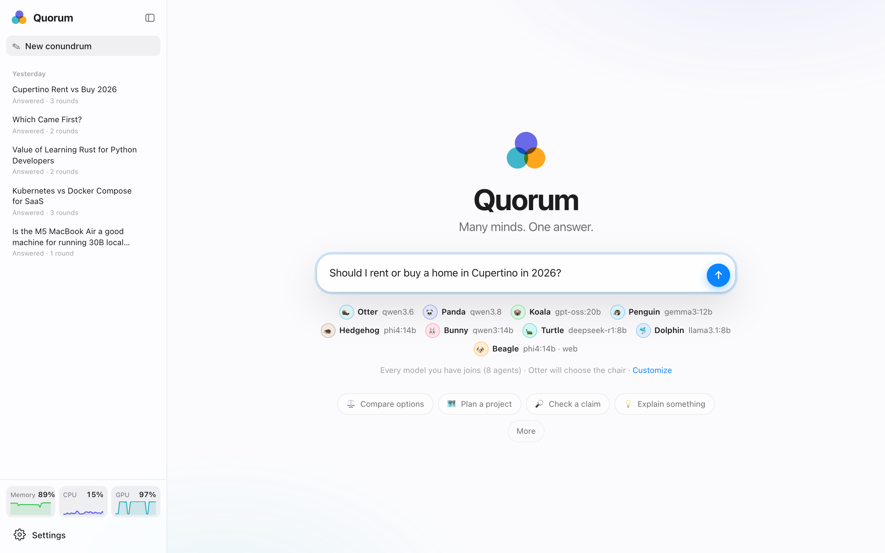</td>
<td width="50%">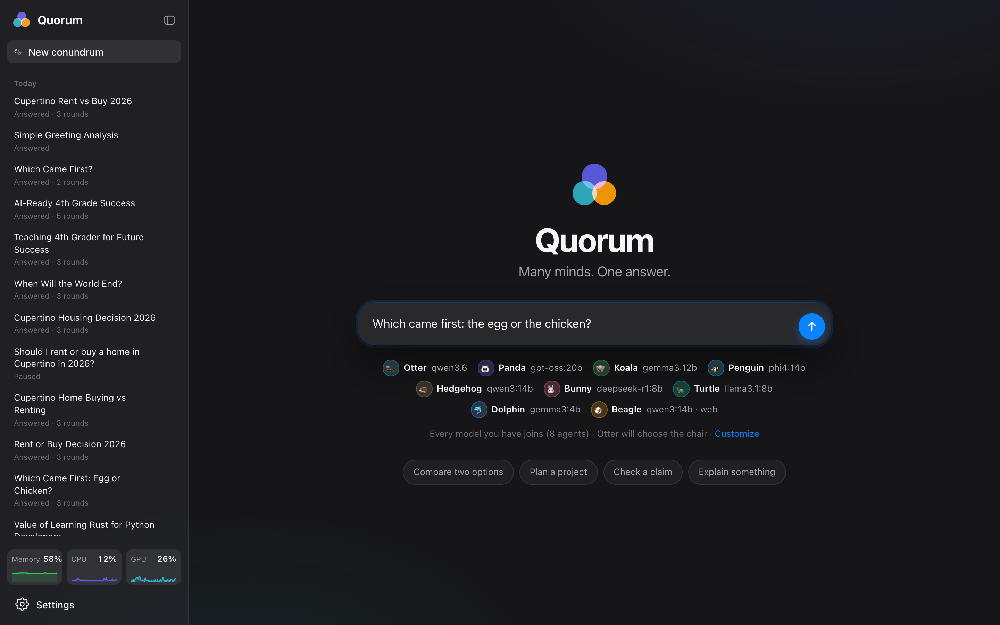</td>
</tr>
<tr>
<td width="50%" valign="top"><b>Just type</b><br>Every model you have installed joins the council as an animal agent. Beagle 🐶 does the research.</td>
<td width="50%" valign="top"><b>Light or dark</b><br>Follows your system appearance, from phone to ultrawide.</td>
</tr>
</table>

### 2. Clarify and debate

<table>
<tr>
<td width="50%">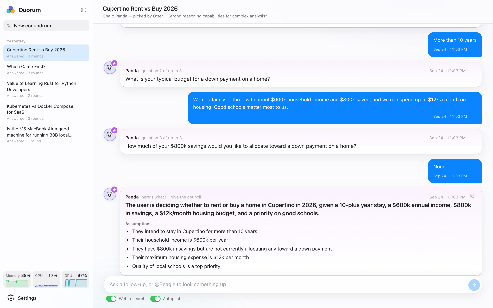</td>
<td width="50%">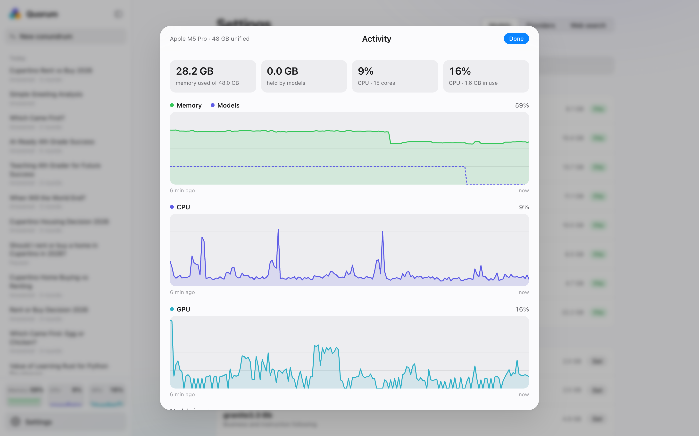</td>
</tr>
<tr>
<td width="50%" valign="top"><b>The chair asks first</b><br>Up to three questions, one at a time, then a summary of assumptions for you to confirm.</td>
<td width="50%" valign="top"><b>Watch your machine work</b><br>Live Memory, CPU and GPU charts while the council debates.</td>
</tr>
</table>

### 3. Get one answer

<table>
<tr>
<td width="50%">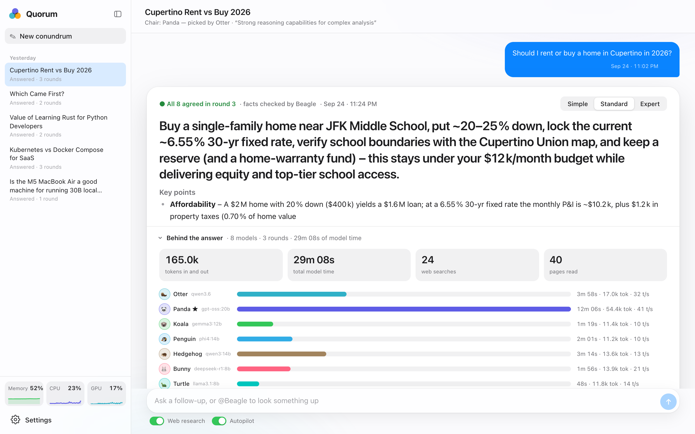</td>
<td width="50%">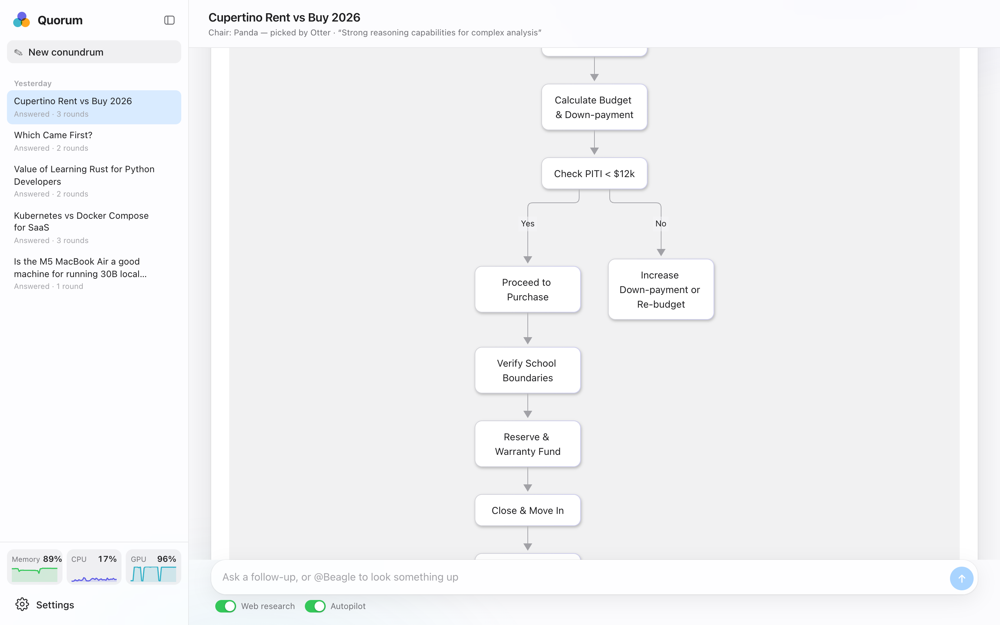</td>
</tr>
<tr>
<td width="50%" valign="top"><b>Bottom line first</b><br>Key points, where the agents differed, reading levels, and the tokens and time behind it.</td>
<td width="50%" valign="top"><b>Expert adds a diagram</b><br>The chair draws the decision when a picture helps.</td>
</tr>
</table>

### 4. Set up once

<table>
<tr>
<td width="50%">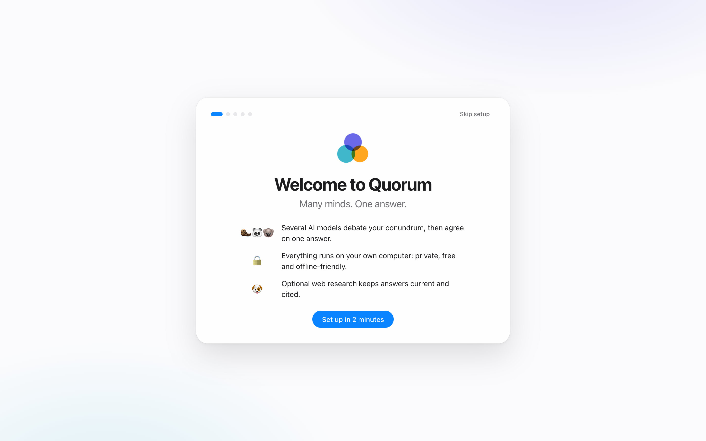</td>
<td width="50%">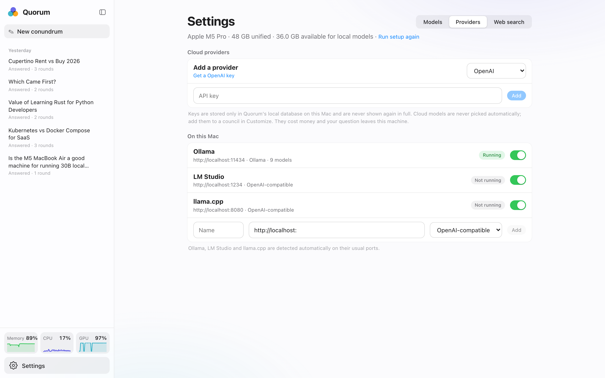</td>
</tr>
<tr>
<td width="50%" valign="top"><b>Two-minute setup</b><br>Checks Ollama, downloads a starter council sized for your machine, and turns on web search.</td>
<td width="50%" valign="top"><b>Local first, cloud optional</b><br>Ollama, LM Studio and llama.cpp are found automatically. Cloud models need your own key.</td>
</tr>
</table>

## Requirements

| | Minimum | Recommended |
|---|---|---|
| OS | macOS 12+, Linux or Windows 10+ | macOS on Apple Silicon |
| Memory | 8 GB | 16 GB+ (32 GB+ for 14B-class councils) |
| Disk | 10 GB free for models | 30 GB+ |
| [Ollama](https://ollama.com/download) | 0.5+ | latest |
| [uv](https://docs.astral.sh/uv/getting-started/installation/) (Python 3.10+) | required | |
| [Node.js](https://nodejs.org) | 20+ | 22 LTS |
| [Docker](https://www.docker.com/products/docker-desktop/) (Compose 2.24+) | required for web search | Docker Desktop, 8 GB for its VM |

GPU acceleration comes from Ollama: Apple Silicon (Metal), NVIDIA (CUDA) and AMD (ROCm) all work. CPU-only machines
work too, just slower.

## Quick start

```bash
git clone https://github.com/dv333/quorum.git
cd quorum
./start.sh
```

`start.sh` checks everything Quorum needs. On a Mac with [Homebrew](https://brew.sh) it offers to install anything
missing (uv, Node.js, Ollama, Docker Desktop), starts Ollama and Docker if they aren't running, and installs the
app's packages. Run `./start.sh --check` to only check and install, or `./start.sh --yes` to install without asking.
On Windows, run `.\start.ps1` in PowerShell; it offers the same installs through winget.

Prefer to install the prerequisites yourself?

```bash
brew install uv node ollama
brew install --cask docker    # for web search
```

Open **http://localhost:5173**. `start.sh` also starts private web search in the background when Docker is running
(the first time downloads about 4 GB). On first launch a short walkthrough checks Ollama, downloads a starter council
sized for your machine, and confirms web search. Then ask your first conundrum.

<details>
<summary>Prefer to set things up by hand?</summary>

```bash
# 1. Models (three families that fit in 16 GB)
ollama pull qwen3:8b
ollama pull gemma3:4b
ollama pull llama3.2:3b

# 2. Backend (http://localhost:8002)
uv sync
uv run python -m backend.main

# 3. Frontend (http://localhost:5173), in a second terminal
cd frontend
npm install
npm run dev
```

</details>

## Web search (optional)

Beagle needs Firecrawl to search the web. `./start.sh` starts it for you when Docker is running; you can also manage
it yourself:

```bash
scripts/firecrawl.sh up      # first run downloads about 4 GB of images
scripts/firecrawl.sh down    # stop it
```

On Windows use `.\scripts\firecrawl.ps1 up`. Set `QUORUM_NO_WEB=1` to skip starting it.

It listens on `127.0.0.1:3002` only and searches through DuckDuckGo. You can also click **Start** in the walkthrough,
or pick **Firecrawl cloud** in *Settings → Web search* and paste an API key.

## Using Quorum

| To… | Do this |
|---|---|
| Ask | Type your conundrum and press Enter |
| Pick a kind of debate | A topic pack under the question box (Review code, Stress-test a decision…) |
| Skip the chair's questions | **Skip, just start** |
| Change the council, chair or priorities | **Customize** under the question box |
| Look something up | `@Beagle what's the current 30-year mortgage rate?` |
| Talk to one agent | Type `@` and pick them, like `@Otter why rent?` |
| Copy a message or the answer | The copy button on each bubble |
| Steer a running debate | Type a message; the next agent sees it |
| Get the answer early | **Answer now** |
| Read it simpler or deeper | **Simple / Standard / Expert** on the answer |
| Save or share the answer | **Export** on the answer: Markdown (with or without the debate), or print / save as PDF |
| New conundrum | ⌘N / Ctrl+N |
| Hide the sidebar | ⌃⌘S |

### Topic packs

A topic pack sets up a kind of debate: a question starter, what to focus on, and guidance every agent and the
chair follows. Quorum ships with seven (Compare options, Plan a project, Check a claim, Explain something, Review code,
Stress-test a decision, Brainstorm ideas). To add your own, drop a JSON file in `data/packs/`:

```json
{
  "name": "Pre-mortem",
  "emoji": "🪦",
  "description": "Imagine the project failed and work out why.",
  "prompt": "It's a year from now and this failed: ",
  "focus": "likely failure modes and early warning signs",
  "guidance": "Assume the plan failed. Each agent names a different, specific cause, then the council ranks them by likelihood and says what to watch for."
}
```

The file name is the pack's id (`pre-mortem.json`). See [docs/PACKS.md](docs/PACKS.md) for every field.

### From the terminal

The `quorum` command asks the council from your terminal, scripts or CI, using the Quorum you already have running:

```bash
uv run quorum ask "Should we use Postgres or SQLite for a single-server app?"
git diff | uv run quorum ask --pack code-review --no-questions
uv run quorum ask "Rust or Go for a CLI?" --json > answer.json
uv run quorum show <id> --debate > debate.md
uv run quorum packs
uv run quorum doctor             # health report from your recent conundrums
uv run quorum doctor --ask       # ...and the council's diagnosis
```

Progress goes to stderr and the answer to stdout, as Markdown (or JSON with `--json`). The chair's clarifying
questions are asked in the terminal; `--no-questions` skips them (and they're skipped when input is piped). Every
conundrum also appears in the app, so you can open it there. To use `quorum` from anywhere:
`uv tool install --editable .`. Point it at another port with `QUORUM_URL`.

## Configuration

Everything works out of the box. To change defaults, copy `.env.example` to `.env`:

| Variable | Default | Meaning |
|---|---|---|
| `OLLAMA_URL` | `http://localhost:11434` | Ollama server |
| `FIRECRAWL_URL` | `http://localhost:3002` | Self-hosted Firecrawl |
| `FIRECRAWL_API_KEY` | | Firecrawl cloud key (switches search to the cloud) |
| `LLC_MAX_ROUNDS` | `3` | Rounds when the chair doesn't size the debate itself |
| `LLC_NUM_CTX` | `8192` | Context window per model |
| `LLC_MEMORY_RESERVE_GB` | `8` | Memory kept free for your OS and apps |
| `LLC_REQUEST_TIMEOUT` | `600` | Seconds per model turn |

See [.env.example](.env.example) for the full list.

## Troubleshooting

<details>
<summary><b>"Can't reach Quorum's engine"</b></summary>

The backend isn't running. Start everything with `./start.sh`. If port 8002 is taken, stop the other program or set
`LLC_PORT` (and update `frontend/vite.config.js`).
</details>

<details>
<summary><b>"vite: command not found" or "Cannot find package vite"</b></summary>

The app's packages are missing or were half-installed (for example, the first run was interrupted). Run
`./start.sh` again: it notices an incomplete install and repairs it. Or install them yourself:
`cd frontend && npm install`. Vite doesn't need to be installed globally or with Homebrew.
</details>

<details>
<summary><b>npm install fails with ENOTFOUND</b></summary>

Your npm is probably set to a company registry (check with `npm config get registry`) that only works on your work
network or VPN. `./start.sh` notices an unreachable registry and uses the public one for Quorum. To do it yourself:
`cd frontend && npm install --registry=https://registry.npmjs.org/`
</details>

<details>
<summary><b>Ollama isn't running</b></summary>

`./start.sh` starts Ollama when it's installed. If it isn't, install it with `brew install ollama` (or from
[ollama.com/download](https://ollama.com/download)) and run `./start.sh` again.
</details>

<details>
<summary><b>No models found</b></summary>

Make sure Ollama is running (`ollama serve`, or open the Ollama app) and that you have at least one model
(`ollama list`). *Settings → Models* can download suggested models for you.
</details>

<details>
<summary><b>It's slow</b></summary>

Every installed model joins the council, reasoning models think before they speak, and a council that doesn't fit
in memory loads one model at a time. That's thorough but slow. Under *Customize* you can remove members or turn off
*Think*, and web research can be switched off. *Settings → Models* shows what fits in memory together.
</details>

<details>
<summary><b>Web search is unavailable</b></summary>

Check that Docker is running and `scripts/firecrawl.sh status` shows the containers up, then use *Settings → Web
search → Test*. The first start can take a minute.
</details>

<details>
<summary><b>The answer got a fact wrong</b></summary>

Answer quality is limited by the local models you run. Turn on web research so Beagle can fact-check, and choose your
largest model as chair. A bigger or more capable chair makes the biggest difference.
</details>

## How it works

A conundrum goes through **intake** (the chair clarifies), an **opening brief** (Beagle researches), **rounds** of
debate (each agent ends with a stance: agree, refine or disagree), a **fact-check**, and the chair's **final answer**.
Details are in [docs/ARCHITECTURE.md](docs/ARCHITECTURE.md), and the reasoning behind the design is in
[docs/DESIGN.md](docs/DESIGN.md).

## Development

```bash
uv run pytest                        # backend tests, no models needed
uvx ruff check backend tests         # lint
cd frontend && npm run build         # frontend build
```

README media are generated from the real app:

```bash
uv run --with playwright python scripts/screenshots.py --answer <debate-id>
uv run --with playwright python scripts/record_demo.py
uv run --with pillow python scripts/make_gifs.py
uv run python scripts/licenses.py    # refresh THIRD_PARTY_NOTICES.md
```

Contributions are welcome; see [CONTRIBUTING.md](CONTRIBUTING.md).

## Acknowledgements

- [llm-council](https://github.com/karpathy/llm-council) by Andrej Karpathy, the idea this started from
- [Ollama](https://ollama.com) for making local models easy
- [Firecrawl](https://github.com/firecrawl/firecrawl) for web search and page reading
- [Mermaid](https://mermaid.js.org) for diagrams

## License

Quorum is released under the [MIT License](LICENSE). Third-party licenses are listed in [THIRD_PARTY_NOTICES.md](THIRD_PARTY_NOTICES.md).
