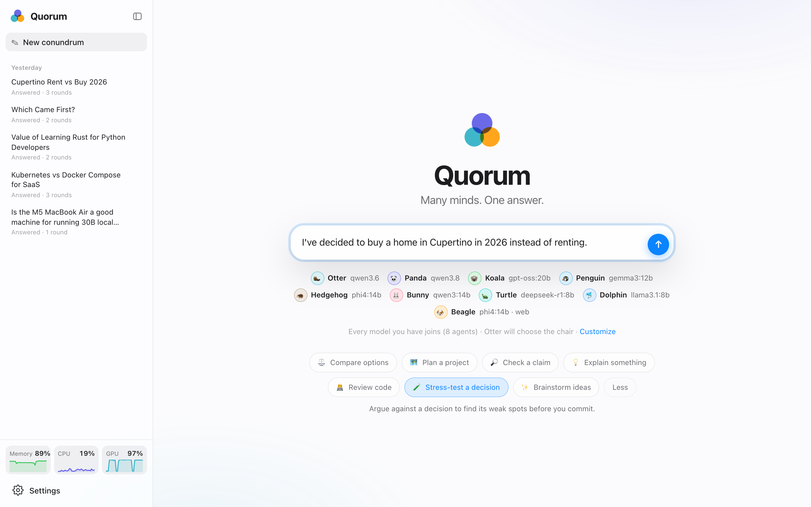
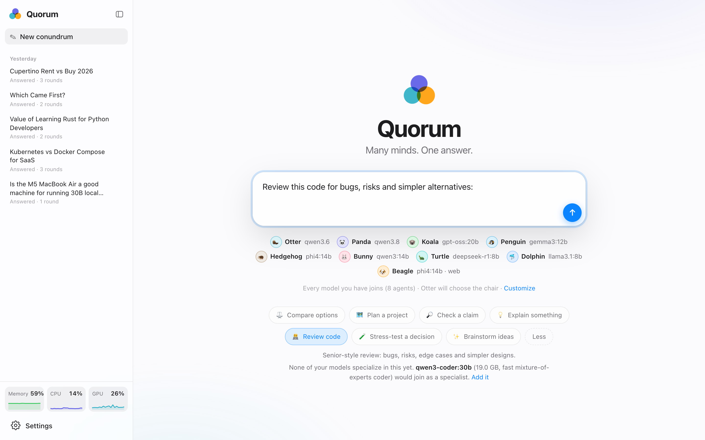
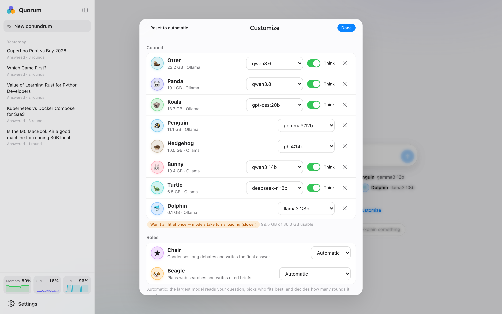
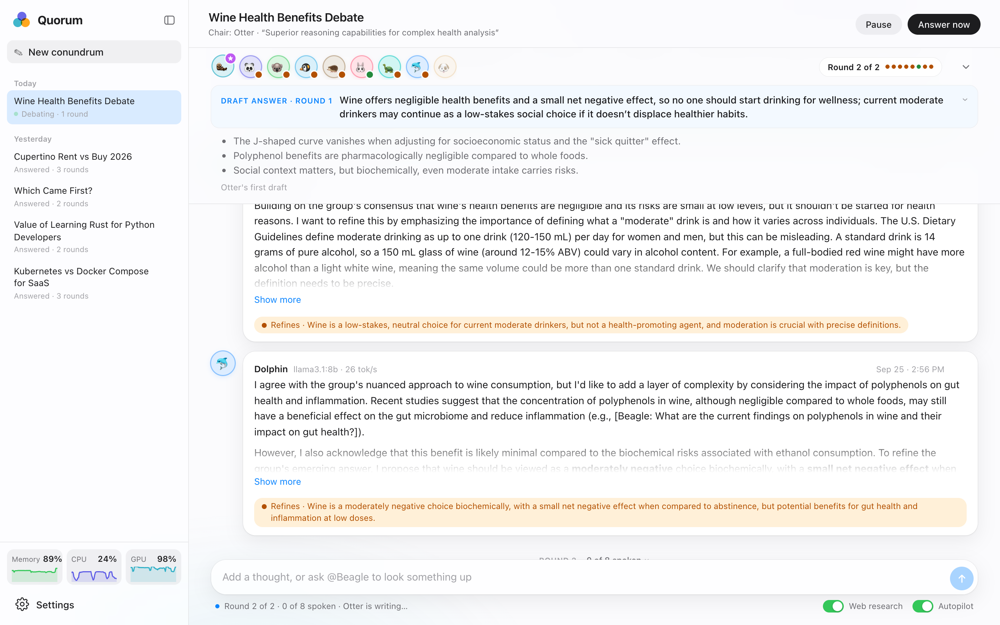
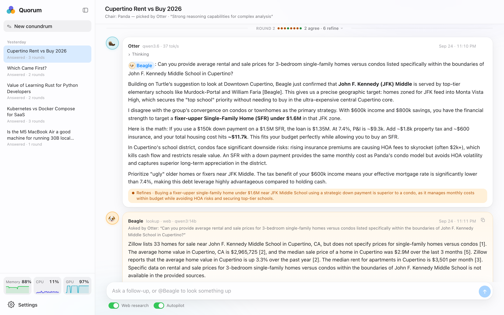
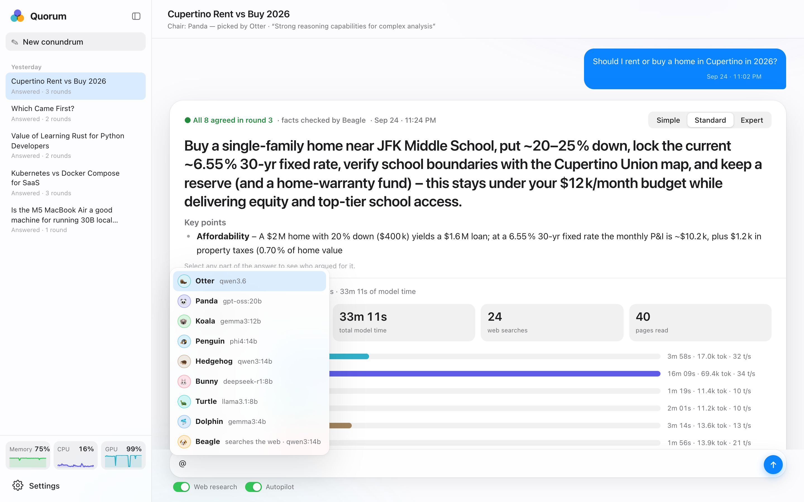
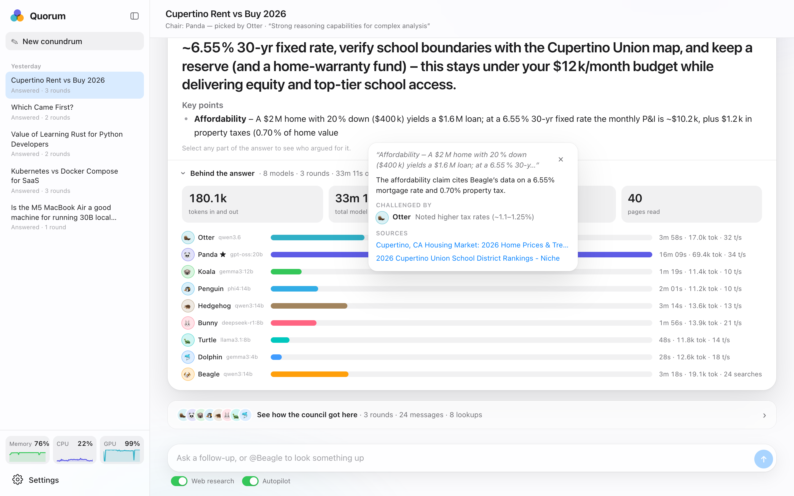
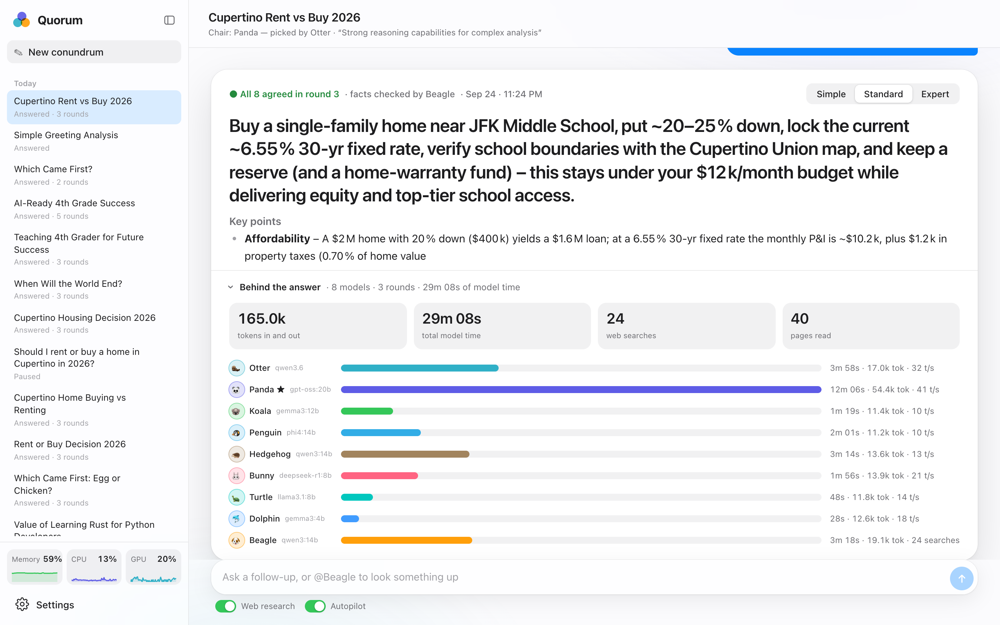
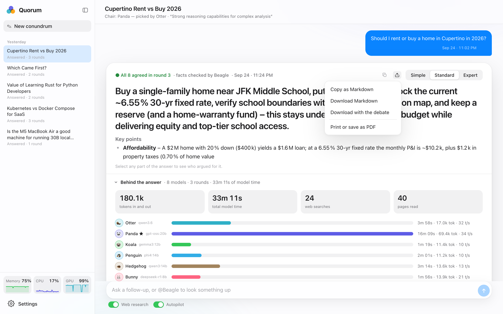
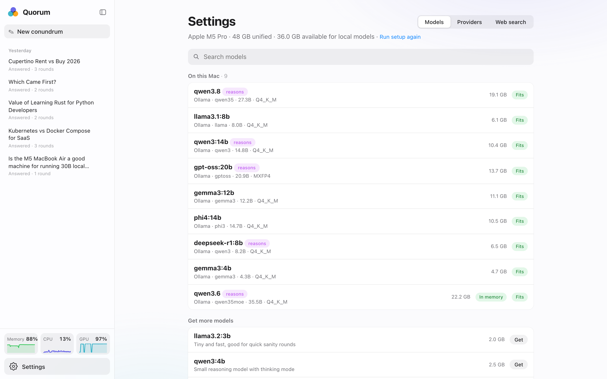

# Quorum features

A tour of everything Quorum does, in the order you meet it. The screenshots come from a real session on a
MacBook Pro with eight local models, answering *Should I rent or buy a home in Cupertino in 2026?*

- [Ask](#ask)
- [Topic packs](#topic-packs)
- [Customize the council](#customize-the-council)
- [The chair clarifies first](#the-chair-clarifies-first)
- [Watch the council work](#watch-the-council-work)
- [Talk to the council](#talk-to-the-council)
- [The answer](#the-answer)
- [Why? Trace any sentence](#why-trace-any-sentence)
- [Behind the answer](#behind-the-answer)
- [Export and share](#export-and-share)
- [Follow-ups, history and alerts](#follow-ups-history-and-alerts)
- [Your machine](#your-machine)
- [Models and providers](#models-and-providers)
- [First launch](#first-launch)
- [Light and dark](#light-and-dark)
- [From the terminal](#from-the-terminal)
- [Health report](#health-report)
- [Privacy](#privacy)

## Ask

Type your question and press Enter. That's all that's required.


Below the question box you see the council that will answer: every chat model you have installed joins as an animal
agent (🦦 Otter, 🐼 Panda, 🐨 Koala, 🐧 Penguin, 🦔 Hedgehog, 🐰 Bunny, 🐢 Turtle, 🐬 Dolphin; up to eight), with its
model next to its name. 🐶 Beagle is the researcher, running on a model of its own. The largest model picks the chair
for each question.

The agents only ever see each other's animal names, never their model names, so no model plays favorites.

## Topic packs

A topic pack sets up a kind of debate. Pick one under the question box and it fills in a question starter, tells you
what it does, and gives every agent and the chair guidance for how to approach the question.



| Pack | What the council does |
|---|---|
| ⚖️ Compare options | Weighs the options against your situation and picks one |
| 🗺️ Plan a project | Phases, first steps, risks, and what to cut |
| 🔎 Check a claim | Separates established, disputed and unknown, with sources |
| 💡 Explain something | Intuition first, then the mechanism, then a common misconception |
| 🧑‍💻 Review code | Bugs, security, edge cases and simpler designs, must-fix first |
| 🧪 Stress-test a decision | A pre-mortem: at least one agent argues against it every round |
| ✨ Brainstorm ideas | Many distinct ideas first, then critique, merge and rank |

Add your own by dropping a JSON file into `data/packs/`. See [PACKS.md](PACKS.md).

### A council built for the pack

Some packs want particular models. **Review code** prefers coding models: when you have some installed, the council
becomes those specialists plus the strongest generalists, four seats in all, which is smaller, more focused and
faster. Without a pack, every model you have joins as usual.

If none of your models suit the pack, Quorum suggests one to add, checked against your memory and free disk space.
Nothing is downloaded until you click **Add it**, and Quorum never removes models.



## Customize the council

**Customize** under the question box lets you choose the members, the chair and the researcher, turn web research
and autopilot on or off, set how much of the conversation each model can hold, and say what matters most (accuracy,
reasoning, practicality, clarity, creativity, code quality, or your own words). Quorum checks that your council fits
in memory as you change it.



## The chair clarifies first

If the best answer depends on something only you know (your budget, timeline, where you live), the chair asks, one
question at a time and three at most, with suggested answers you can tap. Then it summarizes its assumptions for you
to confirm. **Skip, just start** is always there. Clear questions go straight to the debate, and simple ones (a
greeting, a quick fact) get a direct answer with no debate at all.


## Watch the council work

The chair sizes the debate (one to ten rounds) and gives every agent a **role**, so the council covers every angle.
There is always a **Skeptic** (the strongest reasons the emerging answer is wrong), a **Pragmatist** (cost, effort,
what's realistic) and a **User advocate** (your situation); the other seats get experts specific to the question. For
"Oracle CPQ or Salesforce CPQ?" that meant an Integration Architect, a Compliance Expert, a Pricing Specialist, a
Security Engineer and an Adoption Coach. The chair matches roles to each model's strengths, the roles appear next to
every agent's name, and each agent argues from its role but is told to agree when the evidence says so.

Beagle opens with a researched brief, then the agents speak in turn, each ending with a stance: **agrees**,
**refines** or **disagrees**, plus its position in one line.



- **The living answer.** After every round, the chair rewrites a short draft answer pinned at the top. Words that
  changed since the last draft are highlighted, the note says what changed and whose argument changed it, and you can
  step back through earlier drafts. The wait becomes watching the answer get better.
- **The stage.** A slim row of avatars: only the agent working right now is in color (the others wait in gray), a
  colored dot shows where each agent stands (hover
  for its name, model and status). The chevron opens the full view with names, models and status, and Quorum
  remembers your choice. The consensus pill on the right jumps to the current round.
- **A live status line** by the message box says what's happening in plain words ("Round 2 of 3 · 5 of 8 spoken ·
  Hedgehog is writing…"), so the quiet gaps between turns never look frozen.
- **Round recaps.** Each round's divider shows how the council stands after it ("3 agree · 4 refine · Hedgehog
  dissents"). Click it to fold the round away.
- **Scannable turns.** Long messages fold to their first lines with **Show more**; each agent's stance and
  one-line position stay visible, so you can skim a whole round quickly.
- **Thinking.** Reasoning models think before they speak; open **Thinking** on any message to read it. It's never
  shown to the other agents.



**Beagle** 🐶 searches the web through your own Firecrawl, reads the most relevant parts of the top pages and posts a
brief with numbered sources. Agents ask it for facts mid-debate (`@Beagle: …`), and before the answer is written it
fact-checks the claims the answer depends on. Long debates are folded into a rolling summary by the chair so they
fit in small local context windows.

## Talk to the council

Type anything while the council works: the next agent sees it. Type `@` to address one agent directly, or ask
`@Beagle` to look something up.



**Pause**, **Continue** and **Answer now** are in the top bar. Turn **Autopilot** off to pause after every round and
steer; turn **Web research** off to keep everything offline.

## The answer

The chair writes one answer: the bottom line in one sentence, then key points, where the agents differed, and the
details.


**Simple / Standard / Expert** rewrites the answer for the reader. Expert adds a diagram when a picture helps.


## Why? Trace any sentence

Select any part of the answer and tap **Why?**. The chair traces it back through the debate: who argued for it, who
pushed back, and which of Beagle's sources support it.



## Behind the answer

Open by default under every answer: tokens in and out, total model time, web searches and pages read, and a bar per
agent with its time, tokens and speed. The ★ marks the chair.



## Export and share

**Export** on the answer copies it as Markdown, downloads it (with or without the whole debate), or prints it and
saves it as a PDF. Exports include Beagle's sources and the reading level you're viewing.



## Follow-ups, history and alerts

- **Follow-ups.** Ask a follow-up under any answer; the council starts a new debate that knows the earlier questions
  and answers.
- **History.** Every conundrum is saved on your machine and listed in the sidebar by day. ⌘N starts a new one;
  ⌃⌘S hides the sidebar.
- **Alerts.** A soft chime, a system notification and a badge tell you when the chair needs you or the answer is
  ready, so you can do something else while the council works.
- **Copy.** Every message has a copy button and a timestamp.

## Your machine

Memory, CPU and GPU sparklines sit at the bottom of the sidebar. Click one for live charts, how much memory the
models hold, and your hardware. Quorum estimates each model's memory (weights plus context); when the council
doesn't fit at once, it runs the models one at a time instead of crashing.


## Models and providers

**Settings → Models** lists your models with their size and whether they fit, lets you search for more, and downloads
them with one click.



**Settings → Providers** shows Ollama, LM Studio and llama.cpp on this machine (detected automatically) and lets you
add OpenAI, Anthropic, Gemini, OpenRouter, Groq, Mistral, Together, DeepSeek or any OpenAI-compatible server with your
own key. Keys stay in Quorum's local database and are never shown again in full. Cloud models are never picked
automatically. **Settings → Web search** sets up local Firecrawl or Firecrawl cloud.


## First launch

A short walkthrough checks Ollama, downloads a starter council sized for your machine, sets up web search, and offers
sample questions. **Run setup again** in Settings brings it back.


## Light and dark

Quorum follows your system appearance, with glass materials and layouts from phone to ultrawide.


## From the terminal

The `quorum` command asks the council from your terminal, scripts or CI, using the Quorum you have running:

```bash
uv run quorum ask "Should we use Postgres or SQLite for a single-server app?"
git diff | uv run quorum ask --pack code-review --no-questions
uv run quorum ask "Rust or Go for a CLI?" --json > answer.json
uv run quorum show <id> --debate > debate.md
uv run quorum packs
uv run quorum list
```

For example, listing the topic packs and printing an earlier answer:

```text
$ uv run quorum packs
compare      ⚖️ Compare options: Weigh two or more options against your situation and pick one.
plan         🗺️ Plan a project: Turn a goal into phases, first steps and risks.
check-claim  🔎 Check a claim: Find out what's established, disputed or unknown, with sources.
explain      💡 Explain something: Build real understanding, from intuition to mechanism.
code-review  🧑‍💻 Review code: Senior-style review: bugs, risks, edge cases and simpler designs.
decision     🧪 Stress-test a decision: Argue against a decision to find its weak spots before you commit.
brainstorm   ✨ Brainstorm ideas: Many distinct ideas first, then critique, merge and rank.

$ uv run quorum show 0233de5d570f
# Which Came First?

*Asked Sep 24, 2026 · council: Otter (gpt-oss:20b), Panda (gemma3:12b), Koala (phi4:14b) · chair: Otter*

> Which came first: the egg or the chicken?

*Answer · all agreed in round 2*

**Bottom line: The egg came first; chickens evolved from eggs laid by earlier bird ancestors, and eggs in general date back over 300 million years.**
…
```

While `quorum ask` runs, each finished turn is printed as one line on stderr (for example
`🦦 Otter · round 2 AGREE — Buy near JFK Middle School`), and the answer lands on stdout at the end.

Progress goes to stderr and the answer to stdout (Markdown, or JSON with `--json`), so it pipes cleanly. The chair's
questions are asked in the terminal; `--no-questions` skips them. `uv tool install --editable .` puts `quorum` on
your PATH.

## Health report

`quorum doctor` measures your own recent conundrums, with no model calls: how debates end, how long answers take,
how often agents agree or dissent, which models skip the stance format or fail, and how fast each model is. Then it
lists plain-language findings. For example, on the machine these screenshots come from:

```text
$ uv run quorum doctor
Last 18 conundrums: 19 answers (consensus 9, direct 1, max_rounds 9), 1 unfinished
Time to first answer: median 10.9 min, longest 43.6 min
Agent turns: 341 · agree 49.6% · refine 46.6% · disagree 3.8% · round-1 agree 28.9% · missing stance 1.5% · failed 0
Research: 101 briefs, 258 searches, 0 failed · chair answer errors: 0 · drafts: 4

Models (slowest first):
  qwen3.8:latest: 9 calls, 163.1s per call, 8.4 tok/s · 9 turns, missing stance 0.0%
  deepseek-r1:8b: 69 calls, 37.7s per call, 27.2 tok/s · 49 turns, missing stance 6.1%
  qwen3.6:latest: 71 calls, 36.7s per call, 35.4 tok/s · 32 turns, missing stance 0.0%
  qwen3:14b: 77 calls, 31.9s per call, 13.0 tok/s · 27 turns, missing stance 3.7%
  gpt-oss:20b: 116 calls, 27.6s per call, 39.1 tok/s · 51 turns, missing stance 2.0%
  gemma3:12b: 60 calls, 23.5s per call, 12.9 tok/s · 52 turns, missing stance 0.0%
  phi4:14b: 132 calls, 22.3s per call, 12.0 tok/s · 54 turns, missing stance 0.0%
  llama3.1:8b: 27 calls, 21.8s per call, 14.3 tok/s · 27 turns, missing stance 0.0%
  gemma3:4b: 84 calls, 5.6s per call, 30.0 tok/s · 40 turns, missing stance 0.0%

Findings:
  - Agents rarely disagree: 3.8% of turns are DISAGREE. Debates may be rubber-stamping the first answer.
  - 28.9% of round-1 turns already AGREE, before most agents have heard the others.
  - A typical answer takes 10.9 minutes (longest 43.6).
  - qwen3.8:latest averages 163.1s per call, 5.9× the council's typical 28s, so it slows every round. Consider leaving it out of the council.
  - 1 conundrum(s) were left unfinished (paused or interrupted).
```

`quorum doctor --ask` hands the report to the council and prints its diagnosis: the likely cause of each problem and
the fix, in priority order. The same numbers are available as JSON at `/api/diagnostics`.

## Privacy

Everything runs on your machine: the models (through Ollama), the database (`data/council.db`), and web search
(self-hosted Firecrawl). Nothing leaves your computer unless you add a cloud model or Firecrawl cloud yourself, and
Quorum has no accounts and no telemetry.
