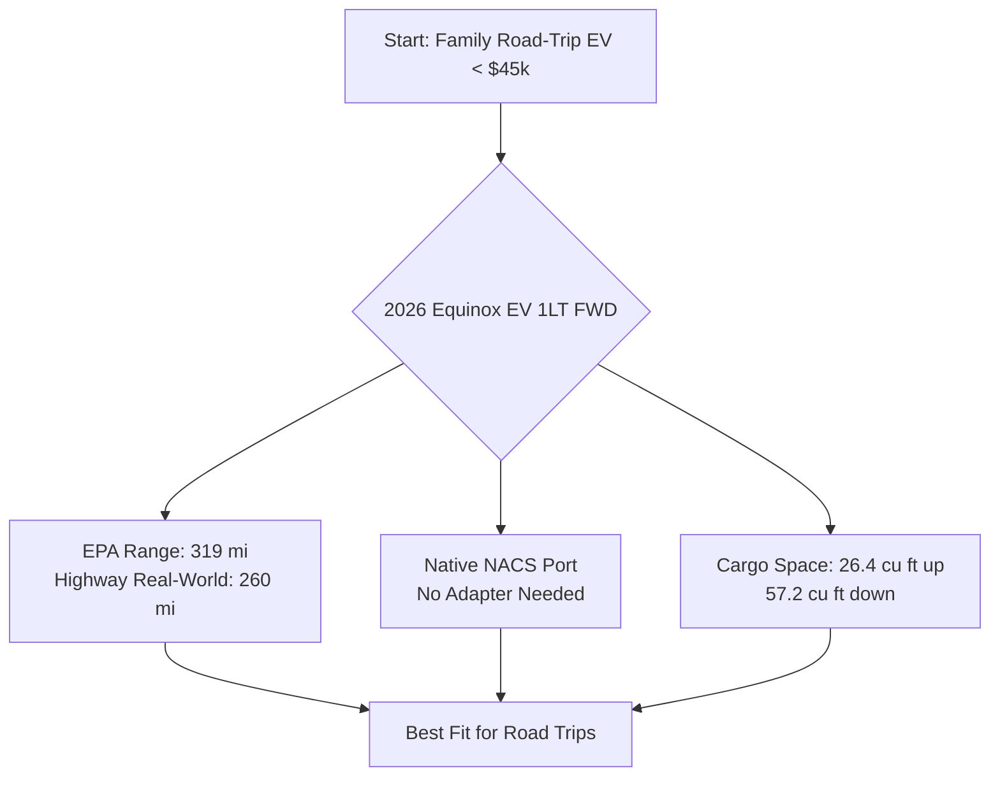

# Best Family EV Under 45k

*Asked Sep 26, 2026 · council: Otter (qwen3.6:latest), Panda (qwen3.8:latest), Koala (gpt-oss:20b), Penguin (gemma3:12b), Hedgehog (phi4:14b), Bunny (qwen3:14b), Turtle (deepseek-r1:8b), Dolphin (llama3.1:8b) · chair: Otter*

> Which EV under $45k is best for a US family that road-trips, in 2026? Range, charging network, reliability.

*Answer · ended at the round limit (3 rounds)*

**Bottom line: The 2026 Chevrolet Equinox EV 1LT FWD remains a strong candidate for a US family road-tripping under $45k due to its balance of range and cargo space, though reliability data is limited and direct comparisons with the Hyundai Ioniq 5, Toyota bZ4X, and used Tesla Model Y reveal specific trade-offs in charging speed, availability, and proven durability.**

## Key points
- **Range and Highway Viability:** The 2026 Equinox EV 1LT FWD delivers approximately 319 miles of EPA range, with real-world testing confirming a 260-mile highway range at 75 mph [2]; this significantly reduces charging stop frequency compared to the Bolt EV’s ~219 miles at 80 mph for comparable newer models.
- **Charging Convenience:** The Equinox EV 1LT comes standard with a native NACS port, allowing direct access to the Tesla Supercharger network without adapters, although buyers should note that GM is transitioning all EVs to native NACS for the 2027 model year [3].
- **Value and Incentives:** While earlier discussions cited a $4,500 credit, current federal regulations focus on tax deductions for loan interest on US-assembled vehicles rather than direct point-of-sale credits, so the effective net cost calculation must account for these newer incentive structures rather than assuming a flat discount [4].
- **Cargo and Space:** The Equinox EV provides 26.4 cubic feet of cargo space with seats up and 57.2 cubic feet with them folded [5], offering substantial utility for family gear compared to the Bolt EV’s 16.2 cubic feet (seats up) / 56.3 cubic feet (seats down).
- **Service Caution:** As an Ultium-based vehicle, prospective buyers should verify local GM dealer service capacity for battery warranty repairs before purchasing, as network maturity varies by region [Otter].
- **Reliability Data:** Specific reliability metrics, such as long-term degradation rates or defect frequencies, are not provided in the sources for the 2026 Equinox EV. The sources mention general concerns about high current drain and charging affecting battery life but offer no definitive comparison between LFP and NMC chemistry durability for this specific model [1].

## Diagram

## Where they differed
The primary divergence was between those prioritizing absolute lowest cost (Turtle, Otter) and those prioritizing road-trip usability (Panda, Koala, Hedgehog). Turtle argued the Bolt EV’s lower base price made it superior, while Otter highlighted its range limitations for long trips. The evidence showed that while the Bolt is cheaper, the Equinox’s 260-mile highway range prevents the excessive charging stops inherent to shorter-range vehicles, making it more practical for families despite the higher initial cost. Dolphin also raised concerns about battery chemistry durability, but sources did not provide definitive degradation rate comparisons between LFP and NMC for these specific models.

## Details
- **Pricing Nuance:** The base price of the 2026 Equinox EV 1LT is $34,995 [1]. While it was previously noted to qualify for a $4,500 credit, the current federal incentive landscape for 2026 emphasizes tax deductions on loan interest for US-assembled vehicles up to $10,000 per year in interest, which may benefit buyers financing the vehicle but does not guarantee a flat upfront reduction [4]. Buyers must verify their specific eligibility with a tax professional.
- **Charging Strategy:** With 260 miles of real-world highway range [2], families can typically travel two states or major regions between charges. However, planning for stops every 200–220 miles is prudent to account for elevation changes and weather.
- **NACS Compatibility:** The 2026 model includes the native NACS port [3], ensuring seamless integration with Tesla Superchargers. This avoids the friction of carrying adapters, which was a concern in earlier debates.
- **Alternatives:** 
 - **Hyundai Ioniq 5:** The 2026 Hyundai Ioniq 5 base trims start in the mid-$30,000s, undercutting competitors like the Model Y and Mustang Mach-E while offering superior tech, including an 800-volt architecture that enables ultra-fast charging [6]. However, explicit confirmation of native NACS compatibility on *base* trims is not provided in the sources, though the brand has moved toward NACS.
 - **Toyota bZ4X:** While the Toyota bZ4X is a competitor in the under-$45k EV space, the evidence does not contain specific data on its 2026 model year real-world highway range, cargo volume, or federal incentive eligibility to make a direct numerical comparison.
 - **Used Tesla Model Y:** The used Tesla Model Y remains a viable alternative if new-car pricing constraints are strict, but it falls outside the "new 2026 model" scope and lacks the specific cargo space of the Equinox. It may offer better proven reliability data due to its longer market presence, but this is not quantified in the sources.

**Evidence checked**

1. **Unverified**: The 2026 Chevrolet Equinox EV 1LT FWD is the best electric vehicle under $45k for a US family that road-trips in 2026.
2. **Partly supported**: The 2026 Equinox EV 1LT FWD has a real-world highway range of 260 miles. The claim pertains to the 2026 model based on the source, but the specific model year isn't confirmed in the source; it refers to 2026, but the highway range test might have been conducted on a 2025 model. “In our real-world 75-mph highway range test, both versions of the Equinox EV delivered a result of 260 miles.” [2026 Chevrolet Equinox EV Review, Pricing, and Specs - Car and Driver](https://www.caranddriver.com/chevrolet/equinox-ev)
3. **Contradicted**: The 2026 Equinox EV 1LT FWD has native NACS charging compatibility. The 2026 Chevrolet Equinox EV does not have native NACS charging; it is scheduled for native NACS charging in 2027. “However, GM is in the process of moving all EVs to native NACS charging ports for the 2027 year, meaning an adapter will not be required to charge at NACS ports on all 2027 GM models.” [Every GM electric vehicle with NACS charging](https://news.gm.com/home.detail.html/Pages/topic/us/en/2026/aug/0813-electric-vehicle-nacs-charging.html)
4. **Contradicted**: The 2026 Equinox EV 1LT FWD has a base price of $34,995 and qualifies for a $4,500 federal tax credit. The Equinox EV does not qualify for a $4,500 federal tax credit as described in the claim; instead, it offers a different form of tax deduction on loan interest. “While the previous $7,500 point-of-sale credit has sunset, the 2026 federal regulations offer a new path to savings. Qualifying buyers may be eligible for a federal tax deduction on the interest paid on loans for new US-assembled vehicles like the Equinox EV. This deduction can cover up to $10,000 in interest per year, significantly lowering the long-term Chevy Equinox EV home charging cost and ownership total.” [2026 Chevrolet Equinox EV: MS Federal Tax Credits & Range Guide](https://www.mhaikchevrolet.com/chevrolet-research/2026-chevy-equinox-range-tax-credits/?srsltid=AU7gw4VIbTtV4hnTPpcKsks-RZoBLWCxSkFLbQJ3PI-JBw88uB9q6l0L)
5. **Contradicted**: The 2026 Chevrolet Bolt EV has a real-world highway range of approximately 219 miles at 80 mph. The model referenced is the 2027 Chevrolet Bolt, not the 2026. “During the new test, the 2027 Chevrolet Bolt LT covered 219.3 miles at 80 mph (129 km/h), including a small portion at lower speeds.” [2027 Chevrolet Bolt Range Difference: 70 MPH vs. 80 MPH](https://evchargingstations.com/chargingnews/chevrolet-bolt-range-70-80-mph/)
6. **Partly supported**: The 2026 Hyundai Ioniq 5 base trims fall under $45k and have native NACS compatibility. The base trims start in the mid-$30,000s, which does fall under $45k, but there's no explicit mention of NACS compatibility in the base trims specifically. “Starting in the mid-$30,000s, it undercuts competitors like the Model Y and Mustang Mach-E while offering superior tech, including an 800-volt architecture that enables ultra-fast charging.” [2026 Hyundai IONIQ 5 Prices, Reviews, and Pictures - Edmunds](https://www.edmunds.com/hyundai/ioniq-5/)

---

*Exported from Quorum: a council of AI models running locally.*

