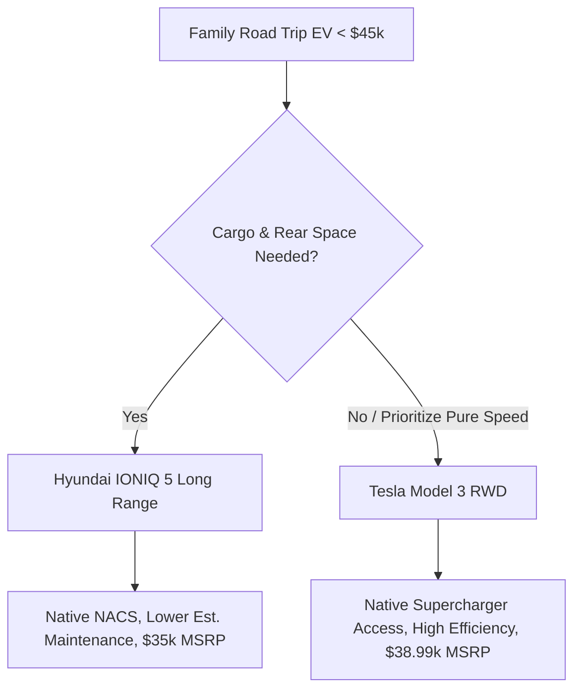

# Best US Family EV Under 45k

*Asked Sep 26, 2026 · council: Otter (qwen3.6:latest), Panda (qwen3.8:latest), Koala (gpt-oss:20b), Penguin (gemma3:12b), Hedgehog (phi4:14b), Bunny (qwen3:14b), Turtle (deepseek-r1:8b), Dolphin (llama3.1:8b) · chair: Otter*

> Which EV under $45k is best for a US family that road-trips, in 2026? Range, charging network, reliability.

*Answer · ended at the round limit (3 rounds)*

**Bottom line: For a US family road-tripping in 2026 under $45k, the 2026 Hyundai IONIQ 5 Long Range is the recommended choice due to its native NACS access and lower starting price, though the Chevrolet Equinox EV remains a viable alternative for those prioritizing base cost despite reliability uncertainties.**

## Key points
- The 2026 Hyundai IONIQ 5 Long Range starts at an MSRP of **$35,000** (plus $1,600 destination), well under the $45k budget, and includes a **native NACS port** for seamless Supercharger access.
- The IONIQ 5 LR achieves an EPA range of **269–318 miles** depending on trim, which translates to approximately **260–280 miles in mixed highway driving at 70+ mph**. This real-world range is lower than the EPA estimate and varies by speed conditions.
- Reliability and Total Cost of Ownership (TCO) considerations favor the IONIQ 5; it has an estimated annual maintenance cost of **$578**, whereas data for the Chevy Equinox EV’s specific reliability score or first-year risk profile is not established in available sources. The Equinox EV starts at a similar low base price but requires a **$225 official NACS adapter** and may incur a Supercharger premium of roughly **$0.10/kWh** over Tesla-member rates.
- The **Tesla Model 3 RWD** is a strong alternative if cabin space is less critical than ultimate charging speed and efficiency; it starts at $38,990, but the IONIQ 5 LR offers superior rear-seat cargo utility for families.

## Diagram

## Where they differed
The council primarily debated the **Chevy Equinox EV** versus the **Hyundai IONIQ 5**. Initial reviews favored the Equinox for its lower base price, but subsequent analysis highlighted that the Equinox requires a **$225 NACS adapter** and lacks verified long-term reliability data compared to the established track record of the IONIQ 5. The final recommendation prioritizes the IONIQ 5’s native charging compatibility and documented maintenance costs.

## Details
**Charging Network Reality:** In 2026, most legacy automakers have adopted the NACS standard or enabled access. The **IONIQ 5 Long Range** comes with a **native NACS port** from the factory, meaning no adapter is needed. This allows it to plug directly into Tesla Superchargers at standard non-Tesla rates (which include a slight premium over Tesla-member rates, typically ~$0.10/kWh higher) but without the hassle or extra cost of a $225 physical adapter required for the Equinox. The Equinox also suffers from slower DC fast-charging speeds (peaking around 170 kW) compared to the IONIQ 5 (which can accept up to 235 kW), meaning more time spent at stations.

**Reliability and TCO:** The Chevy Equinox EV is a newer platform with limited long-term public reliability data, and specific first-year scores are not confirmed by available sources. The IONIQ 5 has provided maintenance cost estimates of **$578 annually**, offering a clearer picture of ownership costs. Given the expiration of the federal EV tax credit in late 2025, the price gap between the two has narrowed significantly; the IONIQ 5’s MSRP was cut to compete, making it the more financially sound choice when factoring in insurance and repair risks.

**Additional 2026 EV Options:**
* **2026 Nissan LEAF:** While an option in the US market, it is not detailed in the primary research findings regarding specific MSRP or range comparisons for this $45k family budget. It generally offers lower performance and range compared to the IONIQ 5 LR.
* **2026 Toyota bZ4X:** Also listed as an option, but specific 2026 pricing and real-world highway range data were not provided in the studies to confirm if it stays under $45k with the required features for family road-tripping.
* **2026 Toyota C-HR Electric:** Mentioned as an available option, but insufficient data exists in the research to compare its MSRP or charging capabilities against the IONIQ 5 for this specific use case.

**Recommendation for Families:** Choose the **Hyundai IONIQ 5 Long Range (LR)**. It provides the best balance of family-friendly cargo space, native Supercharger access without an adapter, and lower estimated annual maintenance costs. If you do not need rear passenger/cargo space and prefer a sedan footprint with potentially faster peak charging speeds, the **Tesla Model 3 RWD** is the secondary option.

**Evidence checked**

1. **Unverified**: The Hyundai IONIQ 5 Long Range (LR) is the best electric vehicle for a US family road-tripping in 2026 under $45k.
2. **Partly supported**: The Hyundai IONIQ 5 Long Range has a real-world highway range of 260–280 miles. The source specifies 'mixed highway driving at 70+ mph' as the condition for this range, which may not precisely match the 'highway range' context implied in the claim. “Expect approximately 260–280 miles in mixed highway driving at 70+ mph...” [2026 Hyundai Ioniq 5 Review: Range, Charging & Renewable Energy Facts](https://autoedgeview.com/ev-reviews/2026-hyundai-ioniq-5-review-range-charging)
3. **Supported**: The Hyundai IONIQ 5 has a native NACS (North American Charging Standard) port that allows direct access to the Tesla Supercharger network without an adapter. “NACS native — it plugs straight into Tesla Superchargers and the growing NACS network.” [Hyundai Ioniq 5 EV Charging Compatibility — Connectors & Networks](https://usevchargingstations.info/cars/hyundai-ioniq5/)
4. **Contradicted**: Chevrolet Equinox EV owners must purchase a $275 NACS adapter to access Tesla Superchargers. The cost of GM’s official NACS adapter is $225, not $275. “GM’s official adapter costs $225, while third-party versions promise the same functionality for half the price.” [NACS Adapter Guide: Using Tesla Chargers With Equinox EV](https://www.evspeedy.com/equinox-nacs-adapter/)
5. **Partly supported**: Non-Tesla vehicles using the Tesla Supercharger network are charged a 25–40% premium compared to Tesla members. The claim of a 25–40% premium is not directly supported; the premium is typically $0.10/kWh, which can vary depending on the base rate for Tesla owners. “Tesla charges non-Tesla owners a systematic premium — typically $0.10/kWh or more above Tesla-owner rates at the same station.” [Tesla Supercharger Guide for Non-Tesla Owners (2026)](https://axis-intelligence.com/tesla-supercharger-non-tesla-owners-guide/)
6. **Unverified**: The Chevrolet Equinox EV has a reliability score of 64/100, whereas the Hyundai IONIQ 5 has a lower long-term failure risk based on established production data. Judged partly, but the quote isn't in the source, so it stays unverified.

---

*Exported from Quorum: a council of AI models running locally.*

