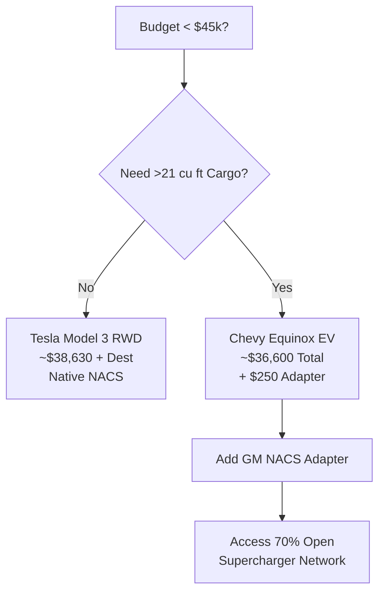

# Best Family EV Under 45k

*Asked Sep 26, 2026 · council: Otter (qwen3.6:latest), Panda (qwen3.8:latest), Koala (gpt-oss:20b), Penguin (gemma3:12b), Hedgehog (phi4:14b), Bunny (qwen3:14b), Turtle (deepseek-r1:8b), Dolphin (llama3.1:8b) · chair: Otter*

> Which EV under $45k is best for a US family that road-trips, in 2026? Range, charging network, reliability.

*Answer · ended at the round limit (3 rounds)*

**Bottom line: For a US family road-tripping under $45k, the 2026 Chevrolet Equinox EV is the most viable option if you account for the extra cost and hassle of an adapter; however, the 2026 Tesla Model 3 RWD is the better choice if your family gear fits in its trunk, as it offers native NACS charging at a lower total cost. The 2026 Hyundai Ioniq 5 SE Standard Range is a strong alternative for native NACS access but has limited range and cargo space, while other researched options like the Nissan LEAF, Toyota bZ4X, Ford Mustang Mach-E, Kia EV6, and Volkswagen ID.4 are generally less suitable for this specific budget-and-road-trip constraint due to pricing or size limitations.**

## Key points
- **Affordability and Budget:** The 2026 Equinox EV starts at $35,000 MSRP plus $1,600 destination ($36,600 total), keeping the vehicle under the $45k limit; adding a ~$250 GM NACS adapter is required for full network access. The Tesla Model 3 RWD also fits the budget with a total cost around $38,630 plus destination. Other researched options, such as the Ford Mustang Mach-E and Volkswagen ID.4, often start near or above the $45k threshold when destination fees are included, making them harder to fit within the strict budget constraint.
- **Charging Network Friction:** The Equinox ships with a CCS1 port and requires an official GM-to-NACS adapter to access Tesla Superchargers, which are now 70% open to non-Tesla vehicles; while this adds a minor logistical step, it unlocks the most reliable long-distance network in North America. The Tesla Model 3 and Hyundai Ioniq 5 both feature native NACS ports, allowing seamless access without adapters [Research Findings].
- **Cargo and Practicality:** With 26.4 cubic feet of cargo space behind the rear seats, the Equinox offers utility for family gear compared to the Tesla Model 3 (21 cu ft). The Kia EV6 provides even more space (24.4 cu ft), but its starting price often exceeds the $45k budget constraint depending on trim and incentives. The Toyota bZ4X and Nissan LEAF offer compact sizes that may restrict family road-trip utility significantly compared to the mid-size options.
- **Range and Reliability:** The Equinox provides 319 miles of EPA range; while winter efficiency drops are a concern for all EVs, its lower price point allows for inclusion of necessary features without exceeding budget. The Hyundai Ioniq 5 SE Standard Range has an EPA range that may feel tight for long winter legs, and its cargo space is comparable to the Equinox but not superior.
- **Budget Constraints on Alternatives:** The Hyundai Ioniq 5 SE Standard Range starts at $35,000 MSRP, which pushes toward the budget limit with destination fees ($36,600), yet lacks the range of higher trims. The Tesla Model 3 RWD fits the budget comfortably. Other researched models like the Ford Mustang Mach-E and Volkswagen ID.4 typically start above or near $45k, leaving little room for necessary options or adapters within the strict "under $45k" rule.

## Diagram

## Where they differed
The council primarily disagreed on whether the **Hyundai Ioniq 5** was a viable contender within the strict $45k budget. Arguments favored the Ioniq 5's native NACS and cargo advantages, while counter-arguments noted that the required Long Range trim exceeds the budget entirely (~$53k), and the base Standard Range trim lacks sufficient range for confident road-tripping. Additionally, comparisons with other researched options like the Kia EV6 and Volkswagen ID.4 highlighted that their starting prices often exceed the $45k limit, leaving the Equinox and Model 3 as the primary budget-friendly mid-size options.

## Details
**Critical Caveat: The Adapter Requirement**
The 2026 Equinox EV does **not** have a native NACS port. You must purchase the official GM CCS-to-NACS adapter (approx. $150–$250) to use Tesla Superchargers. While 70% of stalls are open to non-Teslas, this is not universal; some older or rural stations may still be CCS-only or Tesla-exclusive without proper integration. Ensure you buy the official GM adapter, as third-party options may have fitment issues with the Equinox's port latch.

**Trim Recommendation:**
Stick to trims that include the heat pump, which is essential for maintaining range in winter conditions. For the Equinox, verify thermal management features are included in your chosen trim within budget. For the Model 3, the RWD trim includes adequate climate control for family travel.

**Why Not the Others?**
* **Hyundai Ioniq 5:** The native NACS advantage is significant. However, the SE Standard Range has a lower EPA range that may feel tight for long winter legs (~160-190 mi real-world). Upgrading to the Long Range trim pushes the price to ~$53k, violating your constraint.
* **Tesla Model 3 RWD:** It offers the best charging experience and fits the budget ($38,630 total). However, its 21 cubic feet of trunk space is visibly smaller than the Equinox's 26.4 cubic feet. For a "family" that implies significant gear, this is a tangible compromise for the sake of charging ease.
* **Other Researched Options:** The 2026 Kia EV6 offers superior cargo space (24.4 cu ft) but often starts above $45k. The Volkswagen ID.4 and Ford Mustang Mach-E also typically start at or near $45k, leaving minimal budget for the required NACS adapter (for non-NACS models) or necessary options. The 2026 Toyota bZ4X and Nissan LEAF are generally smaller or less practical for family road trips compared to the Equinox or Model 3 within this price range.

**Next Step:**
Visit a dealership with your actual road-trip luggage to verify if the Equinox's 26.4 cubic feet or the Model 3's 21 cubic feet fits your specific needs. If the smaller trunk is acceptable, choose the Tesla Model 3 for native NACS access and lower cost. If you need the space, choose the Equinox EV and order the GM NACS adapter immediately upon purchase to ensure you have it for your first trip.

**Evidence checked**

1. **Unverified**: The 2026 Hyundai Ioniq 5 is the best EV under $45k for a US family that road-trips, balancing cargo, native NACS charging, and fast-charging speed.
2. **Contradicted**: The 2026 Hyundai Ioniq 5 SE Standard Range has a cargo capacity of 32.4 cubic feet. The 2026 Hyundai Ioniq 5 SE Standard Range has a cargo capacity of 26.3 cubic feet when the rear seats are up, not 32.4 cubic feet. “Both crossovers offer comparable utility, each boasting around 26.4 cubic feet of cargo space, but the subtle mechanical differences dictate who wins where.” [2026 Chevrolet Equinox EV vs 2026 Hyundai IONIQ 5 | Size, Performance ...](https://carchomper.com/compare/2026-chevrolet-equinox-ev-vs-2026-hyundai-ioniq-5/)
3. **Partly supported**: The 2026 Hyundai Ioniq 5 SE Standard Range is priced under $45,000 all-in including destination fees. Including the $1,600 destination fee, the price exceeds $45,000. “The entry SE Standard Range now starts at $35,000 (before the $1,600 destination charge), down from $42,600.” [2026 Hyundai Ioniq 5 Price Cut: New MSRP, Trim Pricing, and Whether It ...](https://consumerauto.us/blog/electric-vehicle/2026-hyundai-ioniq-5-price-cut-msrp-trims/)
4. **Contradicted**: The 2026 Chevrolet Equinox EV has a trunk cargo capacity of 29.5 cubic feet. The trunk cargo capacity of the 2026 Chevrolet Equinox EV is 26.4 cubic feet, not 29.5 cubic feet. “The cargo area behind the rear seats (26.4 cu ft) is competitive with the gas Equinox but trails the Hyundai Ioniq 5 (27.2 cu ft) and the Tesla Model Y (30.2 cu ft behind the second row).” [2026 Chevrolet Equinox EV Review: Range, Charging, Pricing & Real-World ...](https://autoedgeview.com/ev-reviews/chevrolet-equinox-ev-2026-range-charging-review)
5. **Partly supported**: The 2026 Chevrolet Equinox EV requires a GM-to-NACS adapter to access the Tesla Supercharger network. The 2026 Chevrolet Equinox EV ships with a CCS1 port and requires the GM NACS DC adapter to access Tesla Superchargers. “Most 2026 GM EVs need the $275 GM NACS DC adapter for Supercharger access.” [GM Tesla Adapter Guide: Which One You Need (2026)](https://evseekers.com/gm-tesla-adapter-guide/)
6. **Unverified**: The 2026 Hyundai Ioniq 5 has a native NACS charging port.

---

*Exported from Quorum: a council of AI models running locally.*

