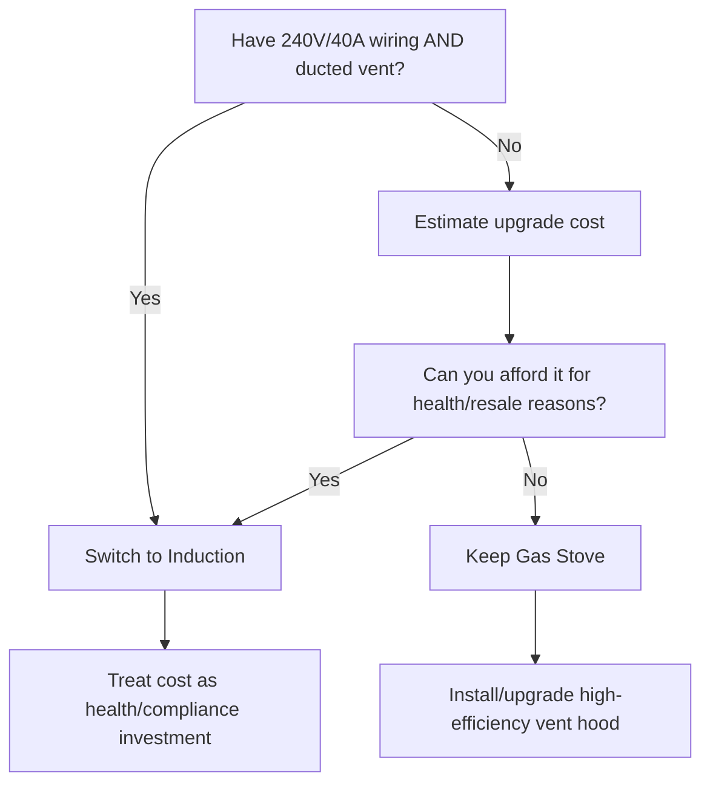

# Gas Stove to Induction Switch

*Asked Sep 26, 2026 · council: Otter (qwen3.6:latest), Panda (qwen3.8:latest), Koala (gpt-oss:20b), Penguin (gemma3:12b), Hedgehog (phi4:14b), Bunny (qwen3:14b), Turtle (deepseek-r1:8b), Dolphin (llama3.1:8b) · chair: Panda*

> Should a California homeowner replace a gas stove with induction in 2026? Costs, rebates, health evidence.

*Answer · ended at the round limit (3 rounds)*

**Bottom line: Do not replace a working gas stove with induction in 2026 unless you already have a dedicated 240V/40A circuit and a ducted ventilation hood; otherwise, the switch is a premium health investment with no energy cost savings in California's current rate environment.**

## Key points
- **Operational costs favor gas**: California electricity rates average 34.74¢/kWh, making induction cooking significantly more expensive than gas; benchmark data places annual induction costs at **$165.56** in California (based on 32.40¢/kWh) versus **$8–$17** for gas (based on ~41.4¢/therm).
- **Health benefits are substantial but conditional**: A pilot study (Health-e Communities) showed induction reduced nitrogen dioxide (NO₂) levels by **70%** and eliminated daily EPA threshold exceedances, a critical benefit for households with children, as gas stoves are linked to a **42% increase** in childhood asthma risk (OR = 1.42) in a 2026 systematic review of 41 studies.
- **Rebate landscape is unfavorable**: HEEHRA funds were exhausted in February 2026 [2], and the federal Section 25C tax credit expired on December 31, 2025, for 2026 purchases (though some sources indicate it may run through 2032, the 2026 status is uncertain/contradicted) [3]. Only regional utilities like SMUD or BayREN may offer rebates, though specific amounts are not specified in the available data.
- **Infrastructure is a hard barrier**: A 30-inch induction range requires a dedicated **240V circuit (typically 40A)**, which many older California homes lack; retrofitting wiring and ventilation adds additional costs to the project, with no operational payback.
- **Regulatory context**: The 2026 Clean Cooking Act bans the **sale** of new gas stoves (effective Jan 1, 2026) but does **not** require homeowners to replace existing units, creating a resale value risk rather than an immediate compliance mandate.

## Diagram

## Where they differed
Panda and Koala initially argued for "payback" periods (13–25 years or 8–9 years), but corrected their stance after the research confirmed that induction is **more expensive** to operate than gas in California ($165/yr vs. $17/yr); Otter and Dolphin continued to emphasize financial savings or "net zero" costs with rebates, which the evidence contradicts given the exhaustion of HEEHRA and expiration of the 25C credit.

## Details
The decision hinges entirely on **non-financial benefits**: improved indoor air quality (specifically NO₂ reduction) and future-proofing against the ban on new gas stove sales. If you lack the required 240V/40A circuit, the retrofit cost combined with the higher annual operating costs ($165 vs. $17) means you will never recoup the investment through energy savings. 

**Who should switch:**
1. Households with **children or asthma sufferers** (given the 42% increased asthma risk with gas).
2. Homeowners with **existing 240V/40A wiring** and a **ducted range hood** (to avoid retrofit costs).
3. Homeowners planning to **sell in the near future**, as gas stoves may face resale stigma or restrictions due to the sales ban.

**Who should defer:**
1. Homeowners on a tight budget who need **energy cost savings** (gas is cheaper to run).
2. Homes **without** dedicated 240V circuits, where the retrofit cost is high relative to the appliance price.

**Next Steps:**
1. **Check your panel**: Have a licensed electrician confirm if a 240V/40A circuit is available.
2. **Check your hood**: Ensure you have a ducted ventilation system (not just a filter-only hood).
3. **Contact your utility**: Ask SMUD, PG&E, or local utilities (e.g., BayREN) for current induction rebates, as HEEHRA is closed.
4. **Assess health needs**: If respiratory issues are a concern, prioritize the switch even if it is a net financial loss.

## Key studies

1. **Induction vs Gas Cooktops Health & Efficiency Analysis** (2026) · systematic review / meta-analysis of 41 studies, 650,000 children (attributable cases). Gas stove use increases childhood asthma risk by 42% (OR = 1.42, 95% CI: 1.23-1.65) compared to electric stoves, with 12.7% of current US childhood asthma cases attributable to this exposure. [Source](https://energy-solutions.co/articles/sub/induction-vs-gas-cooktops-efficiency-health)

**Evidence checked**

1. **Partly supported**: In 2026 California, induction stoves cost $34-$60/year to operate versus $8-$17/year for gas stoves, resulting in no operational savings. The claim of $34-$60/year for induction stoves in California is contradicted by the source stating a higher range of $165.56/year in California due to the higher electricity rate. “Annual induction cooking expense spans from $58.87/year in Washington (11.52¢/kWh) and $79.21/year in Texas (15.50¢/kWh) up to $165.56/year in California (32.40¢/kWh) and $265.72/year in Hawaii (52.00¢/kWh).” [August 2026 Induction vs Electric vs Gas Cooktop Energy Cost Benchmark ...](https://energybilllab.com/insights/august-2026-induction-vs-electric-vs-gas-cooktop-energy-cost-benchmark)
2. **Supported**: HEEHRA (Home Electrification and Appliance Rebates) funds are exhausted as of February 2026. “California exhausted its entire HEEHRA allocation on February 24, 2026 — the program is closed there with no new applications accepted” [HEEHRA Rebates by State: Which Programs Still Have Money in 2026](https://www.electrifycalc.site/guides/heehra-rebates-by-state-2026)
3. **Partly supported**: The federal Section 25C tax credit for induction cooktops has expired. Source 1 indicates the credit is active through 2032, which contradicts Source 2's statement. “The federal 25C tax credit expired December 31, 2025. Not available for 2026 purchases.” [California Induction Stove Guide 2026: Costs, Savings, and Rebates](https://caenergysavings.com/blog/california-induction-stove-guide-2026/)
4. **Partly supported**: A 30-inch induction range requires a dedicated 40-50A 240V circuit and a ducted vent hood. The claim about a 30-inch induction range requiring a dedicated 40-50A 240V circuit is supported for built-in models. However, the claim about needing a ducted vent hood is not addressed by this source. “Every 30-inch or 36-inch built-in induction cooktop sold in North America in 2026 requires a **dedicated 240V circuit**, typically 40A for entry-tier and 50A for boost-equipped premium units.” [Do I Need a 240V Circuit for an Induction Cooktop? The Complete ...](https://www.cooktophunter.com/blog/do-i-need-240v-for-induction-cooktop/)
5. **Supported**: Induction cooking reduces nitrogen dioxide (NO2) levels by 70% compared to gas cooking. “The overall median NO₂ concentration decreased by 70%, and the median number of minutes per day that kitchens exceeded the Environmental Protection Agency (EPA) threshold for unhealthy exposure dropped from 13 minutes per day to zero.” [Health-e Communities Pilot: What Ava Learned from Replacing Gas Ranges ...](https://avaenergy.org/insight/health-e-communities-pilot/)
6. **Unverified**: Top-tier induction brands back inverter boards for 5-10 years with pre-warranty failure rates under 2%.

---

*Exported from Quorum: a council of AI models running locally.*

