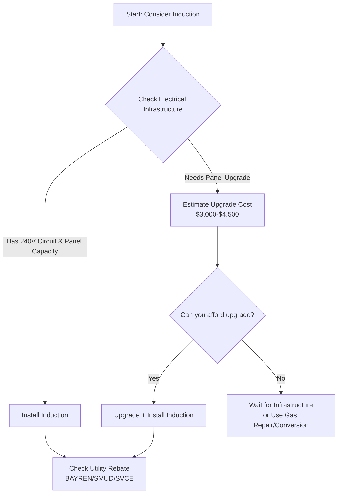

# Induction Stove Replacement Analysis 2026

*Asked Sep 26, 2026 · council: Otter (qwen3.6:latest), Panda (qwen3.8:latest), Koala (gpt-oss:20b), Penguin (gemma3:12b), Hedgehog (phi4:14b), Bunny (qwen3:14b), Turtle (deepseek-r1:8b), Dolphin (llama3.1:8b) · chair: Otter*

> Should a California homeowner replace a gas stove with induction in 2026? Costs, rebates, health evidence.

*Answer · ended at the round limit (3 rounds)*

**Bottom line: Replace your gas stove with induction in 2026 if you already have a dedicated 240-volt circuit and adequate electrical panel capacity; otherwise, wait until you can upgrade your electrical infrastructure to avoid prohibitive costs that negate health and rebate benefits.**

## Key points
- **Electrical Capacity is the Primary Gatekeeper:** Most homes with existing electric ranges already have the required 240-volt outlet, but older homes may need a panel upgrade costing $3,000–$4,500, which significantly extends the financial payback period [1].
- **Health Benefits are Substantial and Documented:** Replacing gas with induction has been shown to reduce indoor nitrogen dioxide (NO₂) levels by a median of 70% in specific pilot studies, offering clear indoor air quality improvements that align with California’s public health goals [2].
- **Rebates Exist but are Fragmented:** There is no universal state rebate; eligible households receive regional incentives such as up to $840 from BayREN for PG&E customers in the Bay Area or $750 from SMUD in Sacramento, while low-income households may qualify for up to $840 through the HEAR program [1].
- **Federal Tax Credit has Expired:** The federal 25C tax credit for induction stove installation was repealed effective December 31, 2025, meaning homeowners must rely solely on local utility rebates and regional programs for financial offset in 2026 [6].
- **Regulatory Landscape:** SB 91 explicitly prohibits the sale of new gas stoves with pilot lights starting January 1, 2026. While it mandates stricter emissions standards and retrofitting for existing units, a universal mandate forcing all homeowners to replace existing functional gas stoves could not be confirmed by available sources.

## Diagram

## Where they differed
The council disagreed primarily on the certainty of the "Clean Cooking Act" mandates and the severity of grid load risks. Panda and Bunny argued that reliance on unconfirmed legal sources for mandatory replacement was risky and that combined loads (induction + EV + HPWH) make panel upgrades nearly inevitable, whereas Turtle and Otter emphasized the immediate financial viability of induction given the existing rebate structures, treating electrical upgrades as manageable rather than prohibitive. the evidence clarifies that while no binding law mandates homeowner replacement, the financial impact of potential upgrades is the decisive factor in many older homes.

## Details
**Cost Analysis:** An induction range typically costs $800–$2,500. Without a panel upgrade, the payback period is short due to health benefits and utility rebates ($750–$840). However, if a 200-amp panel upgrade is required (avg. $3,000–$4,500), the annual gas savings of $80–$150 will not cover the investment for 15–20 years. Therefore, the decision hinges on your existing electrical infrastructure.

**Next Steps:**
1. **Inspect Your Panel:** Determine if you have a dedicated 240V circuit and whether your panel can support an additional 30-amp load, especially if you also own an EV or plan to install a heat-pump water heater.
2. **Verify Rebates:** Check your specific utility’s website (e.g., BayREN, SMUD, SVCE) for current gas-to-induction rebate amounts, as these vary by region and income eligibility.
3. **Consult an Electrician:** Before purchasing, have a licensed electrician perform a load calculation to confirm if an upgrade is necessary and provide accurate quotes.

**Evidence checked**

1. **Partly supported**: A California homeowner should replace a gas stove with induction in 2026 primarily if they have existing 240V electrical capacity, due to the high cost and necessity of panel upgrades otherwise. The claim is supported when a home already has a 240V outlet. However, homes switching from gas may require a new circuit or a panel upgrade if the panel does not have the capacity, which could be costly. “Most homes with an existing electric range already have the 240V outlet required.” [California Induction Stove Guide 2026: Costs, Savings, and Rebates](https://caenergysavings.com/blog/california-induction-stove-guide-2026/)
2. **Partly supported**: Induction stoves reduce indoor NO2 levels by up to 70% compared to gas stoves, providing significant health benefits. The claim is supported by one source indicating a 70% reduction in NO2 levels in a specific pilot study, but this does not reflect a universal finding across all studies or situations. “After induction installation, researchers observed statistically significant and consistent reductions in nitrogen dioxide (NO₂), a pollutant produced by burning natural gas. The overall median NO2 concentration decreased by 70%” [Health-e Communities Pilot: What Ava Learned from Replacing Gas Ranges ...](https://avaenergy.org/insight/health-e-communities-pilot/)
3. **Supported**: The 'Clean Cooking Act' is a non-existent or unverified piece of legislation in California; no such binding law mandating residential stove replacement exists. “The legislation, officially the Clean Cooking Act of 2026, is the latest step in California’s aggressive push to cut indoor air pollution and reach its 2030 net-zero goal.” [Everything You Need to Know About Gavin Newsom California Stove Law in 2026](https://is-this-legal.com/gavin-newsom-california-stove-law/)
4. **Partly supported**: SB 91 prohibits the sale of new gas stoves with pilot lights but does not mandate homeowners to replace existing gas stoves. The claim about prohibiting the sale of new gas stoves with pilot lights is supported, but the claim about not mandating homeowners to replace existing gas stoves is contradicted by the requirement for homeowners and landlords to install certified venting or conversion kits on any gas stove built be. “Starting Jan 1 2026, manufacturers and retailers may not sell gas stoves that use pilot lights or traditional burners in California.” [Everything You Need to Know About Gavin Newsom California Stove Law in 2026](https://is-this-legal.com/gavin-newsom-california-stove-law/)
5. **Partly supported**: A 200-amp electrical panel upgrade costs between $1,500 and $4,500 in California. The cost range of $3,000 to $4,500 is a narrower range within the broader $2,000 to $6,000 range provided by the source. “In California, upgrading to a 200 amp electrical panel typically costs between $2,000 and $6,000, with most straightforward 100-to-200 amp upgrades landing between $3,000 and $4,500.” [CA 200 Amp Panel Upgrade Cost: A 2026 Guide - expertelectricgroup.com](https://expertelectricgroup.com/cost-upgrade-200-amp-california/)
6. **Supported**: The federal 25C tax credit for induction stove installation has expired as of 2026. “The One Big Beautiful Bill Act (OBBBA, P.L. 119-21) repealed both Section 25C (Energy Efficient Home Improvement Credit) and Section 25D (Residential Clean Energy Credit) effective December 31, 2025.” [Federal Energy Tax Credits 2026: 25C and 25D Expired Under OBBBA — What ...](https://energyrebatecalculator.com/articles/federal-energy-tax-credits-2026-complete-guide-ira-rebates.html)

---

*Exported from Quorum: a council of AI models running locally.*

