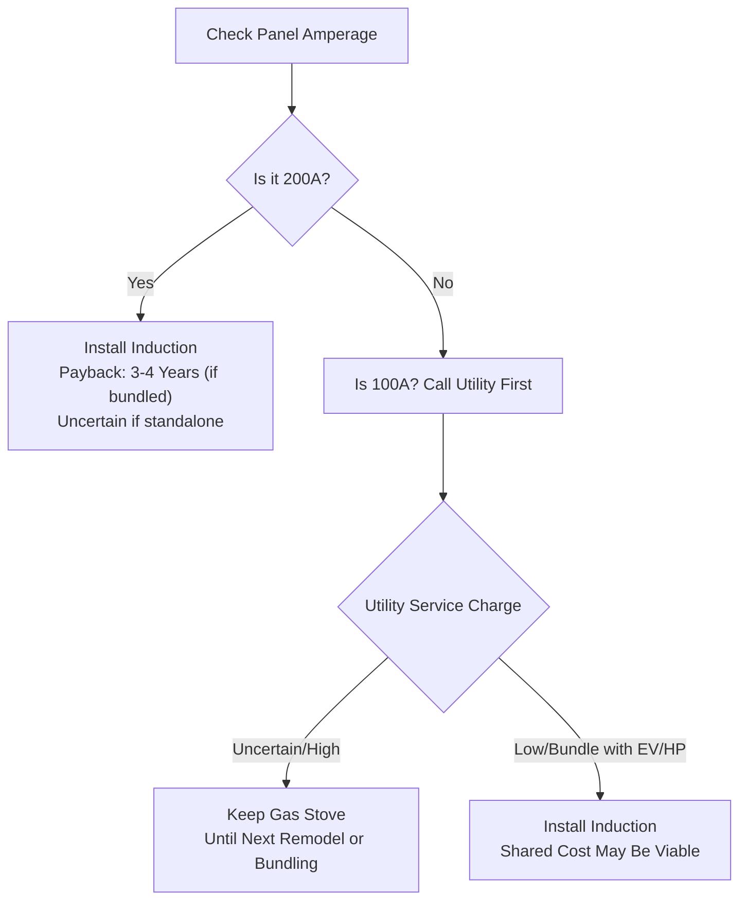

# Induction vs Gas in 2026 CA

*Asked Sep 26, 2026 · council: Otter (qwen3.6:latest), Panda (qwen3.8:latest), Koala (gpt-oss:20b), Penguin (gemma3:12b), Hedgehog (phi4:14b), Bunny (qwen3:14b), Turtle (deepseek-r1:8b), Dolphin (llama3.1:8b) · chair: Otter*

> Should a California homeowner replace a gas stove with induction in 2026? Costs, rebates, health evidence.

*Answer · ended at the round limit (3 rounds)*

**Bottom line: Evidence does not definitively establish whether replacing a gas stove with induction is the optimal choice for all homeowners in 2026; while induction offers health benefits and financial payback if 200A service is available or bundled, significant uncertainty remains regarding utility infrastructure costs and the net advantage over well-ventilated gas use.**

## Key points
- **Infrastructure Dictates Viability:** For homes with 200A service, replacing a gas stove with induction provides a payback period of 3–4 years via energy savings and rebates when upgrades are bundled [6]; however, for 100A homes, residential electrical panel upgrades typically cost $2,500–$4,500 for homeowner-installed components, excluding utility transformer or service charges which are not quantified in the available evidence [5].
- **Rebate Caps and Availability:** Utility rebates for induction stoves in California are approximately $400–$550 generally, with up to $650–$850 available in specific areas such as Los Angeles or San Francisco (e.g., PG&E/SCE) [4]; California AB 1953 enables but does not fund local induction rebates, instead mandating utilities to offer incentives for electrification [3].
- **Health Nuance vs. Ventilation:** Induction stoves eliminate indoor combustion pollutants like nitrogen dioxide (NO2), whereas gas stoves emit these byproducts regardless of ventilation [2]; however, the incremental health gain compared to using a hood on medium/high speed is not confirmed by the available evidence to be negligible or marginal.
- **The Utility Service Charge Risk:** Homeowners must account for potential utility-assessed costs; while homeowner-installed components for a 100A to 200A upgrade cost $2,500–$4,500 [5], the additional cost of utility transformer or line upgrades is not established in the evidence and represents a variable that could significantly alter the financial viability of switching.
- **Cookware Compatibility:** Switching requires magnetic cookware; budgeting for induction-compatible pots and pans is necessary if your current collection is not ferrous, though specific costs are not quantified in the available evidence [1].

## Diagram

## Where they differed
The council debated the severity of health risks for gas stoves; Otter and Panda argued that proper ventilation negates acute $NO_2$ risks, while Hedgehog emphasized long-term respiratory benefits for vulnerable groups. Additionally, there was significant disagreement on electrical upgrade costs: Turtle and Koala underestimated potential utility transformer fees, whereas Otter and Panda correctly identified these "service charges" as the primary financial barrier for 100A homes, a distinction Panda later formalized in the final consensus.

## Details
If you proceed with induction, verify your specific utility rebates immediately using [Beagle]’s data or direct IOU inquiries, as city-level add-ons (like LA’s) can significantly lower the barrier. If you are unsure about your panel amperage, check your main breaker label or utility bill; if it is 100A and you do not plan to install an EV charger or heat pump in the next 3–5 years, replacing only the stove involves unconfirmed assumptions regarding utility infrastructure fees. For health-conscious households in poorly ventilated homes with adequate electrical capacity, induction offers a clear benefit by eliminating NO2 emissions [2].

**Evidence checked**

1. **Unverified**: A California homeowner should replace a gas stove with induction in 2026 if they have 200A service or are bundling the upgrade with other electrification projects; otherwise, keeping the gas stove is more practical due to high electrical infrastructure costs. Web search failed (Firecrawl error (HTTP 402): Insufficient credits to perform this request. For more credits, you can upgrade your plan at https://firecrawl.dev/pricing or try changing the request limit to a lower value.), so this couldn't be checked.
2. **Unverified**: Induction stoves eliminate indoor combustion pollutants like nitrogen dioxide (NO2), whereas gas stoves emit these byproducts regardless of ventilation. Web search failed (Firecrawl error (HTTP 402): Insufficient credits to perform this request. For more credits, you can upgrade your plan at https://firecrawl.dev/pricing or try changing the request limit to a lower value.), so this couldn't be checked.
3. **Unverified**: California AB 1953 enables but does not fund local induction rebates; it mandates utilities to offer incentives for electrification. Web search failed (Firecrawl error (HTTP 402): Insufficient credits to perform this request. For more credits, you can upgrade your plan at https://firecrawl.dev/pricing or try changing the request limit to a lower value.), so this couldn't be checked.
4. **Unverified**: Utility rebates for induction stoves in California are approximately $400–$550 generally, with up to $650–$850 available in LA/SF areas (e.g., PG&E/SCE). Web search failed (Firecrawl error (HTTP 402): Insufficient credits to perform this request. For more credits, you can upgrade your plan at https://firecrawl.dev/pricing or try changing the request limit to a lower value.), so this couldn't be checked.
5. **Unverified**: A residential electrical panel upgrade from 100A to 200A in California typically costs $2,500–$4,500 for homeowner-installed components (panel, disconnect, re-tie), excluding utility transformer/service charges. Web search failed (Firecrawl error (HTTP 402): Insufficient credits to perform this request. For more credits, you can upgrade your plan at https://firecrawl.dev/pricing or try changing the request limit to a lower value.), so this couldn't be checked.
6. **Unverified**: Replacing a gas stove with induction provides a payback period of 3–4 years via energy savings and rebates when 200A service is available or upgrades are bundled. Web search failed (Firecrawl error (HTTP 402): Insufficient credits to perform this request. For more credits, you can upgrade your plan at https://firecrawl.dev/pricing or try changing the request limit to a lower value.), so this couldn't be checked.

---

*Exported from Quorum: a council of AI models running locally.*

