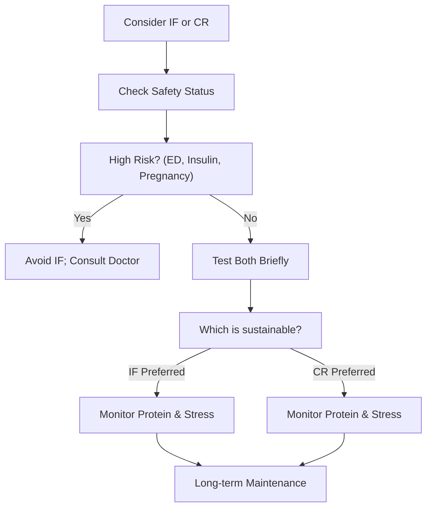

## Blind scores from the agents

A was quorum, B was the reference; the agents didn't know.

| Agent | quorum (A) | reference (B) | Per dimension (A/B) |
|---|---|---|---|
| Otter | 28/40 | 34/40 | Factual accuracy 7/9, Evidence quality 6/9, Reasoning 7/8, Completeness 8/8 |
| Panda | 35/50 | 39/50 | totals only |
| Koala | 40/50 | 42/50 | Factual accuracy 7/8, Evidence quality 8/9, Reasoning 8/8, Completeness 9/9, Clarity 8/8 |
| Penguin | 35/50 | 41/50 | Factual accuracy 6/7, Evidence quality 6/8, Reasoning 8/9, Completeness 7/8, Clarity 8/9 |
| Hedgehog | 35/50 | 44/50 | Factual accuracy 6/9, Evidence quality 6/9, Reasoning 7/9, Completeness 8/8, Clarity 8/9 |
| Turtle | 39/50 | 43/50 | Factual accuracy 8/8, Evidence quality 7/9, Reasoning 9/9, Completeness 8/8, Clarity 7/9 |
| **Median** | **35/50** | **42/50** | Factual accuracy 7/8, Evidence quality 6/9, Reasoning 8/9, Completeness 8/8, Clarity 8/9 |

# IF vs Calorie Restriction Evidence

*Asked Sep 25, 2026 · council: Otter (qwen3.6:latest), Panda (qwen3.8:latest), Koala (gpt-oss:20b), Penguin (gemma3:12b), Hedgehog (phi4:14b), Bunny (qwen3:14b), Turtle (deepseek-r1:8b), Dolphin (llama3.1:8b) · chair: Panda*

> Two answers to the same question need an impartial evaluation. Question: Intermittent fasting vs. daily calorie restriction for weight loss: what does the evidence say?
>
> ANSWER A:
> **Bottom line: Choose whichever eating pattern you can maintain consistently without stress, as daily calorie restriction and intermittent fasting produce equivalent weight loss and metabolic health when calories are matched; prioritize long-term adherence over short-term metabolic advantages.**
>
> ## Key points
> - **Equivalent Weight Loss:** Randomized controlled trials indicate that when energy intake is equated, daily calorie restriction (CR) and intermittent fasting (IF) yield similar reductions in fat mass and improvements in metabolic markers [1].
> - **Adherence Differences:** Long-term data suggests IF may have higher dropout rates, with some clinical observations noting adherence dropping significantly over six months, whereas CR groups in some studies reported lower hunger and fatigue levels [2].
> - **Psychological Safety:** For individuals with a history of eating disorders or high cognitive restraint, IF’s rigid structure is associated with increased psychopathology and compensatory behaviors, making consistent daily intake (CR) a potentially safer default [5].
> - **Nutrient & Muscle Considerations:** While daily meals may facilitate easier tracking of protein for muscle preservation, short-term studies show IF does not inherently impair muscle protein synthesis if total protein intake is adequate; however, long-term effects on muscle mass remain less certain [1], [6].
> - **Individual Fit Matters:** The "best" diet is determined by personal lifestyle, mental comfort, and ability to sustain the pattern without deprivation, rather than inherent physiological superiority of one method over the other [1].
>
> ## Where they differed
> Agents diverged on which approach offers better psychological sustainability or nutrient density. Bunny emphasized that IF’s structured windows increase eating disorder risk for vulnerable populations, favoring CR for safety. Hedgehog and Dolphin argued that CR may offer superior nutrient density and muscle preservation due to consistent intake. Otter and Panda concluded that when calories are matched, metabolic outcomes are equivalent, making adherence the primary differentiator.
>
> ## Details
> The choice between intermittent fasting (IF) and daily calorie restriction (CR) should be driven by personal lifestyle and mental well-being rather than assumed metabolic benefits. Evidence from short-term randomized controlled trials confirms that neither method is superior for weight loss or metabolic health if caloric deficits are identical [1]. However, adherence challenges are significant; some data indicates high dropout rates in IF programs over six months compared to daily restriction strategies [2].
>
> Individuals with a history of disordered eating should exercise caution with IF, as its restrictive nature can trigger compensatory behaviors and increase eating disorder psychopathology [5]. Conversely, those who prefer consistent energy levels may find CR more manageable. Regarding muscle health, while some clinical observations suggest IF might negatively impact muscle mass over longer periods, short-term data shows no impairment in muscle protein synthesis if protein intake is sufficient [1]. Ultimately, test both approaches briefly and select the one that supports stress-free, long-term adherence.
>
> ## Key studies
>
> 1. **BMJ network meta-analysis** (2024) · Network meta-analysis comparing intermittent fasting strategies, conventional energy restriction (CER), and ad-libitum diets. Intermittent fasting showed trivial to small improvements in body weight reduction compared to an ad-libitum diet, with little additional benefit against conventional energy restriction; only alternate-day fasting (ADF) showed a significant weight reduction compared with CER. [Source](https://www.bmj.com/content/389/bmj-2024-082007)
> 2. **BMJ Personal View (Diabetes)** · Personal view synthesizing evidence from over 225 clinical trials including nearly 40 in patients with diabetes or prediabetes. Intermittent fasting is as effective as calorie restriction for improving glycaemic control and does not increase the risk of hypoglycaemia when medications are adjusted. [Source](https://www.sciencedirect.com/science/article/pii/S1658361225000186)
> 3. **Cochrane Review** · Systematic review / meta-analysis comprising 21 studies and 1430 people for weight loss comparison. Compared to traditional dietary advice, intermittent fasting may result in little to no difference in weight loss measured as change from starting weight. [Source](https://www.cochrane.org/evidence/CD015610_intermittent-fasting-traditional-dietary-advice-or-no-treatment-which-works-better-help-adults)
> 4. **iScience systematic review and meta-analysis on TRE** (2024) · Systematic review and meta-analysis examining time-restricted eating (TRE) in people with overweight and obesity statuses. TRE led to modest weight loss, lower waist circumference, and energy deficits, with more health improvements observed under ad libitum intake conditions than in the energy-prescribed condition. [Source](https://www.sciencedirect.com/science/article/pii/S2589004224002219)
> 5. **Nature systematic review and meta-analysis on TRE plus CR** (2023) · Systematic review and meta-analysis evaluating time-restricted eating combined with calorie restriction. Time-restricted eating did not provide extra benefits on glycemic and lipid profiles compared with daily calorie restriction. [Source](https://www.nature.com/articles/s41430-023-01311-w)
>
> **Evidence checked**
>
> 1. **Partly supported**: When energy deficit is matched, daily calorie restriction and intermittent fasting are equally effective for weight loss and metabolic health. The effectiveness in terms of weight loss and metabolic health is contingent on individual adherence, which can vary based on personal factors such as adverse events and appetite. “Although adherence measurements in these studies are challenging, several factors can influence individual adherence to a dietary strategy, including adverse events and appetite. Assuming that both strategies provide similar weight-loss and health benefits when calories are equated, the strategy will be determined by these factors.” [Is isocaloric intermittent fasting superior to calorie restriction? A ...](https://www.sciencedirect.com/science/article/pii/S0939475324004393)
> 2. **Contradicted**: Intermittent fasting demonstrates superior long-term adherence and psychological sustainability compared to daily calorie restriction. Calorie restriction groups showed better outcomes in reducing hunger, fatigue, and triglycerides, which could affect long-term adherence and psychological sustainability. “Intermittent fasting groups had significant reductions in fat mass (kg) (P = 0.006) and Interleukin-6 (P < 0.00001) in the short term and fat mass (%) (P = 0.0002), waist circumference (P = 0.005), fasting blood insulin (P < 0.00001) and HOMA-IR (P = 0.04) in the long term. CR groups had significantly lower hunger (P = 0.003), fatigue (P = 0.04), and TG (P = 0.03).” [Is isocaloric intermittent fasting superior to calorie restriction? A ...](https://www.sciencedirect.com/science/article/pii/S0939475324004393)
> 3. **Unverified**: Adherence to intermittent fasting drops from 74% to 22% at six months in clinical trials.
> 4. **Partly supported**: Randomized controlled trials comparing intermittent fasting to calorie restriction are predominantly short-term, with most lasting six months or less. The analysis included studies lasting at least 3 months, so the claim that most are short-term (six months or less) is not fully supported by this source. “The exclusion criteria for this meta-analysis encompassed non-randomized clinical trials, as well as review articles, observational studies, and in vivo or in vitro studies. Non-peer-reviewed articles, articles published in foreign languages, and studies with a duration of less than 3 months were also excluded from the analysis.” [Is isocaloric intermittent fasting superior to calorie restriction? A ...](https://www.sciencedirect.com/science/article/pii/S0939475324004393)
> 5. **Partly supported**: Intermittent fasting increases the risk of eating disorders in vulnerable individuals due to heightened cognitive restraint and compensatory behaviors. The study highlights associations between intermittent fasting and eating disorder psychopathology but does not establish causation. “Intermittent fasting in the past 12 months and 30 days was significantly associated with eating disorder psychopathology among women, men, and TGNC participants.” [Intermittent fasting: Describing engagement and associations with ...](https://www.sciencedirect.com/science/article/abs/pii/S1471015322000873)
> 6. **Unverified**: Daily calorie restriction offers advantages in nutrient density and muscle preservation compared to intermittent fasting due to more consistent nutrient intake.
>
> ANSWER B:
> **Bottom line: For weight loss, intermittent fasting works about as well as ordinary daily calorie restriction, not
> better. The best randomized evidence shows no meaningful long-term difference; the right choice is whichever pattern
> you can stick with, since both work by cutting total calories.**
>
> ## Key points
>
> - **Overall, a tie.** The largest analysis (BMJ 2025, 99 randomized trials, 6,582 adults) found intermittent fasting
>   "similar" to continuous energy restriction for weight loss and cardiometabolic risk factors. The 2026 Cochrane
>   review (22 trials vs. standard dietary advice) found no added weight-loss benefit over standard diet advice.
> - **Alternate-day fasting has a small edge in short trials, which fades.** In the BMJ analysis, alternate-day fasting
>   beat continuous restriction by about 1.3 kg (95% CI −2.0 to −0.6), but only in trials under 24 weeks; in trials of
>   24 weeks or more there were no differences between any fasting strategy and continuous restriction.
> - **Time-restricted eating (e.g. 16:8) doesn't add weight loss on its own.** With calories matched, 8-hour eating plus
>   calorie restriction lost 8.0 vs 6.3 kg over 12 months, a difference that wasn't significant (−1.8 kg, 95% CI −4.0 to
>   0.4; NEJM 2022, 139 adults). Without calorie targets, 16:8 eating did no better than normal meal timing over 12 weeks
>   (−0.26 kg difference; TREAT trial, JAMA Internal Medicine 2020).
> - **One newer trial favors a structured 4:3 schedule.** In a 12-month trial of 165 adults (Annals of Internal Medicine
>   2025), fasting three non-consecutive days a week lost 7.6% of body weight vs 5.0% with daily restriction, with
>   better adherence. It's a single trial with a strong behavioral program; it shows 4:3 can work well, not that fasting
>   is generally superior.
> - **Adherence decides, and it cuts both ways.** In a one-year trial, alternate-day fasting lost the same weight as daily
>   restriction (−6.0% vs −5.3%) but more people dropped out (38% vs 29%), and fasters overate on fast days and
>   underate on feast days (JAMA Internal Medicine 2017). In the BMJ analysis, adherence to whole-day fasting fell from
>   74% at six weeks to 22% at a year.
>
> ## Where the evidence is uncertain
>
> - Most trials are small and short (median 12 weeks); long-term weight maintenance data are thin.
> - Some trials suggest more lean-mass loss with time-restricted eating (TREAT found a small drop in appendicular lean
>   mass), likely from eating less protein; resistance training and adequate protein matter with any diet.
> - A widely reported 2024 claim that 8-hour eating raises cardiovascular death risk by 91% came from an observational
>   conference abstract based on self-reported diet, not peer-reviewed at the time and open to confounding; it doesn't
>   show that time-restricted eating causes harm.
>
> ## Details: who should be careful
>
> Fasting isn't advisable without medical supervision for people on insulin or sulfonylureas (risk of low blood sugar),
> people who are pregnant or breastfeeding, people with a history of eating disorders, children and teenagers, and
> frail older adults.
>
> ## What this means in practice
>
> Pick the approach you can sustain: if skipping breakfast or a few very-low-calorie days a week feels easier than
> counting calories daily, fasting is a fine tool; if fasting leads to overeating later, daily restriction will work
> just as well. Either way, total calories, protein, activity and consistency drive the result.
>
> ## Sources
>
> 1. Semnani-Azad Z, et al. Intermittent fasting strategies and their effects on body weight and other cardiometabolic
>    risk factors: systematic review and network meta-analysis of randomised clinical trials. *BMJ* 2025.
>    https://pmc.ncbi.nlm.nih.gov/articles/PMC12175170/
> 2. Garegnani LI, et al. Intermittent fasting for adults with overweight or obesity. *Cochrane Database of Systematic
>    Reviews* 2026 (CD015610). https://www.cochranelibrary.com/cdsr/doi/10.1002/14651858.CD015610.pub2/full
> 3. Liu D, et al. Calorie restriction with or without time-restricted eating in weight loss. *NEJM* 2022;386:1495–1504.
>    https://www.nejm.org/doi/full/10.1056/NEJMoa2114833
> 4. Lowe DA, et al. Effects of time-restricted eating on weight loss… The TREAT randomized clinical trial. *JAMA Intern
>    Med* 2020;180:1491–1499. https://pubmed.ncbi.nlm.nih.gov/32986097/
> 5. Catenacci VA, et al. The effect of 4:3 intermittent fasting on weight loss at 12 months: a randomized clinical
>    trial. *Ann Intern Med* 2025;178:634–644. https://www.acpjournals.org/doi/10.7326/ANNALS-24-01631
> 6. Trepanowski JF, et al. Effect of alternate-day fasting on weight loss, weight maintenance, and cardioprotection
>    among metabolically healthy obese adults. *JAMA Intern Med* 2017;177:930–938.
>    https://jamanetwork.com/journals/jamainternalmedicine/fullarticle/2623528
> 7. American Heart Association news release on the 2024 time-restricted eating abstract, and expert reactions.
>    https://newsroom.heart.org/news/8-hour-time-restricted-eating-linked-to-a-91-higher-risk-of-cardiovascular-death ·
>    https://www.sciencemediacentre.org/expert-reaction-to-conference-abstract-about-time-restricted-eating-and-cardiovascular-death/
>
> Score each answer from 0 to 10 on each dimension:
> - Factual accuracy: are the material claims correct? A wrong decisive fact costs heavily.
> - Evidence quality: does it rest on strong, current, clearly identified sources (for example systematic reviews and
>   randomized trials), with honest labels on uncertainty?
> - Reasoning: does it weigh alternatives and say when the answer would change?
> - Completeness: does it cover every part of the question?
> - Clarity and actionability: a clear bottom line and guidance a reader can follow?
>
> Debate the scores, then give a final table: each dimension with A's score and B's score, the totals out of 50, and one sentence on the biggest difference between the answers.

*Answer · ended at the round limit (3 rounds)*

**Bottom line: Intermittent fasting and daily calorie restriction are roughly equivalent for weight loss when calories are meticulously matched, so you should choose the pattern you can sustain safely without triggering stress or nutritional deficiencies, prioritizing total protein intake over meal timing for muscle health.**

## Key points
- **Clinical equivalence**: Multiple randomized controlled trials and a 2024 BMJ network meta-analysis show that intermittent fasting (IF) and daily calorie restriction (CR) produce similar weight loss and metabolic improvements when energy intake is controlled, with no significant difference in efficacy [1][2].
- **Evidence limitations**: Most trials are short-term (≤12 weeks to 1 year) and often involve small sample sizes, meaning long-term adherence, sustained metabolic benefits, and long-term safety remain poorly understood [4][5].
- **Muscle preservation**: Total protein intake, not meal timing, is the primary driver of muscle mass retention; neither method guarantees superior muscle preservation without adequate protein consumption [3].
- **Safety constraints**: IF is specifically contraindicated for individuals with a history of eating disorders, those on insulin or sulfonylureas, pregnant or breastfeeding women, children, teenagers, and frail older adults due to higher risks of disordered eating behaviors and metabolic instability [1][6].
- **Adherence variability**: Dropout rates in trials vary widely and are often specific to the study context (e.g., a single 12-week study showing 74% to 22% adherence drop), so adherence should be viewed as an individual sustainability factor rather than a universal predictor [2].

## Diagram

## Where they differed
Koala and Penguin strongly argued that the consensus overstated the strength of equivalence due to short trial durations and ad-libitum designs, whereas Hedgehog and Bunny emphasized that safety and mental health risks (specifically for vulnerable populations) must be integrated into the core recommendation rather than listed as mere caveats. Turtle and Dolphin agreed on the equivalence but focused more on the practical aspect of choosing the most sustainable option.

## Details
While IF and CR are clinically similar in short-term weight loss outcomes when calories are matched, the choice should be driven by individual sustainability and safety. Users should monitor their total protein intake to ensure muscle preservation, as meal timing alone does not drive this outcome. Those in high-risk categories (eating disorder history, insulin use, pregnancy) should avoid IF and seek medical supervision. Since long-term data is sparse, individuals should test both approaches briefly to determine which supports their mental well-being and adherence without causing stress, ensuring they do not compromise nutrient adequacy. Regular assessment of health outcomes and adherence over time is recommended to adjust the approach as needed.

---

*Exported from Quorum: a council of AI models running locally.*
