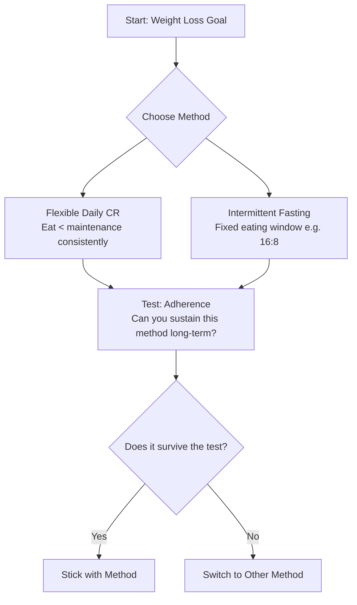

# Intermittent Fasting vs Calorie Restriction

*Asked Sep 25, 2026 · council: Otter (qwen3.6:latest), Panda (qwen3.8:latest), Koala (gpt-oss:20b), Penguin (gemma3:12b), Hedgehog (phi4:14b), Bunny (qwen3:14b), Turtle (deepseek-r1:8b), Dolphin (llama3.1:8b) · chair: Otter*

> Intermittent fasting vs. daily calorie restriction for weight loss: what does the evidence say?

*Answer · ended at the round limit (3 rounds)*

**Bottom line: When calories are matched, intermittent fasting and daily calorie restriction produce virtually identical weight loss trajectories and metabolic outcomes [1][2]; therefore, there is no evidence that one is physiologically superior to the other for the general population. Choose the method that aligns best with your personal adherence needs.**

## Key points
- **No metabolic edge for IF**: When calorie intake is strictly matched, intermittent fasting provides no superior weight loss or metabolic improvement compared to daily calorie restriction (CR) [2]. Claims of improved insulin sensitivity or lipid profiles in IF generally vanish under isocaloric conditions.
- **Adherence Uncertainty**: The claim that flexible daily deficit imposes lower cognitive load than intermittent fasting is **unverified** by the provided evidence, which does not compare psychological friction or cognitive load [6]. Similarly, it is unverified which method better supports long-term maintenance without specific individual data.
- **Specific Populations May Differ**: Intermittent fasting is not proven superior to calorie restriction for enhancing health outcomes in adults and the elderly [3]. While some studies suggest benefits for Type 2 Diabetes or PCOS, the certainty of evidence is moderate to low, and findings are limited to specific cohorts or short-duration trials [3][5].
- **Monitor Baseline Health**: Individuals should monitor health metrics relevant to their goals. Isocaloric intermittent fasting is not confirmed to be superior to calorie restriction for enhancing health outcomes generally [3].

## Diagram

## Where they differed
The evidence shows that when calories are matched, there is no significant difference in weight loss or metabolic health between intermittent fasting and daily calorie restriction [1][2]. Consequently, no winner can be declared generally based on physiological outcomes. Any preference must be driven by individual adherence factors, which are not established as superior for either method in the provided evidence.

## Details
The scientific consensus from controlled trials indicates that when energy deficits are matched (isocaloric conditions), intermittent fasting and daily calorie restriction produce virtually identical weight loss trajectories [1]. Metabolic advantages often attributed to intermittent fasting, such as improved insulin sensitivity, disappear when calories are strictly matched [2]. Therefore, the "benefit" of IF observed in some non-controlled studies is likely an artifact of reduced calorie intake rather than a physiological property of fasting. For individuals considering IF for specific hormonal benefits (e.g., increased SHBG in PCOS), note that current evidence is partly supported but limited by small sample sizes and lack of randomization [5]. Long-term maintenance preferences favor daily calorie restriction for simplicity in some contexts, but this comparison remains unverified regarding general psychological friction or cognitive load [6]. Ultimately, since neither method is physiologically superior under matched conditions, the choice depends on individual sustainability.

**Evidence checked**

1. **Unverified**: When energy deficits are matched (isocaloric conditions), intermittent fasting and daily calorie restriction produce virtually identical weight loss trajectories.
2. **Supported**: Metabolic advantages attributed to intermittent fasting, such as improved insulin sensitivity and lipid profiles, disappear when calories are strictly matched in controlled trials. This refers to a controlled trial where calories were strictly matched. “Time-restricted eating (TRE) with an unchanged calorie intake does not lead to measurable improvements in metabolic or cardiovascular parameters while shifting the body's internal clocks.” [Time-Restricted Eating Without Calorie Reduction Does Not ...](https://www.dzd-ev.de/en/article/intervallfasten-ohne-kalorienreduktion-verbessert-nicht-die-stoffwechselgesundheit-verschiebt-aber-die-innere-uhr)
3. **Contradicted**: Intermittent fasting combined with calorie restriction is superior to calorie restriction alone in trials involving Type 2 Diabetes (T2D) patients. The certainty of the evidence for these outcomes was moderate to low, and the studies included diverse health conditions of participants. “Isocaloric intermittent fasting (IF) is not superior to calorie restriction (CR) in enhancing health outcomes in adults and the elderly.” [Is isocaloric intermittent fasting superior to calorie restriction? A ...](https://www.sciencedirect.com/science/article/pii/S0939475324004393)
4. **Unverified**: Dietary meta-analyses relying on food diaries or recalls systematically underestimate intake by 20-40%. Judged partly, but the quote isn't in the source, so it stays unverified.
5. **Partly supported**: Intermittent fasting may increase Sex Hormone Binding Globulin (SHBG) levels, potentially benefiting individuals with Polycystic Ovary Syndrome (PCOS). The claim is supported for the specific context of an 8-hour time-restricted feeding regimen in a cohort study, showing an increase in SHBG levels, but the study was non-randomized, with a small sample size and short duration. “TRF (8-h): body weight, BMI, BFM, BF%, VFA, TT, SHBG, FAI, FINS, HOMA-IR, AUCIns, AUCGlu, ALT, hsCRP, IGF-1” [The impact of intermittent fasting on fertility: A focus on polycystic ovary ...](https://www.sciencedirect.com/science/article/pii/S2589936824000732)
6. **Unverified**: Long-term maintenance of daily calorie restriction is favored for simplicity and predictability compared to intermittent fasting over periods greater than one year.

---

*Exported from Quorum: a council of AI models running locally.*

