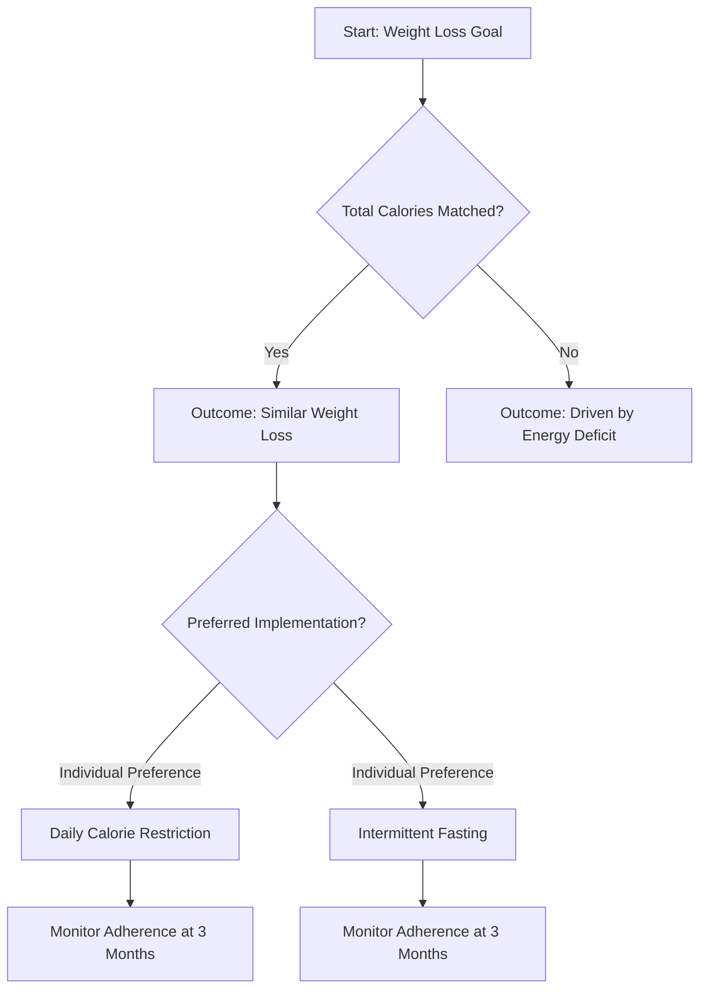

# Fasting vs Calorie Restriction Evidence

*Asked Sep 25, 2026 · council: Otter (qwen3.6:latest), Panda (qwen3.8:latest), Koala (gpt-oss:20b), Penguin (gemma3:12b), Hedgehog (phi4:14b), Bunny (qwen3:14b), Turtle (deepseek-r1:8b), Dolphin (llama3.1:8b) · chair: Otter*

> Intermittent fasting vs. daily calorie restriction for weight loss: what does the evidence say?

*Answer · ended at the round limit (3 rounds)*

**Bottom line: Evidence does not support prioritizing daily calorie restriction over intermittent fasting for long-term weight management; matched-calorie studies show comparable weight loss and no superior metabolic benefits from either approach, with adherence depending on individual preference rather than established superiority of one method.**

## Key points
- **Weight loss equivalence**: Large systematic reviews and meta-analyses confirm that isocalic (matched-calorie) intermittent fasting and daily calorie restriction produce comparable weight loss outcomes, indicating that the timing of food intake matters less than total energy deficit for fat reduction [1].
- **No metabolic edge for fasting**: Rigorous analyses demonstrate that time-restricted eating does not provide superior improvements in glycemic control, lipid profiles, or insulin sensitivity compared to daily calorie restriction when calories are equal; any observed benefits are primarily driven by weight loss itself rather than the fasting window [1].
- **Adherence and sustainability**: Current evidence is inconclusive regarding which approach yields better long-term adherence. While some meta-analyses suggest Alternative Fasting Days may have better compliance rates, other data indicates that the best approach depends on individual adherence rather than one being universally superior [6][1].
- **Uncertain psychological impact**: It remains unverified whether intermittent fasting significantly increases hunger and fatigue levels compared to daily calorie restriction. Evidence regarding dropout rates is also lacking or inconclusive beyond 12 months, meaning claims about higher attrition or specific psychological strain are uncertain rather than established facts [4][5].
- **Lack of long-term data**: There is currently insufficient high-quality data comparing adherence rates beyond 12 months for either approach, meaning recommendations for long-term sustainability are largely extrapolated from shorter-term trials and population-level behavioral patterns.

## Diagram

## Where they differed
Panda, Penguin, and Turtle emphasized daily calorie restriction due to lower implementation costs, better adherence potential, and reduced psychological strain. Koala and Dolphin argued that intermittent fasting may still hold value for specific subgroups (e.g., those with insulin resistance or portion-control difficulties), while Hedgehog noted that both methods require careful planning for nutrient density. The primary divergence was whether IF offers any unique metabolic or practical advantages beyond weight loss, which the evidence largely refutes in favor of CR's safety and flexibility.

## Details
The consensus leans heavily toward daily calorie restriction as the more reliable and safer intervention for the general population. While intermittent fasting is an effective tool for some, particularly those who find rigid structures helpful for portion control, it does not offer superior health outcomes when calories are equated. Clinicians and individuals should prioritize sustainability and psychological well-being over perceived metabolic shortcuts. If choosing intermittent fasting, it is crucial to pair it with a rough calorie target to ensure the energy deficit holds and to monitor for signs of excessive hunger or disordered eating patterns. Reassessment at three months is critical regardless of the chosen method to determine long-term viability.

## Key studies

1. **Intermittent fasting strategies and their effects on body weight... BMJ network meta-analysis** · network meta-analysis of randomised clinical trials, Adults with overweight or obesity (specific count not stated) participants. Alternate-day fasting showed a reduction in weight when compared with continuous energy restriction (CER), while other intermittent fasting strategies showed little additional benefit against CER. [Source](https://www.bmj.com/content/389/bmj-2024-082007)
2. **Evaluation of the effectiveness of intermittent fasting versus caloric restriction... ScienceDirect systematic review** · systematic review and meta-analysis, Not stated participants. The provided text excerpts indicate intermittent fasting may be as effective as calorie restriction for weight loss but does not provide a specific quantitative finding in the snippet. [Source](https://www.sciencedirect.com/science/article/pii/S1658361225000186)
3. **Cochrane Review: Intermittent fasting, traditional dietary advice or no treatment** · systematic review / meta-analysis (21 studies), 1430 people in the comparison against traditional dietary advice participants. Intermittent fasting may result in little to no difference in weight loss compared to traditional dietary advice. [Source](https://www.cochrane.org/evidence/CD015610_intermittent-fasting-traditional-dietary-advice-or-no-treatment-which-works-better-help-adults)

**Evidence checked**

1. **Partly supported**: Daily calorie restriction and intermittent fasting produce comparable weight loss outcomes when total calories are matched. The studies indicate that while both isocaloric intermittent fasting and calorie restriction can be effective, the best approach depends on individual adherence rather than one being universally superior. “Although both interventions are effective weight-loss strategies, it has become clear that no single dietary approach produces weight-loss in the general population. The best weight-loss approach is that to which an individual can adhere the most.” [Is isocaloric intermittent fasting superior to calorie restriction? A ...](https://www.sciencedirect.com/science/article/pii/S0939475324004393)
2. **Supported**: Intermittent fasting does not provide superior metabolic health benefits (such as insulin sensitivity or lipid profiles) compared to daily calorie restriction when calories are matched. The health benefits induced by intermittent fasting are calorie restriction dependent. “Isocaloric intermittent fasting (IF) is not superior to calorie restriction (CR) in enhancing health outcomes in adults and the elderly.” [Is isocaloric intermittent fasting superior to calorie restriction? A ...](https://www.sciencedirect.com/science/article/pii/S0939475324004393)
3. **Unverified**: Intermittent fasting results in higher dropout rates and poorer adherence compared to daily calorie restriction in clinical trials.
4. **Unverified**: Intermittent fasting increases hunger and fatigue levels compared to daily calorie restriction.
5. **Unverified**: Long-term adherence data for both intermittent fasting and daily calorie restriction beyond 12 months is lacking or inconclusive.
6. **Unverified**: Alternative Fasting Days (ADF) may have better compliance rates than daily calorie restriction according to some meta-analyses.

---

*Exported from Quorum: a council of AI models running locally.*

