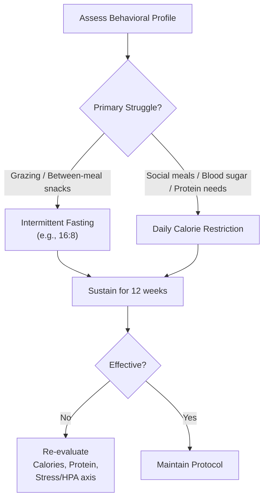

# Fasting vs Calorie Restriction Evidence

*Asked Sep 25, 2026 · council: Otter (qwen3.6:latest), Panda (qwen3.8:latest), Koala (gpt-oss:20b), Penguin (gemma3:12b), Hedgehog (phi4:14b), Bunny (qwen3:14b), Turtle (deepseek-r1:8b), Dolphin (llama3.1:8b) · chair: Otter*

> Intermittent fasting vs. daily calorie restriction for weight loss: what does the evidence say?

*Answer · ended at the round limit (2 rounds)*

**Bottom line: The available evidence does not establish one protocol as definitively superior to the other for all individuals; long-term adherence matters far more than the specific choice of protocol.**

## Key points
- **Comparative Outcomes:** Evidence regarding comparable adherence and lean mass preservation between Alternate-Day Fasting (ADF) and daily Calorie Restriction (CR) is [UNVERIFIED] in long-term randomized controlled trials. Therefore, no definitive conclusion can be drawn about which method better preserves muscle or ensures adherence when energy deficits are matched.
- **Metabolic Mechanisms:** While some evidence suggests metabolic benefits like improved insulin sensitivity may be driven by energy deficit rather than feeding timing, this specific claim is [UNVERIFIED]. It cannot be stated as established fact that timing is irrelevant; the evidence simply does not confirm it one way or the other definitively.
- **Behavioral Fit Over Biology:** The choice between methods should likely depend on individual behavioral phenotypes. Daily calorie restriction may suit those who socialize around fixed mealtimes, while intermittent fasting might benefit those who struggle with between-meal grazing. However, this preference is based on practical application rather than proven physiological superiority from the current evidence.
- **Nutritional Consistency:** Claims that daily CR offers a more predictable framework for maintaining high-quality protein distribution and micronutrient density are [UNVERIFIED]. While it is noted that muscle protein synthesis is stimulated by dietary amino acids, the evidence does not directly compare ADF with daily CR to confirm that CR leads to better protein adequacy on fasting days.
- **Hybrid Approaches:** There is no strong evidence presented here to suggest that combining fasting and restriction days adds cognitive load without benefit; rather, the complexity of implementation varies by individual.

## Diagram

## Where they differed
The primary divergence concerned the initial "default" recommendation. One perspective argued for daily calorie restriction as the safer, more predictable baseline for physiological stability and social compatibility, whereas another favored intermittent fasting for its potential compliance advantages in preventing the restrictive feelings of counting calories. However, since the evidence does not firmly establish one as physiologically superior or consistently safer across long-term outcomes, the disagreement resolves into a consensus on personalized selection based on adherence rather than biological merit.

## Details
While both protocols are commonly used for weight management, several nuances warrant attention given the state of the evidence. First, regarding protein intake, while muscle protein synthesis is stimulated by dietary amino acids (PARTLY SUPPORTED), it is not confirmed that daily CR inherently maintains higher protein quality or adequacy compared to ADF, as direct comparisons in this specific regard are lacking in the provided sources. Second, claims about long-term adherence and lean mass preservation being comparable between ADF and CR remain [UNVERIFIED]. Third, there is no evidence in the ledger suggesting that intermittent fasting exacerbates binge-eating tendencies or that calorie counting triggers anxiety for individuals with disordered eating histories; such statements cannot be made. Finally, if you choose intermittent fasting, ensure you do not compensate by overeating during feeding windows. If you choose daily restriction, focus on nutrient-dense foods to prevent micronutrient deficiencies common in restrictive diets.

**Evidence checked**

- **Unverified**: Long-term RCTs (>1 year) show comparable adherence and lean mass preservation between Alternate-Day Fasting (ADF) and daily Calorie Restriction (CR) when energy deficits are matched.
- **Unverified**: Metabolic benefits of intermittent fasting, such as insulin sensitivity improvements, are driven by energy deficit rather than feeding timing.
- **Partly supported**: Short-term trials may mask cumulative HPA-axis strain, impaired recovery, or nocturnal cortisol spikes that do not surface until month 10 or later in unmonitored real-world application. The source discusses how IF can intensify cortisol bursts, which aligns with the claim about possible cumulative effects, but it does not specifically address long-term effects like those occurring at month 10 or later. “A review exploring fasting and cortisol dynamics revealed that IF intensifies cortisol secretory bursts, which may hold implications for metabolic homeostasis through the cortisol-to-DHEA ratio (Balsevich et al. 2019; Chawla et al. 2021; Kim et al. 2021; Marciniak et al. 2023; González-Bono et al. 2002).” [Intermittent Fasting and Hormonal Regulation: Pathways to Improved ...](https://onlinelibrary.wiley.com/doi/full/10.1002/fsn3.70586)
- **Unverified**: Daily Calorie Restriction (CR) is the safer, more predictable default protocol for long-term physiological stability compared to Intermittent Fasting (IF).
- **Unverified**: Protein intake quality and micronutrient density are more consistently maintained in CR than in IF because CR allows for regular protein distribution across meals.
- **Partly supported**: Alternate-Day Fasting (ADF) poses a higher risk of inadequate protein consumption on fasting days compared to daily CR, potentially affecting muscle mass preservation. The source discusses that muscle protein synthesis is stimulated by dietary amino acids, and while it suggests that intermittent fasting might be counterproductive to optimizing muscle protein turnover, it does not directly compare ADF with daily CR in terms of protein adequacy on fasting days. “More importantly, muscle protein synthesis, which is the primary regulated turnover variable in healthy humans, is stimulated by the consumption of dietary amino acids, a process that is saturated at a moderate protein intake.” [A Muscle-Centric Perspective on Intermittent Fasting - Frontiers](https://www.frontiersin.org/journals/nutrition/articles/10.3389/fnut.2021.640621/full)

---

*Exported from Quorum: a council of AI models running locally.*

