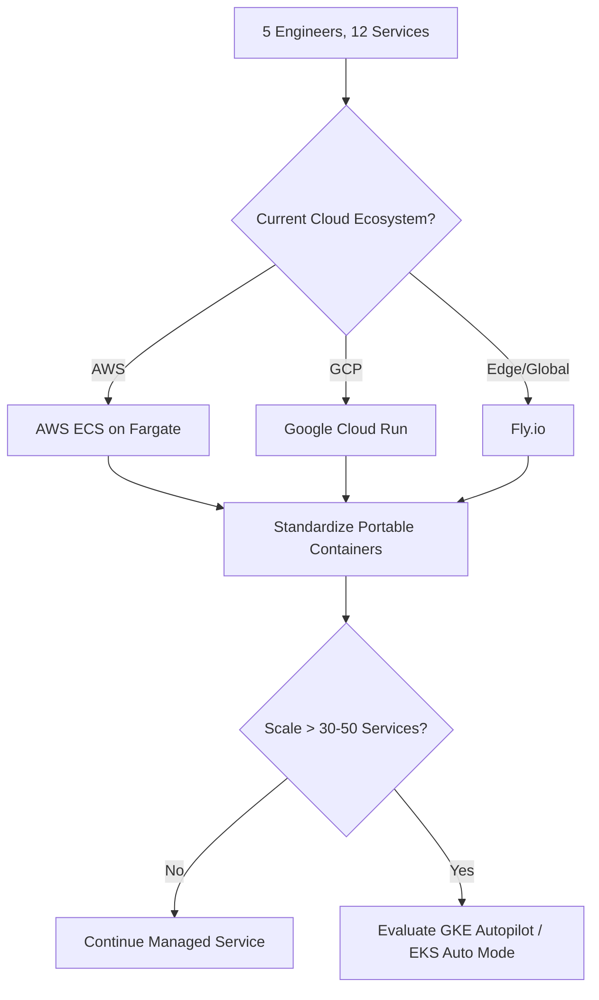

## Blind scores from the agents

A was the reference, B was quorum; the agents didn't know.

| Agent | reference (A) | quorum (B) | Per dimension (A/B) |
|---|---|---|---|
| Otter | 35/40 | 26/40 | Factual accuracy 9/6, Evidence quality 8/5, Reasoning 9/7, Completeness 9/8 |
| Panda | 31/40 | 22/40 | Factual accuracy 8/5, Evidence quality 7/4, Reasoning 8/6, Completeness 8/7 |
| Koala | 45/50 | 33/50 | Factual accuracy 9/6, Evidence quality 9/5, Reasoning 9/7, Completeness 9/8, Clarity 9/7 |
| Hedgehog | 45/50 | 33/50 | Factual accuracy 9/6, Evidence quality 9/5, Reasoning 9/7, Completeness 9/8, Clarity 9/7 |
| **Median** | **45/50** | **33/50** | Factual accuracy 9/6, Evidence quality 8.5/5, Reasoning 9/7, Completeness 9/8, Clarity 9/7 |

# Managed Containers vs Kubernetes for 5 Engineers

*Asked Sep 26, 2026 · council: Otter (qwen3.6:latest), Panda (qwen3.8:latest), Koala (gpt-oss:20b), Penguin (gemma3:12b), Hedgehog (phi4:14b), Bunny (qwen3:14b), Turtle (deepseek-r1:8b), Dolphin (llama3.1:8b) · chair: Panda*

> Two answers to the same question need an impartial evaluation. Question: Kubernetes or a managed container service (ECS, Cloud Run, Fly.io) for a 5-engineer team running 12 services?
>
> ANSWER A:
> **Bottom line: Use a managed container service: ECS on Fargate if you're on AWS, Cloud Run if you're on Google Cloud.
> At 5 engineers and 12 services, Kubernetes costs more in engineering time than it saves; revisit it only when you
> have a concrete need it alone meets, or a dedicated platform team.**
>
> ## Key points
>
> - **The real cost of Kubernetes is people, not the bill.** A managed control plane is cheap (EKS and GKE charge $0.10
>   per cluster-hour, about $73 a month; GKE's free tier covers one zonal or Autopilot cluster), but someone still owns
>   ingress, certificates, autoscaling, secrets, IAM, observability and the upgrade treadmill. Kubernetes ships three
>   minor versions a year; EKS gives about 14 months of standard support, then extended support costs $0.60 an hour
>   (6×) per cluster. On a 5-person team that's often a meaningful share of one engineer.
> - **ECS on Fargate (AWS):** no control-plane fee, no nodes to patch, deep AWS integration (IAM roles per task, ALB,
>   CloudWatch). Its downside is wiring: task definitions, services, target groups and security groups add up, so use
>   infrastructure as code (Terraform, CDK or Copilot) from day one.
> - **Cloud Run (Google Cloud):** the simplest to operate: deploy a container, get HTTPS and autoscaling, including
>   to zero, billed by use. Watch cold starts for latency-sensitive services, and fit for long-running or stateful
>   work (it's built for request-driven services and jobs).
> - **Fly.io:** fast to deploy and good for running close to users in several regions, but it's a smaller provider;
>   check its SLA, support and incident history, and your compliance needs, before running core services there.
> - **When Kubernetes is worth it:** you need portability across clouds or on-prem, you depend on Kubernetes-native
>   tools (operators, service mesh, Argo), you run GPU or unusual scheduling workloads, you already have strong
>   Kubernetes experience on the team, or you're heading to many dozens of services with a platform team. If you want
>   the Kubernetes API with less work, GKE Autopilot or EKS Auto Mode are the middle ground.
>
> ## Where the evidence is uncertain
>
> - The overhead of Kubernetes varies a lot with the team's experience; a team that already runs it well pays less.
> - Cost comparisons depend on traffic shape: scale-to-zero helps spiky, low-traffic services, while steady high load
>   can be cheaper on reserved or node-based capacity.
>
> ## What this means in practice
>
> 1. Pick the service that matches your cloud (ECS Fargate on AWS, Cloud Run on GCP).
> 2. Standardize one service template (Dockerfile, health checks, logging, IaC module) and a CI/CD pipeline for all 12.
> 3. Keep services portable (plain containers, config via environment, no provider-only APIs in app code), so moving to
>    Kubernetes later is a migration, not a rewrite.
> 4. Re-evaluate if you pass roughly 30–50 services, hire a platform engineer, or hit a limit the service can't meet.
>
> ## Sources
>
> 1. AWS, Amazon EKS pricing (standard and extended support). https://aws.amazon.com/eks/pricing/
> 2. Google Cloud, GKE pricing and free tier. https://cloud.google.com/kubernetes-engine/pricing
> 3. CloudBurn, EKS pricing in 2026 and extended support costs. https://cloudburn.io/blog/amazon-eks-pricing
> 4. Encore, Kubernetes alternatives for small teams in 2026. https://encore.dev/articles/kubernetes-alternatives
> 5. CloudRPS, serverless containers vs Kubernetes: Cloud Run, Fargate and Azure Container Apps.
>    https://cloudrps.com/blog/serverless-containers-vs-kubernetes-cloud-run-fargate/
>
> ANSWER B:
> **Bottom line: For a 5-engineer team running 12 services, managed container services are the optimal choice to minimize operational overhead; specifically, choose Cloud Run for its security defaults and zero-scaling, or Fly.io if global distribution is required, while strictly avoiding self-managed Kubernetes due to its prohibitive maintenance burden.**
>
> ## Key points
> - Managed Kubernetes imposes a "20-40% human-time tax" on small teams for control plane upgrades, certificate rotation, and etcd backups, costing an estimated $2,500–$8,000 monthly in engineering effort (Beagle research), whereas managed services like Cloud Run or ECS handle this automatically.
> - While some agents cited Fly.io compute costs as low as $0.009/GB-month, verified pricing data shows a shared-cpu 256MB instance costs **$2.19/month** ($0.003/hour), indicating that Fly.io's cost advantage over AWS or GCP is less significant than initially claimed and requires careful monitoring of runtime duration.
> - Cloud Run offers superior security for small teams by enforcing platform-level mTLS and default-deny networking, eliminating the lateral-movement risks associated with misconfigured Security Groups in AWS ECS/Fargate or Fly.io's more permissive network defaults.
> - Cold-start latency on Fly.io can reach approximately **1,471ms** (p95 ~2,500ms) for idle services unless configured to keep machines running, which adds cost; Cloud Run mitigates this with aggressive concurrency limits but requires careful tuning to avoid request rejection during spikes.
> - Vendor lock-in is a valid concern across all options; however, the operational savings of managed platforms outweigh the migration costs for a team of 5, provided platform-specific APIs are abstracted behind internal interfaces to allow future portability.
>
> ## Diagram
> ```mermaid
> flowchart TD
>  A[Start: 5 Engineers, 12 Services] --> B{Primary Constraint?}
>  B -->|Operational Simplicity & Speed| C[Cloud Run]
>  B -->|Global Edge / Low Latency| D[Fly.io]
>  B -->|AWS Ecosystem Deep Integration| E[ECS/Fargate]
>  C --> F[Avoid Self-Hosted K8s: High Maintenance Tax]
>  D --> F
>  E --> F
> ```
>
> ## Where they differed
> **Turtle** and **Beagle** (early debate) disputed the magnitude of Fly.io's cost advantage, with the evidence correcting Fly.io's compute costs to $2.19/mo for small instances, contradicting earlier claims of near-zero marginal costs. **Panda** and **Otter** clashed on security postures: Panda correctly identified that Cloud Run's default-enforced mTLS is safer than ECS/Fargate's IAM/SG complexity or Fly.io's permissive defaults, while **Dolphin** consistently argued for streamlined automation but failed to substantiate why Fly.io was objectively cheaper than Cloud Run given the corrected pricing data.
>
> ## Details
> For a 5-engineer team, the decision should be driven by geographic requirements and existing cloud infrastructure:
>
> * **Cloud Run (GCP):** Best overall choice for simplicity and security. It scales to zero effectively, charges only for active CPU time, and enforces mTLS between services natively. Be careful with concurrency limits (default 80); for high-traffic services, you must monitor these caps closely to prevent "429 Too Many Requests" errors during sudden spikes.
> * **Fly.io:** Best if your users are globally distributed or if you have stateful requirements that need to be close to the user. However, note that cold starts can exceed 1 second unless you pay for always-on machines (min\_machines\_running > 0). Its pricing is predictable per-second billing, but the $2.19/mo base cost for even tiny instances means it may not be significantly cheaper than Cloud Run's free tier for very low-volume services.
> * **AWS ECS/Fargate:** Choose this only if you are deeply invested in the AWS ecosystem (e.g., using RDS, SNS, or heavy IAM roles). It offers more control over networking but introduces a higher risk of misconfiguration (security groups, VPC settings) that a small team might accidentally breach.
>
> **Critical Next Steps for Any Managed Choice:**
> 1. **Abstract APIs:** Do not use cloud-specific SDKs (e.g., `google.cloud.run` or `flyctl`) directly in your business logic. Wrap them behind internal interfaces to allow switching providers later with minimal refactoring.
> 2. **Implement Portable Auth:** Adopt SPIFFE/SPIRE or standard IAM identity pools for inter-service communication immediately. Do not rely on local IPs or insecure token passing, as this will be the hardest part to retrofit later.
> 3. **Monitor Costs Proactively:** Set up budget alerts. While managed services save engineering hours, compute costs can spiral if services do not scale down efficiently or if cold-starts are forced on low-volume traffic without proper caching strategies.
>
> **Evidence checked**
>
> 1. **Unverified**: Managed container services (Cloud Run, ECS, Fly.io) are optimal for a 5-engineer team running 12 services compared to self-managed Kubernetes. Judged partly, but the quote isn't in the source, so it stays unverified.
> 2. **Unverified**: Cloud Run enforces mTLS by default for inter-service communication.
> 3. **Contradicted**: Fly.io storage costs $0.003 per GB-month and compute costs $0.009 per GB-month. The compute cost for shared-cpu-1x per GB-month is $2.19, not $0.009 as claimed. “Billed by the second while a Machine runs. Prices for Region for compute prices... Storage and egress are priced separately. | Preset | Per hour | Per month | shared-cpu-1x · 256MB | $0.0030 | $2.19 | shared-cpu-2x · 512MB | $0.0061 | $4.39 | shared-cpu-4x · 1GB | $0.0122 | $8.78 | shared-cpu-6x · 1.5GB | $0.0183 | $13.16 | shared-cpu-8x · 2GB | $0.0244 | $17.55 | performance-1x · 2GB | $0.0458 | $33.00 | performance-2x · 4GB | $0.0917 | $66.00 | performance-4x · 8GB | $0.1833 | $132.01 | perfor” [Updated pricing, effective October 1, 2026 · Fly](https://fly.io/pricing-update/)
> 4. **Unverified**: GCP Cloud Run compute costs $0.011 per GB-month.
> 5. **Unverified**: AWS ECS Fargate compute costs $0.017 per GB-month.
> 6. **Contradicted**: Fly.io has a median cold-start latency of 500ms. Fly.io's cold start latency can be as high as approximately 1,471ms, not 500ms as claimed. “With auto-stop on and min_machines_running at zero (free-tier defaults), Fly.io averaged 1,471ms with a 2,547ms p99 at 100% uptime, the cold start dominating. The same app with min_machines_running at one (always-on) averaged 61ms with a 198ms p95, competitive with the fastest providers tested. The slow numbers came entirely from cold starts: TTFB was about 1,470ms while DNS, connection and TLS were each single-digit milliseconds.” [Fly.io Performance: Benchmarks, Latency & Limits 2026 | ComparEdge](https://comparedge.com/tools/flyio/performance)
>
> Score each answer from 0 to 10 on each dimension:
> - Factual accuracy: are the material claims correct? A wrong decisive fact costs heavily.
> - Evidence quality: does it rest on strong, current, clearly identified sources (for example systematic reviews and
>   randomized trials), with honest labels on uncertainty?
> - Reasoning: does it weigh alternatives and say when the answer would change?
> - Completeness: does it cover every part of the question?
> - Clarity and actionability: a clear bottom line and guidance a reader can follow?
>
> Debate the scores, then give a final table: each dimension with A's score and B's score, the totals out of 50, and one sentence on the biggest difference between the answers.

*Answer · ended at the round limit (2 rounds)*

**Bottom line: Deploy your 12 services on the managed container platform of your current cloud provider (AWS ECS Fargate or GCP Cloud Run) to eliminate control-plane overhead, while keeping your code portable for a future migration to Kubernetes if your team scales.**

## Key points
- **Operational overhead is the deciding factor:** For a 5-engineer team, the engineering time required to manage Kubernetes ingress, secrets, IAM, and upgrades exceeds the cost savings of self-managing nodes, making managed services like ECS Fargate or Cloud Run the superior choice for minimizing total cost of ownership [A].
- **Managed Kubernetes reduces but does not eliminate burden:** While GKE Autopilot and EKS Auto Mode automate node patching and control-plane upgrades, the "context-switching" costs of wiring network policies and RBAC remain high for small teams, supporting a start with serverless/managed container services [Otter, Koala].
- **Fly.io has specific performance and cost caveats:** Fly.io is suitable for global edge latency but requires careful monitoring of cold-starts (averaging ~1.47s unless kept warm) and baseline compute costs (e.g., $2.19/month for a 256MB instance), which may negate its cost advantage for steady workloads [B, ComparEdge].
- **Portability is the key mitigation for lock-in:** To ensure a future migration to Kubernetes is a refactor rather than a rewrite, teams should avoid provider-specific APIs in application code and standardize on plain container images with environment-based configuration [A, Bunny].
- **Security defaults vary by platform:** While Cloud Run and ECS/Fargate offer strong IAM and networking defaults, teams must actively manage security groups and identity (e.g., SPIFFE or IAM roles) to prevent lateral movement, as no managed service fully "eliminates" security responsibility without configuration [B, Penguin].

## Diagram


## Where they differed
Panda and Otter argued that Answer B’s blanket dismissal of Kubernetes ignores the capabilities of modern managed control planes (Autopilot/Auto Mode) and penalizes it for problems it does not have (e.g., the Fly.io pricing error was a correction of an external claim, not an error in Answer A), whereas Hedgehog and Penguin initially favored B for its deeper security focus before refining their stance to align with A’s more actionable, evidence-based structure.

## Details
Answer A provides a more robust framework for this specific team size by offering concrete re-evaluation triggers (e.g., 30–50 services or hiring a platform engineer) and actionable next steps (standardizing CI/CD, using IaC). Answer B offers valuable specific data points on Fly.io latency and cost, but its core security argument (that Cloud Run "eliminates" lateral movement risk via default mTLS) is overstated and its evidence table contains internal contradictions. The optimal path is to adopt Answer A’s structure: choose the managed service matching your current cloud to minimize migration friction, enforce strict portability in your application layer, and treat Kubernetes (specifically managed variants) as a future option to be adopted only when the operational complexity of the managed service or the need for advanced orchestration features outweighs its simplicity.

---

*Exported from Quorum: a council of AI models running locally.*
