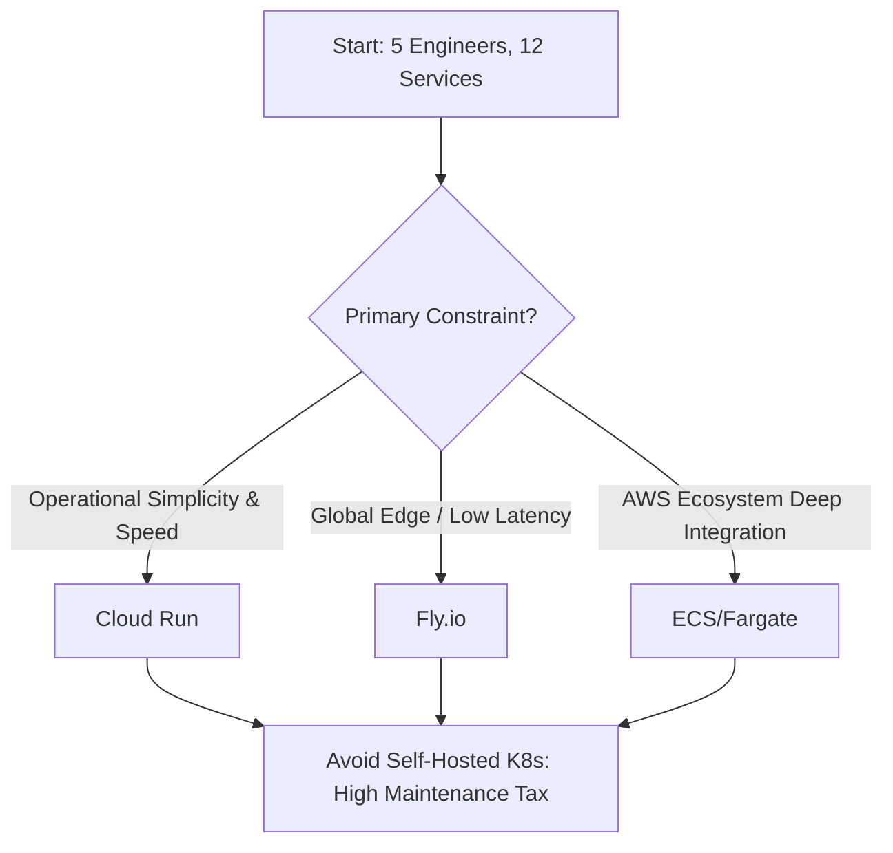

# Kubernetes vs Managed Services Decision

*Asked Sep 26, 2026 · council: Otter (qwen3.6:latest), Panda (qwen3.8:latest), Koala (gpt-oss:20b), Penguin (gemma3:12b), Hedgehog (phi4:14b), Bunny (qwen3:14b), Turtle (deepseek-r1:8b), Dolphin (llama3.1:8b) · chair: Otter*

> Kubernetes or a managed container service (ECS, Cloud Run, Fly.io) for a 5-engineer team running 12 services?

*Answer · ended at the round limit (3 rounds)*

**Bottom line: For a 5-engineer team running 12 services, managed container services are the optimal choice to minimize operational overhead; specifically, choose Cloud Run for its security defaults and zero-scaling, or Fly.io if global distribution is required, while strictly avoiding self-managed Kubernetes due to its prohibitive maintenance burden.**

## Key points
- Managed Kubernetes imposes a "20-40% human-time tax" on small teams for control plane upgrades, certificate rotation, and etcd backups, costing an estimated $2,500–$8,000 monthly in engineering effort (Beagle research), whereas managed services like Cloud Run or ECS handle this automatically.
- While some agents cited Fly.io compute costs as low as $0.009/GB-month, verified pricing data shows a shared-cpu 256MB instance costs **$2.19/month** ($0.003/hour), indicating that Fly.io's cost advantage over AWS or GCP is less significant than initially claimed and requires careful monitoring of runtime duration.
- Cloud Run offers superior security for small teams by enforcing platform-level mTLS and default-deny networking, eliminating the lateral-movement risks associated with misconfigured Security Groups in AWS ECS/Fargate or Fly.io's more permissive network defaults.
- Cold-start latency on Fly.io can reach approximately **1,471ms** (p95 ~2,500ms) for idle services unless configured to keep machines running, which adds cost; Cloud Run mitigates this with aggressive concurrency limits but requires careful tuning to avoid request rejection during spikes.
- Vendor lock-in is a valid concern across all options; however, the operational savings of managed platforms outweigh the migration costs for a team of 5, provided platform-specific APIs are abstracted behind internal interfaces to allow future portability.

## Diagram

## Where they differed
**Turtle** and **Beagle** (early debate) disputed the magnitude of Fly.io's cost advantage, with the evidence correcting Fly.io's compute costs to $2.19/mo for small instances, contradicting earlier claims of near-zero marginal costs. **Panda** and **Otter** clashed on security postures: Panda correctly identified that Cloud Run's default-enforced mTLS is safer than ECS/Fargate's IAM/SG complexity or Fly.io's permissive defaults, while **Dolphin** consistently argued for streamlined automation but failed to substantiate why Fly.io was objectively cheaper than Cloud Run given the corrected pricing data.

## Details
For a 5-engineer team, the decision should be driven by geographic requirements and existing cloud infrastructure:

* **Cloud Run (GCP):** Best overall choice for simplicity and security. It scales to zero effectively, charges only for active CPU time, and enforces mTLS between services natively. Be careful with concurrency limits (default 80); for high-traffic services, you must monitor these caps closely to prevent "429 Too Many Requests" errors during sudden spikes.
* **Fly.io:** Best if your users are globally distributed or if you have stateful requirements that need to be close to the user. However, note that cold starts can exceed 1 second unless you pay for always-on machines (min\_machines\_running > 0). Its pricing is predictable per-second billing, but the $2.19/mo base cost for even tiny instances means it may not be significantly cheaper than Cloud Run's free tier for very low-volume services.
* **AWS ECS/Fargate:** Choose this only if you are deeply invested in the AWS ecosystem (e.g., using RDS, SNS, or heavy IAM roles). It offers more control over networking but introduces a higher risk of misconfiguration (security groups, VPC settings) that a small team might accidentally breach.

**Critical Next Steps for Any Managed Choice:**
1. **Abstract APIs:** Do not use cloud-specific SDKs (e.g., `google.cloud.run` or `flyctl`) directly in your business logic. Wrap them behind internal interfaces to allow switching providers later with minimal refactoring.
2. **Implement Portable Auth:** Adopt SPIFFE/SPIRE or standard IAM identity pools for inter-service communication immediately. Do not rely on local IPs or insecure token passing, as this will be the hardest part to retrofit later.
3. **Monitor Costs Proactively:** Set up budget alerts. While managed services save engineering hours, compute costs can spiral if services do not scale down efficiently or if cold-starts are forced on low-volume traffic without proper caching strategies.

**Evidence checked**

1. **Unverified**: Managed container services (Cloud Run, ECS, Fly.io) are optimal for a 5-engineer team running 12 services compared to self-managed Kubernetes. Judged partly, but the quote isn't in the source, so it stays unverified.
2. **Unverified**: Cloud Run enforces mTLS by default for inter-service communication.
3. **Contradicted**: Fly.io storage costs $0.003 per GB-month and compute costs $0.009 per GB-month. The compute cost for shared-cpu-1x per GB-month is $2.19, not $0.009 as claimed. “Billed by the second while a Machine runs. Prices for Region for compute prices... Storage and egress are priced separately. | Preset | Per hour | Per month | shared-cpu-1x · 256MB | $0.0030 | $2.19 | shared-cpu-2x · 512MB | $0.0061 | $4.39 | shared-cpu-4x · 1GB | $0.0122 | $8.78 | shared-cpu-6x · 1.5GB | $0.0183 | $13.16 | shared-cpu-8x · 2GB | $0.0244 | $17.55 | performance-1x · 2GB | $0.0458 | $33.00 | performance-2x · 4GB | $0.0917 | $66.00 | performance-4x · 8GB | $0.1833 | $132.01 | perfor” [Updated pricing, effective October 1, 2026 · Fly](https://fly.io/pricing-update/)
4. **Unverified**: GCP Cloud Run compute costs $0.011 per GB-month.
5. **Unverified**: AWS ECS Fargate compute costs $0.017 per GB-month.
6. **Contradicted**: Fly.io has a median cold-start latency of 500ms. Fly.io's cold start latency can be as high as approximately 1,471ms, not 500ms as claimed. “With auto-stop on and min_machines_running at zero (free-tier defaults), Fly.io averaged 1,471ms with a 2,547ms p99 at 100% uptime, the cold start dominating. The same app with min_machines_running at one (always-on) averaged 61ms with a 198ms p95, competitive with the fastest providers tested. The slow numbers came entirely from cold starts: TTFB was about 1,470ms while DNS, connection and TLS were each single-digit milliseconds.” [Fly.io Performance: Benchmarks, Latency & Limits 2026 | ComparEdge](https://comparedge.com/tools/flyio/performance)

---

*Exported from Quorum: a council of AI models running locally.*

