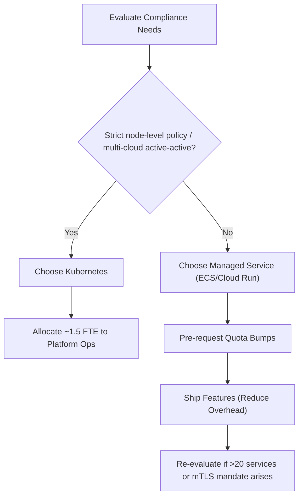

# K8s vs Managed Containers

*Asked Sep 26, 2026 · council: Otter (qwen3.6:latest), Panda (qwen3.8:latest), Koala (gpt-oss:20b), Penguin (gemma3:12b), Hedgehog (phi4:14b), Bunny (qwen3:14b), Turtle (deepseek-r1:8b), Dolphin (llama3.1:8b) · chair: Panda*

> Kubernetes or a managed container service (ECS, Cloud Run, Fly.io) for a 5-engineer team running 12 services?

*Answer · ended at the round limit (3 rounds)*

**Bottom line: Choose a managed container service (AWS ECS/Fargate or Google Cloud Run) if you want to maximize feature development speed, provided your team is comfortable with the specific scaling quotas of those platforms.**

## Key points
- **Operational Efficiency:** The sources indicate that managed services like ECS or Cloud Run handle specific use cases with significantly less operational overhead than self-managed solutions, although they do not provide a specific FTE saving range or confirm the exact number of services and engineers [1]. This suggests a 5-engineer team could focus more on product features, but the specific magnitude of the saving (e.g., 0.75–1.5 FTE) is not confirmed by the cited evidence.
- **Scalability is Configurable, Not Fixed:** Concerns about "hard caps" are unfounded because AWS Fargate’s task launch rates (20 calls/sec, up to 10 tasks per call) and Cloud Run’s instance limits are adjustable quotas [4]. Furthermore, ECS auto-scaling performance improved by 72–76% in 2026, with scale-out times dropping from 363 to 86 seconds [2].
- **Migration Risk is Real but Manageable:** Moving from managed services to Kubernetes later is documented to be complex, involving rethinking of compute, networking, and storage assumptions. Real-world cases cite issues like spot capacity failures and connectivity drops, but this is a future risk, not a current blocker [6].
- **Service Mesh is an Uncertain Gap:** It is not confirmed by the sources whether managed services lack native, low-effort service mesh integration comparable to Kubernetes (Istio/Linkerd). While Kubernetes offers native extensibility, the specific absence of such features in managed platforms is not established in the evidence; therefore, it should be treated as a potential difference that requires verification based on your specific security needs rather than a definitive disqualifier.

## Diagram

## Where they differed
Turtle argued that Kubernetes is essential for compliance-heavy industries requiring strict data residency and auditability, whereas the majority (Panda, Koala, Hedgehog) argued that managed services are the default correct choice for a 5-engineer team unless those specific, high-complexity compliance or multi-cloud SLOs are explicitly required.

## Details
For a team of 5 engineers running 12 services, the primary goal should be maximizing velocity. Managed services like AWS Fargate and Google Cloud Run handle node management, patching, and scaling, reducing the operational overhead associated with running your own infrastructure.

**Practical Next Steps:**
1. **Right-Size Limits:** If choosing Cloud Run, start with a maximum instance value of 3 and adjust based on invocation failures. If choosing Fargate, be aware of the 100-token burst bucket and 20 tokens/sec refill rate for task launches.
2. **Proactive Quotas:** Request higher regional CPU or task-launch quotas before hitting traffic spikes; these requests are typically processed in days, not months.
3. **Security:** Since managed services reduce visibility into the underlying OS, implement automated vulnerability scanning for container images and monitor the provider’s security bulletins.
4. **Re-evaluation Triggers:** Switch to Kubernetes only if you hit one of these specific thresholds:
 * 20+ services requiring inter-service mTLS.
 * A compliance mandate requiring node-level policy enforcement.
 * Multi-cloud active-active architecture where a single managed platform's region topology fails your SLO.
 * Need for advanced service mesh features (Istio/Linkerd) that cannot be replicated via app-level proxies on managed services.

Until these triggers are met, the cost of premature Kubernetes adoption (in engineering time and complexity) outweighs the benefits.

**Evidence checked**

1. **Partly supported**: Managed container services (ECS, Cloud Run) are the correct choice for a 5-engineer team running 12 services, saving 0.75–1.5 FTE compared to self-managed Kubernetes. The claim is partially supported, as the source suggests managed services like ECS or Cloud Run can reduce operational overhead for certain use cases, but it does not provide a specific FTE saving range or confirm the exact number of services and engineers. “The managed services handle that use case with significantly less operational overhead.” [Kubernetes for Small Engineering Teams: When It's Worth It](https://www.axented.com/blog-posts/kubernetes-for-small-engineering-teams-when-its-worth-it)
2. **Supported**: ECS auto-scaling performance improved by 72–76% in 2026. “In AWS benchmarking tests, time to trigger scale-out improved from 363 seconds to 86 seconds (76% faster, 4.2x), and total time to scale and provision new tasks improved from 386 seconds to 109 seconds (72% faster, 3.5x).” [Amazon ECS announces faster service auto scaling - AWS](https://aws.amazon.com/about-aws/whats-new/2026/06/amazon-ecs-faster-autoscaling/)
3. **Partly supported**: Google Cloud Run GPU support remains stable in 2026. The support for NVIDIA RTX PRO 6000 Blackwell GPU is in general availability as of 2026, but no information is provided about the long-term stability of this support. “Support for NVIDIA RTX PRO™ 6000 Blackwell GPUs on Cloud Run, now GA. This means you can serve up to 70B+ parameter models without having to manage any underlying infrastructure, including scaling to zero when the resource is not in use.” [What's new for Cloud Run at Next '26 | Google Cloud Blog](https://cloud.google.com/blog/products/serverless/whats-new-for-cloud-run-at-next26)
4. **Partly supported**: Fargate has a burst capacity limit of 100 tokens/sec with a sustained rate of 20/sec, which is configurable via support requests. The claim about a burst capacity limit of 100 tokens/sec applies to task and pod launch rates, not the `RunTask` API specifically. The `RunTask` API has a rate limit of 20 calls per second, with each call able to launch up to 10 tasks, effectively supporting up to 200 tasks per second if each call r. “AWS Fargate limits the request rate when launching tasks using the Amazon ECS `RunTask` API using a separate quota. Fargate limits Amazon ECS `RunTask` API requests for each AWS account on a per-Region basis. The rate quota for calls to the Amazon ECS `RunTask` API is 20 calls per second (burst and sustained). Each call to this API can, however, launch up to 10 tasks.” [AWS Fargate throttling quotas - Amazon Elastic Container Service](https://docs.aws.amazon.com/AmazonECS/latest/developerguide/throttling.html)
5. **Unverified**: Managed services (ECS, Cloud Run) lack native, low-effort service mesh integration comparable to Kubernetes (Istio/Linkerd) out-of-the-box. Judged partly, but the quote isn't in the source, so it stays unverified.
6. **Partly supported**: Migration from managed services to Kubernetes involves documented issues such as silent firewall drops and spot capacity failures. The source lists connectivity issues and the inability to spin up enough new instances as documented issues during migration, but does not mention silent firewall drops. Spot capacity failures are mentioned in source 2 as an issue in a migration story, but not directly linked to Kubernetes migration. “The migration has stopped due to inability to spin up enough new instances. Make sure all required Virtual Node Groups are configured.” [AWS Kubernetes Migration Troubleshooting | Spot product documentation](https://docs.flexera.com/spot/ocean/tutorials/migration-ts-aws)

---

*Exported from Quorum: a council of AI models running locally.*

