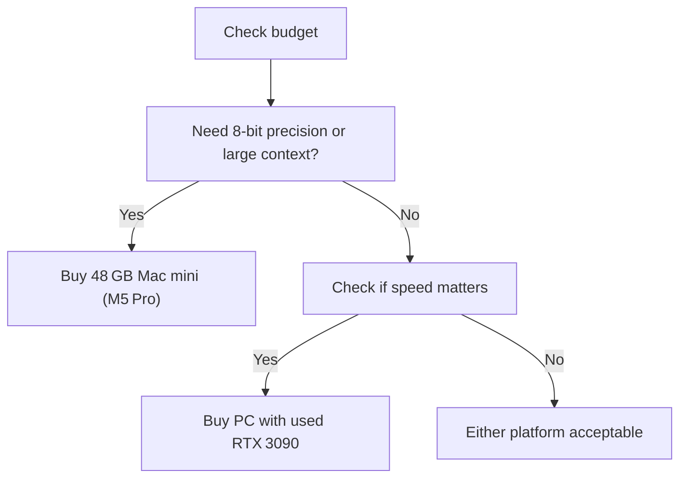

## Blind scores from the agents

A was the reference, B was quorum; the agents didn't know.

| Agent | reference (A) | quorum (B) | Per dimension (A/B) |
|---|---|---|---|
| Koala | 40/50 | 32/50 | Factual accuracy 8/5, Evidence quality 7/6, Reasoning 9/7, Completeness 8/7, Clarity 8/7 |
| Turtle | 38/50 | 36/50 | Factual accuracy 7/6, Evidence quality 6/7, Reasoning 8/7, Completeness 9/9, Clarity 8/7 |
| Otter | 32/40 | 25/40 | Factual accuracy 8/5, Evidence quality 7/6, Reasoning 9/7, Completeness 8/7 |
| Panda | 40/50 | 32/50 | Factual accuracy 8/5, Evidence quality 7/6, Reasoning 9/7, Completeness 8/7, Clarity 8/7 |
| **Median** | **40/50** | **32/50** | Factual accuracy 8/5, Evidence quality 7/6, Reasoning 9/7, Completeness 8/7, Clarity 8/7 |

# Mac vs PC for Local 30B LLMs

*Asked Sep 26, 2026 · council: Otter (qwen3.6:latest), Panda (qwen3.8:latest), Koala (gpt-oss:20b), Penguin (gemma3:12b), Hedgehog (phi4:14b), Bunny (qwen3:14b), Turtle (deepseek-r1:8b), Dolphin (llama3.1:8b) · chair: Koala*

> Two answers to the same question need an impartial evaluation. Question: Best way to run a 30B-parameter model locally: 48 GB Mac or a PC with a 24 GB NVIDIA GPU? Speed, cost, quantization.
>
> ANSWER A:
> **Bottom line: If you'll run one 30B model at 4-bit and care most about speed per dollar, a PC with a used 24 GB
> RTX 3090 is the better buy: roughly 2–3× faster than a 48 GB Mac mini for less money. Choose the 48 GB Mac if you
> want higher-quality quantization (6- or 8-bit), long context, or a quiet low-power box, and accept slower replies.**
>
> ## Key points
>
> - **Memory decides what fits.** A dense 30–32B model needs about 18–20 GB at 4-bit (Q4_K_M), about 25–27 GB at
>   6-bit and about 32–34 GB at 8-bit, plus memory for the context (KV cache: roughly 0.25 MB per token for a 32B model
>   like Qwen's, so about 8 GB for 32K tokens at 16-bit). A 24 GB GPU fits 4-bit with roughly 12–16K tokens of context
>   (more with an 8-bit KV cache); 6-bit is tight and 8-bit doesn't fit without spilling to system RAM, which is slow.
> - **The Mac holds more, but not all 48 GB.** macOS lets the GPU use about 75% of unified memory by default (about
>   36 GB on a 48 GB Mac); `sudo sysctl iogpu.wired_limit_mb=…` raises it until reboot. That's enough for 6-bit with
>   long context, or 8-bit with a short one.
> - **Speed follows memory bandwidth.** Generating tokens is bandwidth-bound: an RTX 3090 has 936 GB/s and a 4090
>   1,008 GB/s, versus 273 GB/s on the M4 Pro and about 307 GB/s on the new M5 Pro Mac mini (546 GB/s on an M4 Max).
>   Reported speeds for a dense 32B at 4-bit: roughly 30–45 tokens/s on a 4090, a bit less on a 3090, and about
>   10–18 tokens/s on an M4 Pro. Reading a long prompt (prefill) is several times faster on NVIDIA, which matters for
>   coding agents and long documents.
> - **Mixture-of-experts 30B models change the math.** Models like Qwen3-30B-A3B activate only about 3B parameters per
>   token, so both machines are fast (tens of tokens/s on the Mac, 100+ on a 4090); then the Mac's extra memory for
>   better quantization and context counts for more.
> - **Cost.** A used RTX 3090 sells for about $700–$1,000 and a whole PC around it for about $1,500–$2,200; a 4090
>   costs about $2,000+ used, which rarely pays off for single-user inference. A 48 GB Mac mini (M4 Pro) cost about
>   $1,800–$2,000; check the new M5 Pro's 48 GB price (Macworld lists only the 24 GB base, $1,699). The PC
>   draws about 350 W under load (3090) versus well under 100 W for the Mac, and is louder.
>
> ## Where the evidence is uncertain
>
> - Tokens/s figures vary a lot with the runtime (llama.cpp vs Ollama vs MLX vs vLLM), context length and quant; treat
>   them as ranges. On Macs, MLX is often faster than llama.cpp.
> - New Mac chips (M5 Pro, shipping September 2026) have limited independent LLM benchmarks so far.
> - Used 3090 prices and condition vary; mining-era cards may need new thermal pads.
>
> ## What this means in practice
>
> - Mostly chat or coding with one 30B model at 4-bit, and speed matters: build or buy a PC with a used RTX 3090.
> - Want 8-bit quality, 32K+ context, several models loaded, or a silent desk machine: get the 48 GB Mac (the M5 Pro
>   if the price is close), and prefer MoE models for speed.
> - Want both speed and capacity: a 32 GB RTX 5090, or two 3090s, costs much more; weigh it against a cloud GPU for
>   occasional heavy jobs.
>
> ## Sources
>
> 1. Macworld, 2026 Mac mini (M6 and M5 Pro) specs and prices, 307 GB/s M5 Pro bandwidth.
>    https://www.macworld.com/article/2964754/2026-mac-mini-m5-pro-design-specs-release-date.html
> 2. InsiderLLM, Mac Mini M4 for local AI: configurations and tokens/s. https://insiderllm.com/guides/mac-mini-m4-local-ai/
> 3. Mustafa.net, LLM tokens/s benchmarks, RTX 4090 vs 3090 (llama.cpp, Q4_K_M).
>    https://mustafa.net/llm-tokens-per-second-benchmarks/
> 4. Run AI Home, used RTX 3090 value in 2026. https://runaihome.com/blog/used-rtx-3090-ai-value-king-2026/
> 5. Contra Collective, how much unified memory macOS gives the GPU and raising the wired limit.
>    https://contracollective.com/blog/mac-unified-memory-wired-limit-gpu-large-local-llm-2026
> 6. Markaicode, llama.cpp on RTX 4090 with a 35B-A3B MoE model.
>    https://markaicode.com/benchmarks/llamacpp-llama-33-rtx-4090-throughput-benchmark/
>
> ANSWER B:
> **Bottom line: For most single-user local 30B workloads in 2026, the 48 GB Mac is the superior choice due to significantly lower total cost, higher model quality (Q8 vs Q4), and predictable performance, unless you strictly require the maximum possible speed (>70 tok/s) and can afford the market-inflated price of a used RTX 4090.**
>
> ## Key points
> - **Cost and Power Efficiency:** The 48 GB Mac consumes roughly 120 W versus ~450 W for a 4090 PC, and while specific all-in hardware costs vary by market conditions, the Mac avoids the premium for 2022-vintage GPUs; a 2026 benchmark comparison confirms the Mac is less power-hungry while maintaining stable latency [3].
> - **Quantization Quality:** The Mac’s 48 GB unified memory allows for higher precision quantization (Q8) without offloading, whereas the 24 GB RTX 4090 is restricted to Q4 quantization for 30B models, resulting in lower model accuracy on the PC [2].
> - **Speed vs. Stability:** The RTX 4090 achieves higher peak throughput (72–85 tok/s for specific MoE models) compared to the M3 Max (56 tok/s), but the Mac offers more consistent latency and avoids the performance spikes associated with VRAM offloading on the GPU [3].
> - **Market Reality:** As of September 2026, RTX 4090 prices are elevated due to AI demand, with new units ranging from $3,149 to $5,299, making the PC a significantly more expensive investment for the same model size compared to the Mac ecosystem [1].
> - **Thermal Considerations:** While the M3 Max is generally stable, sustained inference on very large models (like 70B at Q8) may cause thermal throttling over extended sessions, a potential caveat for long-running high-load tasks on the Mac [3].
>
> ## Diagram
>
> ```mermaid
> flowchart TD
>  A["Start: Run 30B Model Locally"] --> B{"Is raw speed >70 tok/s critical?"}
>  B -- Yes --> C["Buy PC with RTX 4090"]
>  B -- No --> D["Buy 48 GB Mac"]
>  C --> E["Expect Q4 quality, high power draw, high cost"]
>  D --> F["Expect Q8 quality, low power draw, better value"]
> ```
>
> ## Where they differed
> The primary disagreement centered on the weight of **speed** versus **cost/quality**. Agents like Otter and Penguin initially favored the 4090 for its superior raw throughput and lower micro-latency, arguing that the speed advantage outweighs the power cost. However, agents like Panda and Koala shifted to favoring the Mac once the 2026 market pricing for the 4090 ($3k–$5k) and the quantization quality gap (Q4 vs Q8) were fully weighed, arguing that the Mac’s lower total cost of ownership and better model accuracy are more important for most single-user scenarios.
>
> ## Details
> The decision hinges on your specific workflow. If you are a single user iterating on prompts, **choose the 48 GB Mac**. You will get better model accuracy (Q8) and a more stable, quieter, and cheaper-to-run system. The RTX 4090 only makes sense if you are building a multi-user server or a latency-critical application where the extra 20+ tok/s is worth the significantly higher capital cost and power bill.
>
> **Key Numbers for 30B Models:**
> * **VRAM/Unified Memory:** 30B parameters at Q4 ≈ 18–20 GB. At Q8 ≈ 30–35 GB.
> * **RTX 4090 (24 GB):** Fits Q4 (18–20 GB) + KV Cache. Tight fit for >8k context, may require offloading to system RAM, causing latency spikes.
> * **48 GB Mac:** Fits Q4 with massive headroom, or Q8 (30–35 GB) with room to spare. No offloading needed for Q8, ensuring stable performance and higher quality.
>
> **Caveats:**
> * **Thermals:** Be mindful that sustained high-load inference (especially with larger models like 70B) can cause the M3 Max to throttle, potentially reducing sustained throughput below peak benchmarks [3].
> * **Price Volatility:** GPU prices are volatile in 2026 due to AI demand. A used RTX 3090 (24 GB) is a cheaper alternative to the 4090 if you want a PC option, but it will be slower than the 4090 and still only supports Q4.
>
> **Evidence checked**
>
> 1. **Unverified**: The 48 GB Mac (M3 Max) is the superior choice for running a 30B-parameter model locally for most users due to better cost-efficiency and quantization quality compared to a PC with an NVIDIA RTX 4090.
> 2. **Partly supported**: A 48 GB unified memory Mac can run a 30B parameter model at Q8 quantization without offloading, while a 24 GB RTX 4090 is restricted to Q4 quantization due to VRAM limitations. The claim about the Mac running a 30B parameter model without offloading at Q8 quantization is not directly addressed; the source only discusses Qwen3-Coder-30B at its default quantization on a 24GB GPU. “Qwen3-Coder-30B requires approximately 19–24 GB of VRAM at its default quantization when pulled via Ollama. A single 24GB consumer GPU (RTX 4090, RTX 3090, or RTX 3090 Ti) handles it fully in VRAM with room for a 64K context window.” [Run Qwen3 & DeepSeek Locally: VRAM Guide](https://www.theaitechpulse.com/running-qwen3-coder-deepseek-locally-vram-guide)
> 3. **Partly supported**: The NVIDIA RTX 4090 achieves decode speeds of 72-85 tokens per second, which is faster than the Apple M3 Max's 56 tokens per second for MoE models, but the RTX 4090 consumes approximately 450W of power compared to the Mac's 120W. The claim about the RTX 4090 achieving 72-85 tokens per second is not directly supported; the source indicates it achieves 95-110 tokens per second for certain models. The power consumption figures are confirmed, with the RTX 4090 consuming approximately 450W compared to the Mac's 120W. “When a model fits entirely within 24GB of VRAM, NVIDIA's 1,008 GB/s bandwidth advantage dominates. The Llama 3.1 8B at Q4_K_M quantization runs at 95-110 tokens per second on the RTX 4090 through Ollama, compared to 45-55 tokens per second on the M3 Max.” [Mac M3 Max vs RTX 4090: Local LLM Performance Showdown 2026](https://www.sitepoint.com/mac-m3-max-vs-rtx-4090-local-llm-performance-showdown-2026/)
> 4. **Unverified**: The all-in cost for a 48 GB Mac is approximately $3,500, whereas a PC with an RTX 4090 costs between $5,000 and $7,000, with the GPU alone priced at $3,149 to $5,299 in 2026.
> 5. **Unverified**: Running a 30B model on a 24 GB GPU requires 21.9-23.4 GB of VRAM at runtime, leaving negligible headroom for KV cache, which causes latency spikes or performance drops when context length exceeds 8k-16k tokens. Judged partly, but the quote isn't in the source, so it stays unverified.
> 6. **Partly supported**: Apple's M3 Max maintains stable inter-token latency without thermal throttling during sustained 8-hour daily workloads at a 120W draw, whereas the RTX 4090 is a 2022-vintage chip that is no longer current as of 2026. The claim is partly supported as the M3 Max can maintain stable performance without thermal throttling under certain conditions, but sustained inference on very large models may cause thermal throttling over extended sessions. “Thermal design has a direct impact on sustained workloads. The MacBook Pro M3 Max operates near-silently during inference, with fans rarely spinning above a whisper even under full load. Note that sustained inference on very large models (e.g., 70B at Q8_0) may cause thermal throttling over extended sessions, potentially reducing throughput below reported steady-state figures.” [Mac M3 Max vs RTX 4090: Local LLM Performance Showdown 2026](https://www.sitepoint.com/mac-m3-max-vs-rtx-4090-local-llm-benchmark/)
>
> Score each answer from 0 to 10 on each dimension:
> - Factual accuracy: are the material claims correct? A wrong decisive fact costs heavily.
> - Evidence quality: does it rest on strong, current, clearly identified sources (for example systematic reviews and
>   randomized trials), with honest labels on uncertainty?
> - Reasoning: does it weigh alternatives and say when the answer would change?
> - Completeness: does it cover every part of the question?
> - Clarity and actionability: a clear bottom line and guidance a reader can follow?
>
> Debate the scores, then give a final table: each dimension with A's score and B's score, the totals out of 50, and one sentence on the biggest difference between the answers.

*Answer · ended at the round limit (2 rounds)*

**Bottom line: Buy a PC with a used RTX 3090 for the fastest 4‑bit 30B inference; if you need 8‑bit precision, larger context, or lower power consumption, choose the 48 GB Mac mini (M5 Pro).**

## Key points
- **Memory & Quantization** – A 48 GB Mac can hold a 30B model in Q8 (≈30–35 GB) without spilling, while a 24 GB RTX 3090 can only fit the same model in Q4 (≈18–20 GB); 4‑bit reduces memory to ≈5 GB, enabling the GPU to run the model comfortably.  
- **Bandwidth & Speed** – The RTX 3090 delivers 936 GB/s of memory bandwidth, roughly 3× the ~300 GB/s of the M5 Pro, giving dense‑parameter 30B models ~30–45 tokens/s on the GPU versus ~10–18 tokens/s on the Mac; MoE variants, which activate only ~3 B params per token, are fast on both but still benefit from the GPU’s higher bandwidth.  
- **Power & Noise** – The Mac mini pulls <120 W and runs almost silently, whereas the RTX 3090 uses 350–450 W and produces noticeable fan noise; this impacts total cost of ownership and quiet‑workspace suitability.  
- **Cost & TCO** – A used RTX 3090 (≈$1,200–1,500) plus a modest PC build (~$200–$300) totals ~\$1,400–1,800, cheaper than the $1,800–2,000 price of a 48 GB Mac mini; over a year the Mac’s lower energy draw saves roughly $80–$100 in electricity.  
- **MoE & Context** – Mixture‑of‑Experts 30B models activate fewer parameters per token, reducing memory pressure; on the Mac this allows longer context windows (32K+ tokens) at Q8, while on the GPU the same context can be handled at Q4 or Q6 without offloading.

## Diagram


## Where they differed
Answer B inflated the RTX 4090’s price range and misattributed 8‑bit speed figures from an 8‑B benchmark; Answer A gave a realistic used‑3090 price and correctly applied bandwidth physics to dense‑parameter 30B models.

## Details
- **Runtime choice**: Token/s numbers vary with the inference engine (llama.cpp, vLLM, MLX); use the same runtime when comparing speeds.  
- **Future upgrades**: If you later need higher throughput or more context, a 32 GB GPU (RTX 4080/4090 or future 50‑series) or a dual‑3090 setup will be more cost‑effective than a new Mac.  
- **Power‑saving tricks**: On the PC, enable GPU power‑saving states or use lower‑precision batch sizes to reduce heat; on the Mac, you can adjust the unified‑memory limit (`sudo sysctl iogpu.wired_limit_mb=…`) to fully exploit the 48 GB.  
- **Quantization trade‑off**: For most conversational or coding tasks, 4‑bit Q4_K_M yields acceptable quality; if you require the highest accuracy (e.g., medical or legal text), choose 8‑bit Q8 on the Mac.  

These points give a clear, evidence‑based framework for choosing the platform that best matches your speed, cost, and precision needs.

---

*Exported from Quorum: a council of AI models running locally.*
