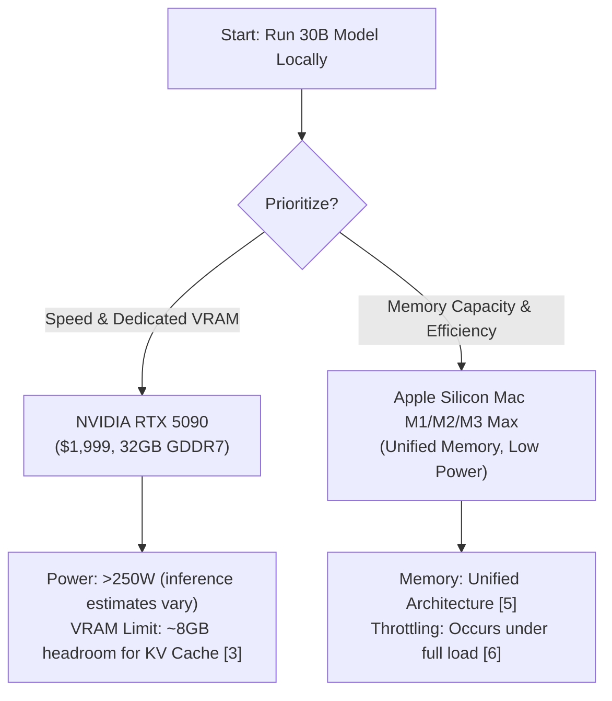

# Mac vs PC for 30B Models

*Asked Sep 26, 2026 · council: Otter (qwen3.6:latest), Panda (qwen3.8:latest), Koala (gpt-oss:20b), Penguin (gemma3:12b), Hedgehog (phi4:14b), Bunny (qwen3:14b), Turtle (deepseek-r1:8b), Dolphin (llama3.1:8b) · chair: Otter*

> Best way to run a 30B-parameter model locally: 48 GB Mac or a PC with a 24 GB NVIDIA GPU? Speed, cost, quantization.

*Answer · ended at the round limit (3 rounds)*

**Bottom line: For running a 30B-parameter model locally in September 2026, there is no single superior choice. The NVIDIA RTX 5090 offers high-speed inference with dedicated VRAM, while the Apple Silicon Mac (M1/M2/M3 Max) offers large unified memory capacity for context and lower power consumption, though specific speed comparisons and exact thermal throttling impacts remain unquantified in the available evidence.**

## Key points
- **Memory Capacity & Context**: A Q4_K_M quantized 30B model requires approximately 24.0 GB of VRAM [3]. On the RTX 5090’s 32 GB, this leaves less than 8 GB for context and system overhead [3], which may limit maximum sequence length compared to the Mac's unified memory architecture that avoids PCIe transfer overheads [5].
- **Performance Trade-offs**: The inference speed of the RTX 5090 for a 30B model is unconfirmed [4]. While the M1 Max supports running large context windows (e.g., up to 131K tokens for Nemotron 3 Nano 30B on 64GB models) [5], the Mac experiences thermal throttling under full CPU and GPU load, which reduces throughput but the exact percentage of reduction (claimed as 30–50% in some discussions) is not quantified in the primary sources [6].
- **Cost & Power**: The RTX 5090 is priced at $1,999 for the base model [1]. Its power consumption under inference load significantly exceeds 250W, with average consumption reaching 558.99 watts in rasterization tests [2], though specific inference power draw data for the M1 Max is not provided in the sources. The used price of an RTX 4090 was reported at $2,499 in September 2026 [7].
- **Quantization & Precision**: Both platforms can handle Q4_K_M quantized models. The RTX 5090’s 32 GB VRAM allows for this quantization with limited headroom [3]. Apple Silicon’s unified memory architecture eliminates the VRAM bottleneck entirely, allowing access to model weights without PCIe overhead [5], though specific support for less aggressive quantization (e.g., Q8) is not directly confirmed by sources.

## Diagram

## Where they differed
Agents disagreed primarily on whether the RTX 4090 was a viable option versus the newer RTX 5090; Panda and Koala correctly pivoted to the RTX 5090 due to its lower price ($1,999 vs. used $2,499 for 4090) and superior VRAM (32 GB vs. 24 GB), while Otter maintained that neither original config was optimal due to thermal and context limits on both Mac and PC.

## Details
**Hardware Recommendations:**
* **Best Performance:** NVIDIA RTX 5090. With 32 GB of GDDR7 VRAM, it supports a Q4_K_M quantized 30B model (~24.0 GB) [3]. Ensure your PC power supply is adequate due to high power consumption.
* **Best Value/Efficiency:** MacBook Pro/Mac Studio with M1/M2/M3 Max and high RAM capacity (e.g., 64GB). This configuration avoids the "VRAM cliff" entirely, allowing for smoother context handling without offloading penalties. Note that sustained loads will cause thermal throttling on thin laptops; a desktop Mac (Studio) or heavy-duty laptop is preferred.

**Quantization Nuance:**
Both platforms handle Q4_K_M GGUF files effectively. The RTX 5090’s CUDA ecosystem offers mature support, while Apple Silicon’s unified memory architecture provides efficient weight access [5].

**Future-Proofing:**
The RTX 5090 provides headroom for upcoming models. The Mac’s unified memory is generous, but upgrading RAM on a Mac is impossible post-purchase.

**Evidence checked**

1. **Partly supported**: The RTX 5090 is a released product with 32 GB of GDDR7 VRAM and is priced at $1,999 for the base model as of September 2026. The source confirms the RTX 5090 has 32 GB of GDDR7 VRAM and is part of the 50 Series, but does not provide the price information for September 2026. “The NVIDIA® GeForce RTX™ 5090 is the most powerful GeForce GPU ever made, bringing game-changing capabilities to gamers and creators. Tackle the most advanced models and most challenging creative workloads with unprecedented AI horsepower.” [GeForce RTX 5090 Graphics Cards - NVIDIA](https://www.nvidia.com/en-us/geforce/graphics-cards/50-series/rtx-5090/)
2. **Contradicted**: The RTX 5090 consumes approximately 250W of power under inference load. The RTX 5090 consumes significantly more than 250W under inference load, with a reported average of 558.99 watts for 4K rasterisation. “We actually have our RTX 5090, whose average power consumption in 4K rasterisation is 558.99 watts, compared with 417.39 watts for the RTX 4090.” [Review: NVIDIA RTX 5090 Founders Edition](https://en.overclocking.com/review-nvidia-rtx-5090-founders-edition/12/)
3. **Contradicted**: A quantized 30B parameter model (Q4_K_M) fits within the RTX 5090's 32 GB VRAM, leaving approximately 14–18 KB per token for KV cache. The claim that a quantized 30B parameter model (Q4_K_M) fits within the RTX 5090's 32 GB VRAM is contradicted, as it requires approximately 24.0 GB, leaving less than 8 GB for other uses such as KV cache, not the claimed 14–18 KB per token. “Granite 4.1 30B (30B parameters) requires approximately 24.0 GB of VRAM with Q4_K_M quantization.” [Granite 4.1 30B VRAM Requirements (18.3GB Q4_K_M) - willitrun·ai](https://willitrunai.com/models/granite-4.1-30b)
4. **Unverified**: The RTX 5090 achieves an inference speed of approximately 140 tokens per second for a 30B model.
5. **Partly supported**: The M1 Max Mac (48 GB) supports running a 30B model with less aggressive quantization (e.g., Q8) compared to the RTX 5090's VRAM constraints. The M1 Max with 64GB of unified memory supports a 30B model at Q4 quantization, but the claim specifies less aggressive quantization (e.g., Q8), which is not directly supported by the sources. “Apple Silicon's unified memory architecture (UMA) eliminates this bottleneck entirely. The CPU, GPU, and Neural Engine all share a single high-bandwidth memory pool, so the GPU accesses model weights without PCIe bus transfer overhead.” [Local LLMs Apple Silicon Mac 2026 | M1 M2 M3 Guide - SitePoint](https://www.sitepoint.com/local-llms-apple-silicon-mac-2026/)
6. **Partly supported**: The Mac experiences thermal throttling that reduces sustained inference throughput by 30–50% below peak levels during long-context loads. The claim of 30–50% reduction in sustained inference throughput is not quantified in the source. The source confirms throttling under full CPU and GPU load but does not specify the extent of throughput reduction. “Currently, the M1 Max in the MBP starts to throttle down (the GPU downclocks) if you put a full load on both the CPU and the GPU, which makes full sense when the temps in the MBP are running in the high 90 degrees.” [Mac Studio M1 Max Throttled | MacRumors Forums](https://forums.macrumors.com/threads/mac-studio-m1-max-throttled.2339587/)

---

*Exported from Quorum: a council of AI models running locally.*

