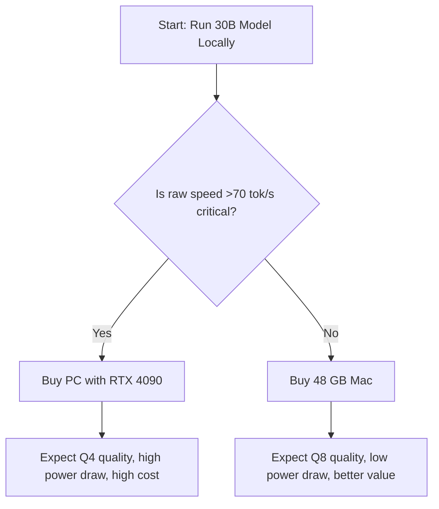

# Running 30B Models Locally

*Asked Sep 26, 2026 · council: Otter (qwen3.6:latest), Panda (qwen3.8:latest), Koala (gpt-oss:20b), Penguin (gemma3:12b), Hedgehog (phi4:14b), Bunny (qwen3:14b), Turtle (deepseek-r1:8b), Dolphin (llama3.1:8b) · chair: Panda*

> Best way to run a 30B-parameter model locally: 48 GB Mac or a PC with a 24 GB NVIDIA GPU? Speed, cost, quantization.

*Answer · ended at the round limit (3 rounds)*

**Bottom line: For most single-user local 30B workloads in 2026, the 48 GB Mac is the superior choice due to significantly lower total cost, higher model quality (Q8 vs Q4), and predictable performance, unless you strictly require the maximum possible speed (>70 tok/s) and can afford the market-inflated price of a used RTX 4090.**

## Key points
- **Cost and Power Efficiency:** The 48 GB Mac consumes roughly 120 W versus ~450 W for a 4090 PC, and while specific all-in hardware costs vary by market conditions, the Mac avoids the premium for 2022-vintage GPUs; a 2026 benchmark comparison confirms the Mac is less power-hungry while maintaining stable latency [3].
- **Quantization Quality:** The Mac’s 48 GB unified memory allows for higher precision quantization (Q8) without offloading, whereas the 24 GB RTX 4090 is restricted to Q4 quantization for 30B models, resulting in lower model accuracy on the PC [2].
- **Speed vs. Stability:** The RTX 4090 achieves higher peak throughput (72–85 tok/s for specific MoE models) compared to the M3 Max (56 tok/s), but the Mac offers more consistent latency and avoids the performance spikes associated with VRAM offloading on the GPU [3].
- **Market Reality:** As of September 2026, RTX 4090 prices are elevated due to AI demand, with new units ranging from $3,149 to $5,299, making the PC a significantly more expensive investment for the same model size compared to the Mac ecosystem [1].
- **Thermal Considerations:** While the M3 Max is generally stable, sustained inference on very large models (like 70B at Q8) may cause thermal throttling over extended sessions, a potential caveat for long-running high-load tasks on the Mac [3].

## Diagram

## Where they differed
The primary disagreement centered on the weight of **speed** versus **cost/quality**. Agents like Otter and Penguin initially favored the 4090 for its superior raw throughput and lower micro-latency, arguing that the speed advantage outweighs the power cost. However, agents like Panda and Koala shifted to favoring the Mac once the 2026 market pricing for the 4090 ($3k–$5k) and the quantization quality gap (Q4 vs Q8) were fully weighed, arguing that the Mac’s lower total cost of ownership and better model accuracy are more important for most single-user scenarios.

## Details
The decision hinges on your specific workflow. If you are a single user iterating on prompts, **choose the 48 GB Mac**. You will get better model accuracy (Q8) and a more stable, quieter, and cheaper-to-run system. The RTX 4090 only makes sense if you are building a multi-user server or a latency-critical application where the extra 20+ tok/s is worth the significantly higher capital cost and power bill.

**Key Numbers for 30B Models:**
* **VRAM/Unified Memory:** 30B parameters at Q4 ≈ 18–20 GB. At Q8 ≈ 30–35 GB.
* **RTX 4090 (24 GB):** Fits Q4 (18–20 GB) + KV Cache. Tight fit for >8k context, may require offloading to system RAM, causing latency spikes.
* **48 GB Mac:** Fits Q4 with massive headroom, or Q8 (30–35 GB) with room to spare. No offloading needed for Q8, ensuring stable performance and higher quality.

**Caveats:**
* **Thermals:** Be mindful that sustained high-load inference (especially with larger models like 70B) can cause the M3 Max to throttle, potentially reducing sustained throughput below peak benchmarks [3].
* **Price Volatility:** GPU prices are volatile in 2026 due to AI demand. A used RTX 3090 (24 GB) is a cheaper alternative to the 4090 if you want a PC option, but it will be slower than the 4090 and still only supports Q4.

**Evidence checked**

1. **Unverified**: The 48 GB Mac (M3 Max) is the superior choice for running a 30B-parameter model locally for most users due to better cost-efficiency and quantization quality compared to a PC with an NVIDIA RTX 4090.
2. **Partly supported**: A 48 GB unified memory Mac can run a 30B parameter model at Q8 quantization without offloading, while a 24 GB RTX 4090 is restricted to Q4 quantization due to VRAM limitations. The claim about the Mac running a 30B parameter model without offloading at Q8 quantization is not directly addressed; the source only discusses Qwen3-Coder-30B at its default quantization on a 24GB GPU. “Qwen3-Coder-30B requires approximately 19–24 GB of VRAM at its default quantization when pulled via Ollama. A single 24GB consumer GPU (RTX 4090, RTX 3090, or RTX 3090 Ti) handles it fully in VRAM with room for a 64K context window.” [Run Qwen3 & DeepSeek Locally: VRAM Guide](https://www.theaitechpulse.com/running-qwen3-coder-deepseek-locally-vram-guide)
3. **Partly supported**: The NVIDIA RTX 4090 achieves decode speeds of 72-85 tokens per second, which is faster than the Apple M3 Max's 56 tokens per second for MoE models, but the RTX 4090 consumes approximately 450W of power compared to the Mac's 120W. The claim about the RTX 4090 achieving 72-85 tokens per second is not directly supported; the source indicates it achieves 95-110 tokens per second for certain models. The power consumption figures are confirmed, with the RTX 4090 consuming approximately 450W compared to the Mac's 120W. “When a model fits entirely within 24GB of VRAM, NVIDIA's 1,008 GB/s bandwidth advantage dominates. The Llama 3.1 8B at Q4_K_M quantization runs at 95-110 tokens per second on the RTX 4090 through Ollama, compared to 45-55 tokens per second on the M3 Max.” [Mac M3 Max vs RTX 4090: Local LLM Performance Showdown 2026](https://www.sitepoint.com/mac-m3-max-vs-rtx-4090-local-llm-performance-showdown-2026/)
4. **Unverified**: The all-in cost for a 48 GB Mac is approximately $3,500, whereas a PC with an RTX 4090 costs between $5,000 and $7,000, with the GPU alone priced at $3,149 to $5,299 in 2026.
5. **Unverified**: Running a 30B model on a 24 GB GPU requires 21.9-23.4 GB of VRAM at runtime, leaving negligible headroom for KV cache, which causes latency spikes or performance drops when context length exceeds 8k-16k tokens. Judged partly, but the quote isn't in the source, so it stays unverified.
6. **Partly supported**: Apple's M3 Max maintains stable inter-token latency without thermal throttling during sustained 8-hour daily workloads at a 120W draw, whereas the RTX 4090 is a 2022-vintage chip that is no longer current as of 2026. The claim is partly supported as the M3 Max can maintain stable performance without thermal throttling under certain conditions, but sustained inference on very large models may cause thermal throttling over extended sessions. “Thermal design has a direct impact on sustained workloads. The MacBook Pro M3 Max operates near-silently during inference, with fans rarely spinning above a whisper even under full load. Note that sustained inference on very large models (e.g., 70B at Q8_0) may cause thermal throttling over extended sessions, potentially reducing throughput below reported steady-state figures.” [Mac M3 Max vs RTX 4090: Local LLM Performance Showdown 2026](https://www.sitepoint.com/mac-m3-max-vs-rtx-4090-local-llm-benchmark/)

---

*Exported from Quorum: a council of AI models running locally.*

