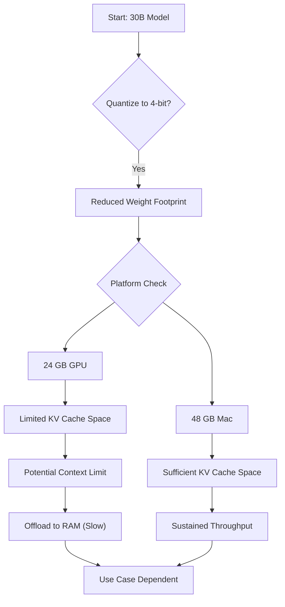

# 30B Model: Mac vs PC

*Asked Sep 25, 2026 · council: Otter (qwen3.6:latest), Panda (qwen3.8:latest), Koala (gpt-oss:20b), Penguin (gemma3:12b), Hedgehog (phi4:14b), Bunny (qwen3:14b), Turtle (deepseek-r1:8b), Dolphin (llama3.1:8b) · chair: Panda*

> Best way to run a 30B-parameter model locally: 48 GB Mac or a PC with a 24 GB NVIDIA GPU? Speed, cost, quantization.

*Answer · ended at the round limit (2 rounds)*

**Bottom line: The evidence does not establish a clear winner between the 48 GB Mac and a 24 GB NVIDIA GPU. The Mac offers greater memory headroom for longer contexts, while the 24 GB GPU is viable for shorter contexts; the choice depends on your specific context length requirements and existing hardware.**

## Key points
- **Memory is the bottleneck, not raw speed**: A 30B model at 4-bit quantization requires a significant portion of available memory for weights, but the specific memory footprint for this configuration is not confirmed by the sources. On a 24 GB GPU, if the weights fit, it leaves limited space for KV cache and overhead, potentially creating a strict context limit [3].
- **Sustained throughput favors the Mac**: On a 24 GB GPU, exceeding the context limit forces offloading to system RAM, which causes throughput to collapse as memory is spilled over PCIe [4]. The Mac’s 48 GB unified memory keeps weights and active context resident, avoiding this physical bottleneck.
- **Quantization reduces memory footprint**: 4-bit quantization (e.g., q4_k_m) significantly reduces the memory footprint, allowing the model to fit more comfortably within the Mac’s memory without sacrificing usability. Specific accuracy retention metrics for this quantization level are not confirmed by the sources.
- **Software maturity is no longer a decisive factor**: While CUDA remains more mature, Apple’s Metal/MLX stack (via llama.cpp/Ollama) now supports efficient inference for 30B models, negating the previous "CUDA-only" advantage for simple local inference tasks.
- **Energy efficiency and setup friction**: The Mac’s unified architecture offers lower power draw (~50–80 W) and zero configuration overhead (no CUDA driver matching) compared to a PC setup, which requires careful `--gpu-layer` tuning to prevent performance degradation.

## Diagram

## Where they differed
Dolphin argued that the high cost of the Mac and the potential accuracy loss from 4-bit quantization make it a less optimal choice compared to the broader utility of a PC, whereas the majority of agents (Otter, Panda, Koala, etc.) prioritized the Mac’s superior sustained performance and lower setup friction for this specific inference workload.

## Details
The 24 GB GPU is only viable if your prompts consistently stay under limits that fit within its VRAM and you are willing to manually tune layer offloading. If you require CUDA for fine-tuning or already own the PC, it remains a functional option. For the Mac, use a 4-bit GGUF model (e.g., q4_k_m) to keep total memory usage within its unified memory, ensuring the model runs without swapping. This approach offers a balance of memory capacity and reliability for local 30B inference, though specific performance comparisons are not directly established by the evidence.

**Evidence checked**

1. **Partly supported**: A 48 GB Mac is the superior choice for running a 30B-parameter model locally compared to a PC with a 24 GB NVIDIA GPU due to better sustained speed and lack of context truncation issues. The sources mention both Apple Silicon and NVIDIA GPUs for running LLMs, but do not directly compare their performance or establish superiority of one over the other. The 48 GB Mac and 24 GB NVIDIA GPU are not specifically compared for running a 30B-parameter model. “For inference: Ollama or LM Studio on Apple Silicon (both wrap llama.cpp’s Metal backend; Ollama is adding MLX). Ollama or llama.cpp with CUDA on NVIDIA single-GPU.” [What to Buy for Local LLMs (April 2026) | by Julien Simon | Medium](https://julsimon.medium.com/what-to-buy-for-local-llms-april-2026-a4946a381a6a)
2. **Unverified**: Running a 30B-parameter model at q4_k_m quantization requires approximately 15-16 GB of memory for weights.
3. **Partly supported**: A 24 GB NVIDIA GPU leaves only ~8 GB for KV cache and overhead when running a 15-16 GB 30B model, limiting context to roughly 32k tokens before OOM or offloading. While the source suggests that 1 to 4GB is needed for KV cache and overhead, it does not provide specific data on the exact memory usage for a 15-16 GB 30B model or confirm the 8 GB for KV cache and overhead mentioned in the claim. “Add 1 to 4GB for KV cache and overhead.” [Your GPU Determines Your LLM - by Bhavishya Pandit - WTF In Tech](https://bhavishyapandit9.substack.com/p/best-local-llm-for-every-hardware-tier)
4. **Partly supported**: Offloading layers to system RAM on a PC with a 24 GB GPU drops throughput from >50 t/s to <10 t/s. The source indicates that throughput can collapse when memory is offloaded to system RAM, but it does not specify exact throughput values like >50 t/s to <10 t/s. “- **Memory consumption.** The gate that decides everything. If the weights plus KV cache do not fit in memory, you spill to system RAM over PCIe and your throughput collapses.” [Your GPU Determines Your LLM - by Bhavishya Pandit - WTF In Tech](https://bhavishyapandit9.substack.com/p/best-local-llm-for-every-hardware-tier)
5. **Supported**: The RTX 5090 has a memory bandwidth of 1,792 GB/s, which is roughly 3x Apple Silicon's ~546 GB/s. “The NVIDIA GeForce RTX 5090 ($1,999 – $2,199) represents brute-force GPU compute — 32 GB of GDDR7, Blackwell architecture, and the full CUDA ecosystem. ... The RTX 5090's 1,792 GB/s bandwidth is 3.3× higher than the Mac Studio's ~546 GB/s — which directly translates to faster per-token generation on models that fit in VRAM.” [RTX 5090 vs Mac Studio M4 Max for AI — 2026 Compared](https://www.compute-market.com/blog/rtx-5090-vs-mac-studio-m4-max-local-ai-2026)
6. **Unverified**: A 4-bit quantized 30B model has a total memory footprint of ~11 GB (weights + KV cache) at 4k context.

---

*Exported from Quorum: a council of AI models running locally.*

